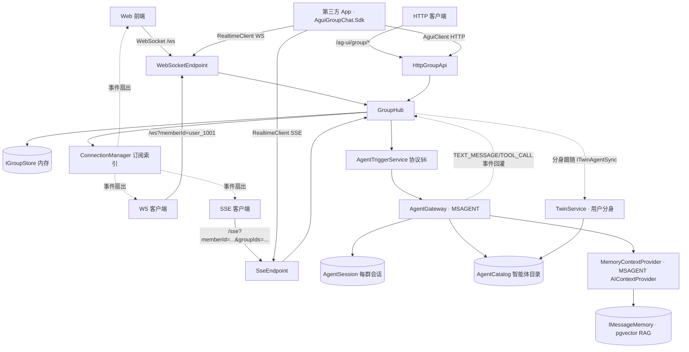

# AG-UI Group Chat Extension Protocol Hub (.NET 10)

**English** | [简体中文](README.md)

A group chat protocol hub implemented according to the *AG-UI Group Chat Extension Protocol Standard v1.0*, written in C# / .NET 10 (ASP.NET Core Minimal API).

- ✅ Group lifecycle: create / update / disband (`GROUP_CREATED` / `GROUP_UPDATED` / `GROUP_DISBANDED`)
- ✅ Group membership management: join / remove / leave / role and profile changes (`GROUP_MEMBER_*`)
- ✅ Message fan-out: user messages are broadcast as the `TEXT_MESSAGE_START/CONTENT/END` triple, with visibility scopes `all / mentioned / private`
- ✅ Subscription mechanism: `GROUP_SUBSCRIBE` / `GROUP_UNSUBSCRIBE` / `GROUP_SUBSCRIBE_ACK` / `GROUP_STATE_SNAPSHOT`
- ✅ Dual transport: WebSocket (full-duplex) and SSE (one-way downstream), with heartbeat keep-alive
- ✅ Agent trigger rules (protocol §6): mention trigger / all-message listen / keyword trigger / contextual trigger (the model decides autonomously whether to speak based on context)
- ✅ **Real agent gateway** (`AguiGroupChat.Agents`): implements `IAgentGateway` on the Microsoft Agent Framework (MSAGENT);
  the mock provider works out of the box (no key needed), and OpenAI-compatible endpoints (Ollama / vLLM / Azure OpenAI) can also be configured;
  streams `TEXT_MESSAGE_START/CONTENT/END` back after triggering, and fans out function calls as `TOOL_CALL_START`
- ✅ **Human-in-the-loop (HITL, protocol 4.5)**: tools can be marked as requiring approval with `ApprovalRequiredAIFunction` — the run is interrupted when the model invokes them,
  an `AGENT_INTERACTION_REQUEST` interaction card is broadcast to the group chat, **only the triggerer can approve / reject**, and the same session resumes after the decision
- ✅ **Web demo frontend** (`AguiGroupChat.Web`): static pages + WebSocket real-time group chat, with built-in @-mention agent triggering
- ✅ **User management (Hub extension)**: register / login / logout / change password / profile maintenance, PBKDF2 password hashing + session tokens, token-based auth for WS/SSE (backward compatible)
- ✅ **AI role management (Web extension)**: the Web UI can add / edit / delete agents at runtime (persona / trigger rule / keywords / model), no longer limited to static `appsettings` configuration
- ✅ **Persistence**: users / login sessions / groups / members / messages (including recalled) / trigger rules / agent definitions are uniformly snapshotted to disk (single JSON file or postgres / mysql / sqlite three database implementations), auto-restored on restart
- ✅ **Topics (group chat extension)**: independent discussion threads within a group, can switch / create / "create topic from this message" / delete; topic-level unread counts and read positions
- ✅ **Link proxy**: http/https links in agent replies are fetched by the Hub and returned to the frontend (`GET /ag-ui/proxy`) — intranet addresses / mixed content that the browser cannot reach directly can be viewed and downloaded normally (with correct filenames)
- ✅ **Data export / import**: account (including password hash) + agents + chat records + attachments are packaged together as a zip (`GET /ag-ui/export`); on import you check the groups to restore and missing accounts / agents are auto-created ( `POST /ag-ui/import/preview` / `/import`)
- ✅ **Runtime model configuration and initialization**: after login, you can fill in the DeepSeek endpoint / apiKey in the UI (leave empty to use the official endpoint and environment variables, `GET/POST /ag-ui/settings/model`), and it survives restarts; the user menu "Data Backup" provides "Initialize (clear everything)" (`POST /ag-ui/reset`, clears data + browser cache)
- ✅ **Desktop multi-instance**: WPF / Avalonia clients share the same backend process (fixed 5200); the first instance starts the `--backend` child process, and the backend is only stopped when the last instance closes; multiple windows can be opened at once
- ✅ **Thinking mode (AG-UI bridging)**: external services' `REASONING_MESSAGE_CONTENT` is fed back through a dedicated channel, and the frontend renders a collapsible "thinking process" block; tool calls are shown concisely ("🔧 name calling…" → collapsed after completion)

## Project Structure

```
src/AguiGroupChat.Hub/           # Protocol Hub: entry and composition (Program.cs / HubApp.cs), models, storage, messages, transport, options
src/AguiGroupChat.Hub/Users/     # User management: AuthService (register/login/session/change-password), PasswordHasher (PBKDF2), IUserStore, UserApi
src/AguiGroupChat.Hub/Persistence/ # Persistence: PersistenceService (snapshot to disk/restore), ChangeHub, HubSnapshot DTO
src/AguiGroupChat.Agents/        # MSAGENT agent gateway: AgentGateway (IAgentGateway implementation), AgentCatalog, MemoryContextProvider (RAG injection), KnowledgeBaseCatalog (knowledge base: document chunk vectors + retrieval), TwinService (user twin + ITwinAgentSync hook), IAgentDefinitionStore (private agent ownership), MockChatClient, skills (AgentSkillCall inter-agent invocation); embedding abstraction (IEmbeddingProvider: HTTP / LLamaSharp local model); built-in tool set (Tools/: calculator / unit_converter / group_memory_search / read_attachment / web_search / read_url)
src/AguiGroupChat.Web/           # Demo Web: composition root (Hub + Agents) + static frontend (index.html / app.js) + management APIs such as TwinApi / AgentApi
src/AguiGroupChat.Sdk/           # Third-party integration SDK: AguiClient (HTTP uplink) + AguiRealtimeClient (WS/SSE downlink) + strongly-typed Models
src/AguiGroupChat.Desktop/       # Pure desktop (Windows, WPF + WebView2): SQLite + sqlite-vec memory, LLamaSharp local embedding (bge-m3 model — NOT in git; bundled in the MSI / downloaded via script when building from source)
src/AguiGroupChat.Desktop.Core/  # Desktop shared host (pure managed, cross-platform): in-process Kestrel assembling Hub + gateway + API + frontend
src/AguiGroupChat.Desktop.Cross/ # Cross-platform desktop shell (Avalonia 12 + official WebView): Windows=WebView2 / macOS=WKWebView / Linux=WebKitGTK
tests/AguiGroupChat.Hub.Tests/   # Unit / integration tests (real Kestrel + ClientWebSocket), including SQLite + sqlite-vec vector memory tests
tests/AguiGroupChat.Sdk.Tests/   # SDK end-to-end integration tests: self-hosted real Hub verifies the full HTTP and WebSocket pipeline
samples/AguiGroupChat.Client/    # Sample client: based on the SDK demonstrating login → create group/send message → realtime subscribe → streaming reply
assets/                          # Branding icons: agui-icon.svg vector source + multi-size PNG/ICO (see assets/README.md)
tools/icon-gen/                  # Icon rasterization generator: outputs the SVG vector icon as multi-size PNG and Windows ICO
tools/agents-starter.json        # Industry agent bundle (25 roles): after login choose "Agent Management → Import JSON" and select this file to bulk-create
tools/build-msi.ps1              # WiX v4 MSI installer build (perUser install to %LocalAppData%\AguiGroupChat; excludes full platform runtimes, bundles bge-m3 model, MSI ≈ 580MB)
tools/download-embedding-model.ps1 # Manually fetch the embedding model (usable for the slim build without the bundled model; default nomic-embed-text-v1.5.Q8_0)
tools/verify-hitl.mjs            # Human-in-the-loop (approval card) end-to-end verification script
tools/verify-agent-import.mjs    # Agent bulk-import verification script
```



## Third-Party Integration SDK (AguiGroupChat.Sdk)

The official .NET client SDK (`src/AguiGroupChat.Sdk`, [README](src/AguiGroupChat.Sdk/README.md)) for **third-party applications** connecting to the Hub.
All you need is one `AguiClient` (HTTP) plus one `AguiRealtimeClient` (WS/SSE) to complete login, create groups, send messages, subscribe in real time, and receive streaming agent replies.

```csharp
var options = new AguiClientOptions { BaseUri = new Uri("http://localhost:5100") };
using var client = new AguiClient(options);
var auth = await client.LoginAsync("zhangsan", "123456");
client.Token = auth.Token;

await using var realtime = new AguiRealtimeClient(options) { Token = auth.Token };
realtime.On<TextMessageContentEvent>(e => Console.Write(e.Delta));
await realtime.ConnectAsync(["group_001"], ct);
await realtime.SendMessageAsync(new GroupMessageSendRequest {
    GroupId = "group_001", Content = "你好", Mentions = ["agent_prd"],
});
```

- Coverage: auth / groups / members / topics / messages (including recall, re-answer, read receipts, typing indicators) / multi-agent discussion / human-in-the-loop decisions / agent catalog / attachment upload / dynamic SSE subscription
- Target frameworks: `net8.0` / `net10.0`, zero external runtime dependencies; errors are uniformly thrown as `AguiException` (protocol error code + HTTP status code)
- Full example: `samples/AguiGroupChat.Client`; end-to-end tests: `tests/AguiGroupChat.Sdk.Tests`

## Quick Start

```bash
# Option 1: Web demo (Hub + MSAGENT agent gateway + static frontend, open http://localhost:5200 in a browser)
# Default Provider=deepseek, requires an API Key to be configured first (see "Connecting DeepSeek" below)
dotnet run --project src/AguiGroupChat.Web

# Option 2: Protocol Hub only (no frontend, no agent replies)
# ⚠️ In this project IAgentGateway is a placeholder implementation (NoopAgentGateway): after agent trigger it only logs, no reply is produced.
# Use Option 1 to see AI replies.
dotnet run --project src/AguiGroupChat.Hub

# Option 3: Pure desktop app (Windows): WPF + WebView2 window, data stored in SQLite (sqlite-vec semantic memory),
# embedding uses the LLamaSharp local model bge-m3 (1024 dims, models/embedding.gguf).
# ⚠️ This model file is NOT in the source repo (exceeds GitHub's per-file limit): the released MSI bundles it;
#    when building from source, run tools/download-embedding-model.ps1 first or set Agents:Memory:ModelDownloadUrl,
#    otherwise semantic memory (RAG) is auto-disabled
# Multi-instance supported: multiple launches share the same backend process (fixed 5200; the first instance automatically starts the --backend child process),
# each instance has its own window, and the backend stops only when the last instance closes (see src/AguiGroupChat.Desktop/README.md)
dotnet run --project src/AguiGroupChat.Desktop

# Option 4: Cross-platform desktop (macOS / Linux / Windows): Avalonia 12 + official WebView control,
# the same in-process host (src/AguiGroupChat.Desktop.Core), experience identical to Option 3
# See src/AguiGroupChat.Desktop.Cross/README.md
dotnet run --project src/AguiGroupChat.Desktop.Cross
```

Sample data: group `group_xxx` (product requirements review group), members `user_1001` (Zhangsan, group owner), `user_1002` (Lisi), `agent_prd` (requirements assistant, mention-triggered), `agent_code` (code assistant, contextual trigger: can proactively speak based on context even without @).

```bash
# Terminal 1: sample client based on the SDK (logs in the demo seed account → connects + subscribes + prints events, exits after 20 seconds)
# Demo accounts zhangsan / 123456 (user_1001); --login username password
# Subscribes to group_001
dotnet run --project samples/AguiGroupChat.Client -- --login zhangsan 123456 --groupIds group_001

# Terminal 2: Another member logs into the same group and sends a message (@需求助手 triggers its reply)
dotnet run --project samples/AguiGroupChat.Client -- --login lisi 123456 --groupIds group_001 --send "大家好，请给个需求大纲"
```

## Containerized Deployment (Docker)

The project provides a multi-stage `Dockerfile` (Web demo), `Dockerfile.hub` (protocol Hub only), and a one-click orchestration `docker-compose.yml`.

**A complete RAG semantic memory stack by default**: a single command starts postgres (pgvector) + bundled Ollama (auto-pulls the embedding model) + Web.

```bash
# One-click start (postgres + bundled ollama semantic memory + Web), open http://localhost:5200 in a browser
# On first start the bundled ollama automatically pulls the bge-m3 model (~1.2GB), then it enters an immediately usable state
# If .env does not exist, copy it first: cp .env.example .env
cp .env.example .env

# Start all services (pulling/building dependency images the first time is slow, please be patient)
docker compose up -d --build

# Check the startup logs: confirm "语义记忆已启用" appears and ollama finished pulling the model
docker compose logs -f web
docker compose exec ollama ollama list

# If you also want to start the protocol-Hub-only service (http://localhost:5100)
docker compose --profile hub up -d

# Stop (data is retained in named volumes; re-up restores full data)
docker compose down
```

Configuration options are set in `.env` (see `.env.example`):

| Variable | Default | Description |
|---|---|---|
| `DEEPSEEK_API_KEY` | empty | DeepSeek API Key (also supports `OPENAI_API_KEY`) |
| `AGENTS_PROVIDER` | `deepseek` | Model provider: `mock` / `openai` / `deepseek` |
| `AGENTS_ENDPOINT` | empty | OpenAI-compatible endpoint (e.g. `http://host.docker.internal:11434/v1`) |
| `AGENTS_MODEL` | `deepseek-chat` | Default model name |
| `AGENTS_ENABLE_TOOLS` | `true` | Whether to enable tool calls (enabled by default: built-in `get_current_time` without approval + `publish_announcement` requiring approval) |
| `AGENTS_REQUIRE_APPROVAL_TOOLS` | `publish_announcement` | Tool names requiring **human-in-the-loop approval** (on match it is wrapped with `ApprovalRequiredAIFunction`: the run is interrupted when the model invokes it, a 🔐 approval card pops up in the chat, and only the requesting user can approve / reject) |
| `STORAGE_PROVIDER` | `postgres` | Storage mode: `postgres` (default, enterprise-grade persistence), `memory` (in-process + JSON snapshot), `sqlite` / `mysql` (single-file / MySQL persistence), `redis` (multi-replica shared, 6.2) |
| `PG_DATABASE` / `PG_USER` / `PG_PASSWORD` | `agui` / `postgres` / `agui` | PostgreSQL database / user / password (effective when `STORAGE_PROVIDER=postgres`) |
| `STORAGE_CONNECTION_STRING` | points to bundled postgres | Custom connection string (can point to an external PostgreSQL instance) |
| `MEMORY_ENABLED` | `true` | Semantic memory (RAG) switch: requires `STORAGE_PROVIDER=postgres` + the pgvector extension (built into compose) |
| `MEMORY_EMBEDDING_ENDPOINT` | `http://ollama:11434/v1` | OpenAI-compatible embedding endpoint (defaults to the compose-bundled ollama; can be changed if you provide your own external instance) |
| `MEMORY_EMBEDDING_MODEL` | `bge-m3:latest` | Embedding model name (when changing the model you must also update `MEMORY_EMBEDDING_DIMENSIONS`) |
| `MEMORY_EMBEDDING_DIMENSIONS` | `1024` | Vector dimensions (bge-m3=1024, MiniLM=384, qwen3-embedding=2560) |
| `MEMORY_TOP_K` / `MEMORY_MIN_SCORE` | `5` / `0.25` | Number of memory entries injected per reply / similarity threshold. **The `group_memory_search` tool is stricter**: threshold is max(0.40, MIN_SCORE), at most 3 entries, low-relevance hits are physically filtered to avoid memory flooding |
| `MEMORY_EMBEDDING_TIMEOUT` | `60` | Embedding call timeout (seconds). First load of bge-m3 on a CPU environment takes tens of seconds |
| `MEMORY_SCOPE` | `agent` | Retrieval scope: `agent` all groups the agent belongs to (default) / `group` only the current group / `all` all groups |
| `MEMORY_KNOWLEDGE_CHUNK_SIZE` / `MEMORY_KNOWLEDGE_CHUNK_OVERLAP` | `800` / `100` | Knowledge-base document chunking: window size (chars) / overlap (chars). Cuts are placed at line breaks or sentence-ending punctuation (avoiding mid-sentence splits), and adjacent slices share an overlapping tail to reduce boundary information loss |
| `MEMORY_PERSONAL_TOP_K` / `MEMORY_PERSONAL_MIN_SCORE` | `3` / `0.25` | Personal memory: number of "the triggerer's own past messages" injected per reply / similarity threshold. Overall capability switch (on by default); whether it is actually injected also depends on the **switches of the user and the agent individually** (both off by default) |
| `SEED_SAMPLE_DATA` | `true` | Web demo: seed sample data when there is no history |
| `SEED_SAMPLE_DATA_HUB` | `false` | Protocol Hub only: whether to seed sample data |
| `WEB_PORT` / `HUB_PORT` | `5200` / `5100` | Host port mappings (consistent with `launchSettings.json`) |
| `OLLAMA_PORT` | `11435` | Bundled Ollama host port (defaults to avoiding the local Ollama's 11434) |
| `OLLAMA_KEEP_ALIVE` | `-1` | Keep the model resident in memory (-1=always; change to `5m` to unload after 5 minutes idle, freeing ~1.1GB memory) |
| `PG_PORT` | `5432` | PostgreSQL host mapped port (unaffected inside the container) |

Key points:

- **RAG semantic memory by default**: `STORAGE_PROVIDER=postgres` (compose-bundled `pgvector/pgvector:pg16` image) + `MEMORY_ENABLED=true` (embedding is provided by the bundled `ollama` service, which runs `ollama pull bge-m3:latest` automatically on startup).
  The first start pulls ~1.2GB of model; the model and data are stored in the named volumes `agui-ollama-data` / `agui-pg-data` respectively, and `docker compose down` does not lose data.
- **Human-in-the-loop (HITL) demo by default**: `AGENTS_ENABLE_TOOLS=true` (compose default) — built-in agent tools: `get_current_time` / `calculator` / `unit_converter` / `group_memory_search` / `read_attachment` require no approval, `publish_announcement` requires approval (ask an agent to "发布公告" in the group chat → 🔐 approval card, **only the requesting user** can approve / reject); `AGENTS_REQUIRE_APPROVAL_TOOLS` can customize which tool names require approval; to require multiple tools append indexed entries such as `Agents__RequireApprovalToolNames__1` in `docker-compose.yml`; web tools `web_search` / `read_url` are off by default (enable with `AGENTS_ENABLE_WEBTOOLS=true`).
- **Bundled Ollama is isolated from the host**: inside the web container it uses the internal network `http://ollama:11434/v1`; the host-mapped port defaults to `OLLAMA_PORT=11435` (avoiding the local Ollama's 11434); a model-pull failure does not cause the container to exit, and the web side prints a warning log.
- **PostgreSQL mode**: groups / members / topics / messages / users / agent trigger rules and definitions are all written to PostgreSQL, and data survives container restarts intact.
  Switch back to `STORAGE_PROVIDER=memory` for in-memory + JSON snapshot mode (semantic memory is unavailable in this mode).
- The image runs as a non-root user (`app`), with a built-in health check `GET /ag-ui/health`.

- If not using Compose, you can build and run directly (in this case you must provide your own pgvector-enabled PostgreSQL and Ollama):

  ```bash
  docker build -t agui-group-chat-web .
  docker run --rm -p 5200:8080 -e DEEPSEEK_API_KEY=sk-xxx -v agui-web-data:/app/data agui-group-chat-web
  ```

## Transport Endpoints

| Endpoint | Description |
|---|---|
| `GET /ws?memberId=user_1001` | WebSocket full-duplex. After the handshake you first receive `GROUP_CONNECTED` (with `connectionId`), then subscribe to events |
| `GET /sse?memberId=user_1001&groupIds=g1,g2` | SSE one-way downstream, `data: {json}\n\n`, heartbeats are comment lines |
| `POST /ag-ui/group/subscribe` | Dynamic SSE subscription (`{"connectionId":"...","groupIds":[...]}`, connectionId comes from the handshake) |
| `POST /ag-ui/group/unsubscribe` | Same as above, cancel subscription |

> Identity verification: when a valid session token (`&token=...` or `Authorization: Bearer`) is supplied, WS/SSE always connect with the **token identity** (overriding the memberId parameter, preventing forgery);
> if no token is supplied, it falls back to trusting the identity via the `memberId` query parameter (compatible with old clients and samples), unless `Auth:RequireTokenOnRealTime=true` is configured to require a token.

WebSocket uplink events (dispatched by `type`): `GROUP_SUBSCRIBE`, `GROUP_UNSUBSCRIBE`, `GROUP_MESSAGE_SEND`, `GROUP_MESSAGE_RECALL`, `GROUP_TYPING`, `GROUP_MESSAGE_READ`.
For `GROUP_MESSAGE_SEND` / `GROUP_MESSAGE_RECALL` / `GROUP_TYPING` / `GROUP_MESSAGE_READ`, the identity fields are always overridden by the connection identity (preventing forgery).

## HTTP Uplink API (protocol §5)

| API | Path | Key parameters |
|---|---|---|
| Create group | `POST /ag-ui/group/create` | groupName、ownerId、isPrivate*、memberIds、members*; if **groupName is empty, the group name can be auto-generated first** |
| Auto-generate group name | `POST /ag-ui/group/generate-name` | memberNames (list of selected member nicknames, requires login): generates a 6-12 character group name from the model based on the members; the mock provider outputs a deterministic template |
| Update group info | `POST /ag-ui/group/update` | groupId、updateFields、groupInfo、operatorId |
| Disband group | `POST /ag-ui/group/disband` | groupId、operatorId |
| Add member(s) | `POST /ag-ui/group/member/add` | groupId、memberIds、operatorId |
| Remove member(s) | `POST /ag-ui/group/member/remove` | groupId、memberIds、operatorId |
| Leave group | `POST /ag-ui/group/member/leave` | groupId、memberId |
| Update member | `POST /ag-ui/group/member/update` | groupId、memberId、updateFields、memberInfo、operatorId |
| Send message | `POST /ag-ui/group/message/send` | groupId、userId、content、mentions、attachments*、replyToMessageId… (content may be empty, pure-attachment message) |
| Upload attachment | `POST /ag-ui/upload` | multipart `file` field (multiple allowed), returns attachment metadata list (requires login; **whitelisted extensions only**, script-like html/js/svg etc. are rejected) |
| Download attachment | `GET /ag-ui/files/{attachmentId}/{name}` | Returns the file content by attachment ID (supports Range, images can be previewed; **requires identity and that the caller is a member of the attachment's group**, otherwise 401/403; **avatar attachments are allowed**: when the attachment is the avatar of any user / agent (including twins), logged-in users can access it; the response includes nosniff and secure response headers) |
| Recall message | `POST /ag-ui/group/message/recall` | groupId、messageId、operatorId |
| Typing indicator | `POST /ag-ui/group/message/typing` | groupId、memberId、isTyping |
| Read receipt | `POST /ag-ui/group/message/read` | groupId、memberId、readMessageId (persists the read position: member × group × topic, used for group-list / topic unread hints) |
| Human-in-the-loop decision | `POST /ag-ui/group/interaction/resolve` | groupId、interruptId、approved (**only the triggerer can decide**, other members get 400) |
| Group detail snapshot | `GET /ag-ui/group/{groupId}` | Returns the `GROUP_STATE_SNAPSHOT` structure |
| Member list | `GET /ag-ui/group/{groupId}/members` | — |
| Agent registration | `POST /ag-ui/agent/register` | agentId、groupIds、triggerMode、keywords*、override (true=override role default within the group) |
| Agent catalog | `GET /ag-ui/agents` | All agents that are mutable at runtime (including appsettings seeds); **private agents are visible only to their creator** |
| Add agent | `POST /ag-ui/agents` | nickname、instructions、triggerMode、keywords、model、isPrivate* (requires login; private agents record the creator) |
| Update agent | `PUT /ag-ui/agents/{agentId}` | Same as above, and syncs the trigger rules of groups it has joined (requires login; **only the creator can update**, built-in agents are read-only) |
| Delete agent | `DELETE /ag-ui/agents/{agentId}` | Removes from catalog / trigger rules, and leaves all groups (requires login; **only the creator can delete**, built-in agents are read-only) |
| Link proxy | `GET /ag-ui/proxy?url=` | The Hub fetches http/https links in agent replies and returns the content (requires login): intranet addresses / mixed content that the browser cannot reach directly are accessed server-side; HTML responses are sandboxed with CSP sandbox, downloads carry the correct filename; `LinkProxy:AllowPrivate` defaults to false (enable explicitly when intranet access is needed; SSRF protection applies otherwise) |
| Data export | `GET /ag-ui/export` | Exports accounts (including password hashes) + agents + chat records + attachments as a zip (`manifest.json` + `files/`), requires login |
| Import preview | `POST /ag-ui/import/preview` | Uploads a zip, returns account / agent existence checks and the group list (multipart `file` field) |
| Import execution | `POST /ag-ui/import` | Uploads a zip + `selectedGroupIds` (JSON array), imports the checked groups; missing accounts are auto-created (if they exist, profile is updated, password is preserved), missing agents are auto-created, attachments and avatar files are restored |
| Model config query | `GET /ag-ui/settings/model` | Returns the current endpoint / whether apiKey is configured / provider / configured (frontend uses this to decide whether to show configuration) |
| Model config save | `POST /ag-ui/settings/model` | `{endpoint?, apiKey?}`: empty endpoint → deepseek official endpoint `https://api.deepseek.com`; empty apiKey → environment variables (`DEEPSEEK_API_KEY` / `OPENAI_API_KEY`); takes effect immediately and is persisted (extension section `modelConfig`) |
| System initialization | `POST /ag-ui/reset` | Clears accounts / agents / groups / messages / attachments / memory / sessions / config (in database mode also clears all business tables); requires login |
| Branding query | `GET /ag-ui/settings/branding` | Public: returns `{appName, logoUrl, primaryColor, forceDark, tagline}` (whitelabel 6.4: brand the login page / top bar / embedded pages) |
| Branding save | `POST /ag-ui/settings/branding` | Admin only: set the app name / logo / brand primary color / force dark / tagline (persisted) |
| Config governance | `POST /ag-ui/admin/config` | Admin only: write and persist runtime parameters online (session / group / message policy / tool switches / approval list / iframe origins), invalid values return 400 |
| Health check | `GET /ag-ui/health` | connections / groups counts |

`*` = Hub extension field. Error responses are uniformly `{"code":"GROUP_XXX","message":"..."}`, with status-code mapping: 403 permission, 404 not found, 409 group full, 400 parameter error.
The enum fields of the HTTP API (`memberType`/`role` etc.) are configured to string values (`user`/`agent`, `owner`/`admin`/`normal`), consistent with protocol §2.

**Write-operation authorization (same as WS / SSE)**: all write endpoints — group management / messages / topics / agent registration — uniformly go through identity resolution —
when `Authorization: Bearer <token>` (or `?token=`) is supplied, the **token identity wins**, overriding `ownerId` / `operatorId` / `userId` / `memberId` in the request body (a logged-in user cannot forge another identity, e.g. impersonate the group owner to disband);
`Auth:RequireTokenOnRealTime` **defaults to true**: connections (WS/SSE) without a valid token and all write requests get 401 (keep it on for public deployments); setting it to false is only for legacy clients / demo-mode fallback (risks `?memberId=` / request-body identity impersonation, for intranet debugging only).
**Read-interface authorization (security hardening)**: GET query endpoints such as group snapshot / member list / message history pagination / topic list all require identity and verify that **the caller is a member of that group** (non-member 403, nonexistent group 404); `GET /ag-ui/member/{memberId}/groups` is only queryable by the user themselves (403 on unauthorized access).
Agent management (catalog / add / edit / delete), twins, and upload endpoints already require a login token; `/ag-ui/agents/register` (frontend create-group / add-member path) verifies that the caller is a group member and the agent is a member of that group, and `/ag-ui/agent/register` (protocol surface) also validates per the rules above.

## User Management (Hub Extension)

| API | Path | Description |
|---|---|---|
| Register | `POST /ag-ui/user/register` | `username`, `password` (≥6 chars), optional `nickname`/`avatar`; registering logs you in, returns `userId` (user_xxx) + `token` |
| Login | `POST /ag-ui/user/login` | `username` + `password` → `token` (default validity 7 days, sliding renewal). **Security hardening**: verify password before counting attempts (correct passwords are not locked out by failed attempts), dummy PBKDF2 to flatten timing (prevents username enumeration), 10-failure rate limit within a window per username |
| Logout | `POST /ag-ui/user/logout` | Revokes the current token |
| Current user | `GET /ag-ui/user/me` | Requires token, returns the profile |
| Change password | `POST /ag-ui/user/password` | `oldPassword` + `newPassword`; on success revokes all of the user's old sessions (requires re-login) |
| Update profile | `PUT /ag-ui/user/profile` | `nickname` / `avatar` / `personalMemoryEnabled` (personal memory switch, off by default) |
| User catalog | `GET /ag-ui/users` | Registered user list (member picker for creating groups in the frontend, public read-only) |
| Twin status | `GET /ag-ui/twin` | Current user's twin status (requires login) |
| Enable twin | `POST /ag-ui/twin/enable` | `triggerMode`; generates a persona and joins all public groups (requires login) |
| Change twin trigger | `POST /ag-ui/twin/trigger` | `triggerMode`; syncs all public group registrations (requires login) |
| Sync twin | `POST /ag-ui/twin/sync` | Fills in public groups created / joined after enabling (requires login) |
| Disable twin | `POST /ag-ui/twin/disable` | Deletes the twin and leaves all groups (requires login) |

- Except register / login / user catalog, all require a token: `Authorization: Bearer <token>` (or `?token=`).
- Passwords are hashed with **PBKDF2 (SHA-256, 100,000 rounds + random salt)** and plaintext is never stored; tokens are 32-byte random values held in-process (`IUserStore`/sessions can be replaced with Redis, a database, or JWT).
- Registered users automatically get a `user_xxx` identity, directly reused by the group membership system (memberId), and can be added to any group.
- Error codes: `USER_EXISTS`(409)、`USER_BAD_CREDENTIALS`(401)、`USER_UNAUTHORIZED`(401)、`USER_PASSWORD_INVALID`(400)、`USER_NOT_FOUND`(404).
- The Web frontend opens to a login / register page; after login the top-right menu can change the password / profile / log out; the login page has a **「保持登录状态」 (stay signed in)** checkbox (unless you log out, you won't need to log in again on the next visit); the top bar **☀️ / 🌙** button toggles the dark / light UI theme (preference is persisted).
- **Sessions survive restarts**: login sessions (token hashes) are persisted to the extension section `agui_sections` and restored on startup — after every desktop startup/restart of the local service, and after Web container restarts, "stay signed in" still works (sessions were originally in-process memory and were lost on restart).
- **Group / topic memory (local persistence, isolated per user)**: remembers the user's **last-selected group** (auto-entered on next login) and the **most recently used topic per group** (auto-selected on next entry into that group; falls back to the main topic if the topic was deleted).

The Web UI supports **creating groups** and **adding members**: 「＋」 at the top-right of the group list → enter a group name, check members (including agents) → auto-enters the new group after creation;
if **no group name is given, it can still be created**: the AI auto-generates a 6-12 character group name based on the selected members (`POST /ag-ui/group/generate-name`, requires login).
**Group list sorted by activity**: the group with the most recent message comes first (`lastMessageAt`); **unread hints**: the group list shows a badge with the combined unread count for the group, and each topic (including the main topic) in the topic bar shows its own unread count —
the read position is persisted by member × group × topic (entering the group / switching topics / receiving a new message in the current topic triggers the frontend to auto-send a read receipt `POST /ag-ui/group/message/read` to zero it; refreshing the group list is based on server-side computation).
「＋」 at the top-right of the member panel → check members outside the group (including agents) → the member list updates in real time after adding.
Both operations auto-register the trigger rules of the checked agents for that group (`POST /ag-ui/agents/register`; the agent catalog used by the frontend is `GET /ag-ui/agents`).
Both the group list and the member list have a 「🔄 refresh」 button at the bottom; 「⚙ group settings」 at the top-right of the chat area can change the group name / avatar / private switch and **disband the group** (group owner only).
**Topic management**: the topic bar can create topics (supports "create topic from this message" referencing a specific post), switch topics (the most recently used topic per group is remembered);
group owners / admins can **clear a topic's chat history** in the topic bar (🧹, including the main topic `main`; messages and their corresponding semantic memory are deleted while the topic is retained) or **delete a topic** (🗑, deleting the topic and all its records).
**Private groups** (「🔒 private group」 switch in the create-group dialog): a private group's memory can only be retrieved within that group, and the group list / chat title show a 🔒 marker.
**Private agents** (「🔒 private agent」 switch in the agent form): only the creator can pull them into a group (server-side validates ownership when creating a group / adding members), the catalog is hidden from other users, and edit / delete are likewise creator-only.
The profile (top-bar nickname → edit profile) supports uploading an avatar and changing the nickname, plus the **personal memory switch** (🧠, off by default); changes sync to each group's member profile.
**AI twin** (edit profile → "AI twin" section): a user can enable their twin themselves — the server aggregates that user's messages across **all public groups**, calls the model to generate a persona (Instructions),
and joins all public groups they belong to as the private agent `twin_{userId}` (manageable by the creator only);
**the trigger mode can be changed at any time** (`POST /ag-ui/twin/trigger` syncs each public group), "sync to public groups" can fill in groups created after enabling, and disabling deletes the twin and leaves all groups.
**Twins do not appear in the「🤖 agents」management catalog** (the `twin_*` prefix is system-reserved: filtered from the catalog, PUT/DELETE intercepted, creation rejected); they are only self-managed via "edit profile → AI twin".
**Online / offline mutual exclusion**: when a user is online, the member list shows the user themself and the twin is paused; when offline, the member list shows the twin with a 🪞 icon (hiding the user themself), and the twin covers replies.
**Summon the twin while online**: even when online (twin normally paused), the user only needs to **@ themselves** in a group (mention themselves, not the twin) to temporarily summon the twin to answer immediately — the summon replies directly per the "mention" semantics (no contextual decision), and only works when the sender @s themselves (others @ing does not summon; the twin must be a member of that group).
Private group content is not used in persona generation, and twins do not enter private groups.
Chat messages support **Markdown rendering** (headings / bold / lists / tables / code blocks / quotes / links etc., GFM syntax): during streaming it shows as plain text to avoid flicker, then renders at the end;
before rendering it is sanitized with DOMPurify to prevent XSS (`<script>`, event attributes, `javascript:` protocol links are all removed), and external links automatically get `target=_blank`. Frontend libraries (marked / DOMPurify) are localized to `wwwroot/vendor/`, requiring no external network.

**AI role management**: the top-bar「🤖 agents」opens the management panel; after login you can add / edit / delete agents **you created** (deletion is a two-step in-line confirmation) —
configure the nickname, avatar (local image upload), one-line description, persona (Instructions), trigger mode (mention / all-message listen / keyword / contextual), keywords and model (optional, overrides the global default),
**personal memory** (🧠, off by default) and **private agent** (🔒, creator-only for pulling into groups / editing / deleting).
**One-click role-setup generation**: next to the「one-line description」input, click「✨ generate role setup」to have the model auto-generate the three-part setup **identity positioning / scope of responsibilities / reply style requirements** from the description,
filling it into Instructions (`POST /ag-ui/agents/generate-instructions`, requires login; the `Provider=mock` output is a deterministic template, no API Key needed); you can review and fine-tune after generation.
**Ownership validation (security hardening)**: edit / delete limited to the creator (`OwnerId`); system built-in agents (`OwnerId` empty) are read-only, the frontend does not show edit / delete buttons; to customize, export and create anew.
Newly created agents automatically appear in the checkable catalog for creating groups / adding members; on deletion, they are removed from all the groups they belong to and their trigger rules are cleaned up.
**Export / import**: 「📤 export all」in the toolbar and the per-row「export」export the configuration as a JSON file (format `{version, agents:[…]}`, sensitive tokens and ownership are not exported);
「📥 import」reads the JSON and creates entries one by one (requires login, ownership goes to the current user; on an agentId conflict the ID is auto-changed rather than overwritten).
Avatars of both users and agents support local image upload (reusing `/ag-ui/upload`), and avatars appear in the group member list, chat messages, and the top bar;
avatar / nickname changes auto-sync to the member profiles of all the groups they belong to and broadcast `GROUP_MEMBER_UPDATED`.

**Data backup and initialization (user menu → Data Backup)**:

- **Export all data** (「📦 导出全部数据」): accounts (including password hash / salt; after import the original password can log in directly) + agent definitions and trigger rules + all groups' members / topics / messages (including recalled / attachments / thinking content) + attachment and avatar files, packaged as a zip (`manifest.json` + `files/`); AI twins and skill-target sub-agents are not exported
- **Import data** (「📥 导入数据」): upload the zip → the backend returns <b>account / agent existence checks</b> and the group list → check the groups to restore → run the import: accounts are checked by username (missing ones are created preserving the password hash; **existing ones get their profile updated** — nickname / avatar / personal memory switch, the password is preserved and not overwritten), agents are checked by agentId (missing ones are created, including bridge config and trigger rules), message senders / mentions / visibility lists are rewritten by account mapping, attachment and avatar files are restored by their original `attachmentId`; imported groups use new groupIds to avoid conflicts, and messages are written directly to storage without triggering agents
- **Initialize (clear everything)** (「🗑 初始化」, dangerous-operations area, requires typing「确认 (confirm)」): deletes all data (accounts / agents / groups / messages / attachments / semantic memory / sessions / config), all logged-in sides become invalid immediately, and <b>clears the browser cache</b> back to the login page; the next time the system is entered, the <b>model configuration</b> UI pops up automatically

**Model configuration (user menu → Model Configuration)**: fill in the DeepSeek `Endpoint` and `API Key` at runtime —
empty endpoint uses the official endpoint `https://api.deepseek.com`; empty apiKey uses the environment variables (`DEEPSEEK_API_KEY` / `OPENAI_API_KEY`).
After saving it **takes effect immediately** (the `AgentCatalog` cache is invalidated, and the client is rebuilt with the new config on the next trigger), and is persisted across restarts via the extension section `modelConfig`;
the apiKey is not echoed back (only a hint of whether it is configured). If no model has been configured, the configuration UI pops up automatically after login.

Message attachments (Hub extension): the frontend first calls `POST /ag-ui/upload` to get the attachment metadata (`attachmentId`/`name`/`contentType`/`size`/`url`/`kind`),
then carries them as an `attachments` array in `GROUP_MESSAGE_SEND` (WS) or `message/send` (HTTP); events and snapshots (`TEXT_MESSAGE_START` / `GROUP_STATE_SNAPSHOT`) also carry them, so history renders completely.
When agents consume attachments: `text` kinds (txt / md / json / csv etc.) and `document` kinds of office documents (docx / xlsx / pptx / pdf)
have their text extracted server-side and injected into the model context (Word extracts the body and table paragraphs, Excel outputs cells per worksheet, PowerPoint extracts slide text, PDF extracts page by page; single file truncated at 12K characters),
while `image` / `binary` kinds carry the filename / size / download URL for the model to be aware of.
Uploads are stored to `data/uploads/` (same root as the persistence snapshot, persisted together via the Docker named volume), with a 20 MB per-file limit and at most 9 files per request; the old formats `.doc` / `.xls` / `.ppt` are not supported — please save them as OOXML or PDF before uploading.
**Security hardening**: uploads only allow whitelisted extensions (images png/jpg/jpeg/gif/webp/bmp; text txt/md/json/csv/yml etc.; documents pdf/docx/xlsx/pptx; zip; **script-like html/js/css/svg/xml are rejected**);
downloads require login and that the caller is a member of the attachment's group, the response carries `X-Content-Type-Options: nosniff`, and script-like extensions are forced into `Content-Disposition: attachment` downloads (never rendered inline);
the page has a global CSP (`script-src 'self'` etc.) plus `X-Frame-Options: DENY`.

## Link Proxy (Hub Fetches External Links)

Markdown links in agent replies (especially external AG-UI bridges) often point to internal services on the same network as the Hub (`127.0.0.1` / `192.168.x.x` etc.) that the browser cannot reach directly; the frontend `renderMarkdown` rewrites all http/https links to `GET /ag-ui/proxy?url=…`, which the Hub fetches server-side and returns the content (the original link is stored in `title` for viewing the real address).

- **Secure closure**: login auth (same as attachment download); http/https schemes only (otherwise 400); max 8MB per request (truncated on exceed); 30s timeout; at most 5 redirect hops; unreachable → 502 / timeout → 504
- **Intranet policy**: `LinkProxy:AllowPrivate` defaults to `false` (by default it only fetches public addresses, using the `IsPrivateOrLoopback` SSRF protection: rejects loopback / private / cloud-metadata addresses). When an external AG-UI needs to reach intranet services, you must explicitly enable `LinkProxy:AllowPrivate=true` (in which case the connection-level `ConnectCallback` still performs consistency checks per hop for redirects)
- **HTML sandboxing**: `text/html` responses get `Content-Security-Policy: sandbox; default-src 'none' …`, disabling scripts / forms / same-origin access to prevent the proxied page from running the target page's scripts; uniformly `nosniff` + `Referrer-Policy: no-referrer`
- **Download filename**: derived in the order of the target response `Content-Disposition` → URL path segment → content-type fallback extension, with `filename*` (RFC 5987) supporting Chinese names; images / plain text / PDF preview inline, everything else is forced to download

## Event Catalog (Protocol Mapping)

| Event | Protocol section | Hub behavior |
|---|---|---|
| `GROUP_CREATED` / `GROUP_UPDATED` / `GROUP_DISBANDED` | 4.2 | Broadcast to currently subscribed connections; UPDATED supports changes to fields such as `isPrivate`; on disband all of the group's semantic memory is physically deleted, after which all events for the group stop |
| `GROUP_MEMBER_JOINED` / `LEFT` / `UPDATED` | 4.3 | Broadcast; LEFT supports `voluntary`/`kick`; a removed member receives the event before their subscription is revoked |
| `TEXT_MESSAGE_START/CONTENT/END` | 4.4 | User messages are fanned out as the triple; START/END carry group extension fields, CONTENT preserves the native format |
| `GROUP_MESSAGE_RECALLED` | 4.4 | Broadcast to the whole group; the message is marked recalled in storage |
| `GROUP_TYPING` / `GROUP_MESSAGE_READ` | 4.4 | Broadcast (not to the action initiator) |
| `TOOL_CALL_START` | 4.5 | Fed back and fanned out by the AG-UI gateway via `BroadcastAsync` |
| `AGENT_INTERACTION_REQUEST` / `AGENT_INTERACTION_RESOLVE` | 4.5 | Tool-approval human-in-the-loop: broadcast the request on run interruption (with `targetMemberId`), **only the triggerer can decide** via WS uplink or HTTP, other members are read-only |
| `AGENT_INTERACTION_RESOLVED` | 4.5 | Broadcast to the whole group after the triggerer's decision takes effect; other members' cards update to "approved / rejected" |
| `GROUP_SUBSCRIBE_ACK` / `GROUP_STATE_SNAPSHOT` | 4.6 / 4.7 | Successful subscription returns ACK + snapshot (group info / members / recent messages) |
| `RUN_ERROR` | §7 | WS/SSE-channel error event, carries the protocol error code |
| `GROUP_CONNECTED` | Hub extension | Connection handshake; used for dynamic subscription in the SSE case |

## Message Fan-out Rules (protocol 2.3 visibility)

| visibility | Recipients |
|---|---|
| `all` | All group members (subscribed connections) |
| `mentioned` | `mentionAll` → whole group; otherwise members hit by `mentions`; empty `mentions` → sender only |
| `private` | Members hit by `visibleMemberIds`; empty → sender only |

- The sender always receives their own messages (echo); events are pushed only to connections **currently subscribed** to that group.
- Non-members cannot subscribe to any group, so they naturally receive no pushes (protocol 3.2).
- Message body extension fields such as `groupId` are carried only by `START` / `END`; `CONTENT` keeps the native format unchanged (protocol 4.4).

## Agent Triggering and the AG-UI Gateway (protocol §6)

After a message is sent, `AgentTriggerService` evaluates it against the registered rules:

- `Mentioned`: `mentions` contains the agentId (or `mentionAll`) → triggered
- `AllMessages`: all-message listen, receives every group message
- `Keyword`: the body matches a keyword (case-insensitive) → triggered
- `Contextual` (**contextual trigger**): no @ or keyword required — every message is evaluated, and the model decides autonomously whether to speak using the **recent group message context**; when it decides not to speak, it silently skips (emits no events, returns `AGENT_DECIDED_SILENT`)

**@ guarantees a trigger**: any agent that is @-mentioned by a message (`mentions` hit) or @-all (`mentionAll`) is **always triggered**, regardless of its registered trigger mode;
in this case it is invoked with `Mentioned` semantics (skipping the contextual silence decision to guarantee a reply).
Typing `@` in the frontend input pops up a group-member-select overlay (↑/↓ to select, Enter to confirm; after selection it fills the input with `@nickname` and adds to mentions).
On a hit, `IAgentGateway` (`src/AguiGroupChat.Hub/Agents/IAgentGateway.cs`) is invoked:

```csharp
public interface IAgentGateway
{
    Task<AgentInvocationResult> InvokeAsync(AgentInvocationContext context, CancellationToken ct);
    Task<bool> IsAvailableAsync(string agentId, CancellationToken ct);
}
```

`src/AguiGroupChat.Agents` provides the real implementation `AgentGateway` based on the **Microsoft Agent Framework**:

1. After triggering it first broadcasts `GROUP_TYPING`, then maintains a shared `AgentSession` per group (client history, default `InMemoryChatHistoryProvider`);
2. `ChatClientAgent` runs streaming, and text deltas are persisted and fanned out as `TEXT_MESSAGE_START/CONTENT/END` via `PublishAgentMessageStartAsync` / `AppendAgentContentAsync` / `EndAgentMessageAsync`;
3. Model function calls are fanned out as `TOOL_CALL_START` (protocol 4.5) via `BroadcastAsync`; exceptions broadcast `RUN_ERROR`.

**Human-in-the-loop (HITL, protocol 4.5)**: tools can be wrapped with `ApprovalRequiredAIFunction` to mark "requires approval" (the `Agents:RequireApprovalToolNames` list, default `publish_announcement`) —
when the model invokes such a tool, the run is **interrupted** (the tool is not executed), the gateway saves the run state and broadcasts `AGENT_INTERACTION_REQUEST` (with `interruptId` / `toolName` / parameters / `targetMemberId`).
The frontend renders an interaction card in the message stream: **only the triggerer (targetMemberId) sees the "approve / reject" buttons**, other group members wait read-only.
The triggerer's decision is sent back via the WS uplink `AGENT_INTERACTION_RESOLVE` (or `POST /ag-ui/group/interaction/resolve`);
after verifying the decision-maker's identity, the gateway feeds the "approve / reject" back to **the same AgentSession** as a User message to resume: approve → execute the tool and continue the reply; reject → skip the tool and continue.
Requests that are not decided within 10 minutes expire automatically (`AGENT_AWAITING_INTERACTION` / an out-of-scope decision returns an error).
**AG-UI bridged roles also support this** (see the next section): approval interruptions from external services (standard+HTTP / standard+WS / hub dialect) are relayed to this Hub to broadcast an approval card, and after the decision they resume per their respective protocol.
**Built-in tools (`Agents:EnableTools=true`, mounted globally on all agents)**:

| Tool | Description | Approval |
|---|---|---|
| `get_current_time` | Returns the current server time (UTC ISO 8601) | No |
| `calculator` | Safe math (hand-written parser, no eval/reflection): `+ - * / % ^`, parentheses, functions (sqrt/abs/round/floor/ceil/min/max/pow/log/ln/exp/sin/cos/tan), constants pi/e, scientific notation | No |
| `unit_converter` | Unit conversion: length/mass/temperature/time/data-quantity/speed (includes Chinese and English unit aliases; temperature C/F/K with offsets) | No |
| `group_memory_search` | Semantic retrieval of the agent's historical memory (same as RAG's scope=agent, covering all its groups); the model can proactively recall background | No |
| `read_attachment` | Reads uploaded file text by attachment ID (txt/md/json/csv and docx/xlsx/pptx/pdf) | No |
| `publish_announcement` | Publishes a group announcement (demo placeholder; requires approval by default, human-in-the-loop HITL) | **Yes** |

**Network tools (`Agents:EnableWebTools=true`, additionally mounted, off by default, requires external network)**:

| Tool | Description |
|---|---|
| `web_search` | Web search (defaults to the free DuckDuckGo Instant Answer endpoint; `Agents:WebSearchEndpoint` is replaceable) |
| `read_url` | Reads a webpage's body text (HTML to text; includes SSRF protection for private/loopback addresses, rejecting intranet targets) |

`publish_announcement` is wrapped with `ApprovalRequiredAIFunction` when it hits the `Agents:RequireApprovalToolNames` list (default); the list is customizable.
In mock mode, messages containing "公告 (announcement)" / "计算 (calculate)" / "换算 (convert)" automatically simulate the tool-call flow.

**Knowledge base (Knowledge Base, RAG knowledge documents)**: agents can bind one or more <b>knowledge bases</b> (`AgentDefinition.KnowledgeBaseIds`),
which the user creates and uploads documents to (txt/md/json/csv and docx/xlsx/pptx/pdf, reusing the attachment text extraction) — documents are chunked (800 chars/chunk + 100 overlap),
vectorized into the semantic-memory vector table (GroupId convention `kb:{KbId}`, `sender_type='kb'`), and before replying `MemoryContextProvider` retrieves relevant snippets per the bound list and injects them into the context,
so the agent answers based on the user-provided material. **Document ingestion is asynchronous**: after upload the document record is shown immediately (`status=processing`); text extraction / chunking / vectorization run in the background,
and the frontend polls the status every 2s — `ready` (stored, showing the chunk count) or `error` (showing the failure reason); a document being processed can be removed at any time (dropping not-yet-written vectors);
a document whose processing was interrupted by a service restart reverts to `error` and must be re-uploaded. **Knowledge base vectors do not participate in group-memory retrieval** (both group-memory RAG and `group_memory_search` exclude `sender_type='kb'`, reading only through the bound path).
Management APIs: `POST/GET/DELETE /ag-ui/kb`、`POST/DELETE /ag-ui/kb/{kbId}/documents(/docId)`
(creator-only management; system-level knowledge bases are read-only); they depend on the vector store and embedding (the same stack as semantic memory: pgvector / sqlite-vec + llama / http embedding);
when unavailable, document ingestion returns an explicit error.

**Skills (curated, inter-agent invocation, Microsoft Agent Framework)**: each agent can configure a `Skills` list, attaching <b>other registered agents</b>
(including AG-UI bridged external experts) as callable sub-agents — when the model needs expertise in that domain, it automatically invokes the sub-agent (executing one run via the framework's `AgentSession`),
and brings its answer back into the current reply. Configuration fields: `skillId` (the tool name exposed to the model, unique within the agent, **auto-generated as `skill_<targetID>` when empty,
appending `_2/_3` on conflicts**, or filled manually but limited to letters/numbers/underscores/hyphens), `description` (when to invoke), and
`targetAgentId` (the target agent). Protection: the target agent's own skills are not recursively mounted (single-level expansion, so A→B→A does not loop), cannot point to itself,
and if the target does not exist or the SkillId is invalid it is skipped with a log entry. When creating / editing an agent, it is submitted via the `skills` field of `POST/PUT /ag-ui/agents`, and the list is echoed back.

**Agent self-created skills (`create_skill` tool, requires approval)**: with `Agents:EnableTools=true` the `create_skill` tool is built in —
when an agent needs specific-domain expertise during a reply, it can request to create a skill (parameters: `skillName` / `instructions` sub-agent persona / `description` invocation description),
**forced through human-in-the-loop approval** (only the triggerer can approve, not adjusted by the `RequireApprovalToolNames` list): on approval, a skill-target agent is dynamically created
(`agentId = skill_<skillName>`, marked `IsSkillTarget`: not shown in the agent catalog, cannot be pulled into groups, HTTP edit/delete rejected) and mounted on the current agent,
persisted in the snapshot so restart does not lose it, **taking effect from the next message onward**. A skill with the same name is reused and its persona overwritten; each agent can self-create at most 10 skills; the skill name must match
`^[a-zA-Z0-9_-]{1,40}$`. In mock mode, messages containing "创建技能 xxx (create skill xxx)" automatically simulate this flow.

**Trigger modes can override the role default within a group**: each agent member in a group can individually specify a trigger mode (mention / all-message listen / keyword / contextual),
or select "follow role default". The in-group setting (`POST /ag-ui/agents/register` with `override=true`) is persisted;
afterwards, editing the role (`PUT /ag-ui/agents/{agentId}`) **only syncs groups that were not overridden**, keeping overridden groups with their in-group settings;
the agent members in the group snapshot (`GROUP_STATE_SNAPSHOT`) carry the `triggerMode` / `keywords` / `isTriggerOverridden` fields,
and the Web UI's group member list can change and save them directly. Contextual speaking decisions also evaluate based on the in-group effective trigger mode.

**Context sliding window**: to avoid unbounded group-chat history slowing model generation, the session is rebuilt on every trigger, and the context is injected by the gateway from group storage with the most recent 12 messages
(500 chars truncated per message, recalled messages filtered, **only whole-group-visible messages injected** — directed-visibility private/mentioned messages are not in the context), with attachment text injected separately (12K chars per file).

**Visibility isolation (security hardening)**: messages not visible to the whole group (`Visibility=private/mentioned`) are not written to semantic memory and do not enter the agent's context window;
agent replies **inherit the trigger message's visibility** (directed-triggered replies are only pushed to the directed members, no longer broadcast to the whole group by default).

**Replies do not echo @**: agent reply messages do not carry the trigger message's `mentions` / `mentionAll` (mentions are only used for triggering).

**Twin online pause**: the `twin_{userId}` twin only responds when its owner user is **offline** (`GroupHub.TriggerAgents` decides by connection count);
once the user comes online, the twin is paused automatically and the member list switches to show the user themself (mutually exclusive display in the frontend).
**@-self to summon the twin**: when the user is online, if they **@ themselves** in a message, `TriggerAgents` bypasses the pause check to force-include the twin and invokes it directly with the `Mentioned` trigger mode (explicit summon semantics, overriding in-group trigger settings).

### AG-UI Bridged Roles (no local LLM, connecting to external AG-UI services)

An agent role can **skip the local LLM** and act as a bridge: it forwards group-chat trigger messages to an external AG-UI service per the AG-UI protocol,
and the external service's streaming reply is fed back into the group chat. Configure `bridgeEndpoint` for the role in `appsettings.json`:

```jsonc
{
  "Agents": {
    "AguiBridge": {
      "Mode": "standard",            // standard (standard AG-UI events) / hub (this project's group chat extension protocol)
      "Token": ""                    // auth token (Authorization: Bearer)
    },
    "Agents": [
      {
        "AgentId": "agent_ext",
        "Nickname": "外部专家",
        "Instructions": "",
        "TriggerMode": "mentioned",
        "BridgeEndpoint": "ws://agui-external:8080/ws",  // non-empty → this role goes through the bridge, not the local LLM
        "BridgeMode": "standard",    // optional, overrides the global Mode
        "BridgeToken": ""            // optional, overrides the global Token
      }
    ]
  }
}
```

Bridge pipeline (`AgentGateway` auto-selects the transport by endpoint scheme and dialect):

- **Transport**: `ws://` / `wss://` → WebSocket; `http://` / `https://` → HTTP(S):
  - **standard + HTTP(S)**: uses this project's built-in **`AguiBridgeHttpStandardClient`** (structure compatible with the official `Microsoft.Agents.AI.AGUI` `AGUIChatClient` / `AGUI.AspNetCore` server) —
    POSTs `RunAgentInput` (`threadId` / `runId` / `messages`, `context` as an empty array) to `{endpoint}/`,
    and consumes the AG-UI event stream from the `text/event-stream` response (`RUN_STARTED` → `TEXT_MESSAGE_*` → `RUN_FINISHED` / `RUN_ERROR`);
  - **standard + WebSocket**: the built-in `AguiBridgeClient` sends the `RunAgentInput` structure,
    and the downlink is compatible with AGUI.Abstractions `TEXT_MESSAGE_START/CONTENT/END`, `RUN_FINISHED`, `RUN_ERROR`,
    as well as native AG-UI `ASSISTANT_MESSAGE` / `RUN_UPDATED` / `RUN_COMPLETED`;
- **hub dialect**: WebSocket connects to the external Hub's `/ws?memberId=...`; for HTTP it sends via `POST /ag-ui/group/message/send` +
    subscribes to replies with `GET /sse` — subscribe to the group first, then uplink `GROUP_MESSAGE_SEND`; the downlink `TEXT_MESSAGE_*` **only accepts replies whose `replyToMessageId` points to a message this bridge sent**
    (captures the message id from its own echo; other members' posts / unrelated messages are always ignored, so mirrored deployments are also correctly distinguished) — usable for Hub cascading;
- note: this project's built-in client requires the target server to return an SSE event stream per the AG-UI protocol (must include `RUN_STARTED` and have `threadId` / `runId` consistent with `RUN_FINISHED`),
  so a non-SSE `application/json` one-shot reply does not apply to standard + HTTP(S);
- connection failure / run exception / **stream dropped mid-way** (connection terminated before a reply is received) broadcasts `RUN_ERROR` (`AGENT_BRIDGE_ERROR` / `AGENT_BRIDGE_DISCONNECTED`) and feeds back into the group chat, and bridged roles show a 🔗 marker in the management UI;
- global config fallback: if an agent does not configure `bridgeEndpoint` itself, it falls back to `Agents:AguiBridge:Endpoint` (the global default endpoint).

**Session and context (per-topic isolation + incremental)**: external AG-UI sessions are keyed by **topic** — the main topic reuses the group-level threadId, non-main topics append a topic suffix,
and the external service maintains an independent session per topic; session-history injection **contains only the messages of that topic** (memory RAG retrieval is the full/cross-topic one).
Incremental transport: when the session is first established (no cursor), it sends **the topic's full history**; after establishment it only sends the topic's new messages **after the last node** (avoiding resending everything each time);
the incremental cursor is persisted via the extension section `bridgeCursors` (`agui_sections` table / JSON snapshot), so the cursor survives gateway restarts.

**External event mapping (standard dialect)**: text deltas (`TEXT_MESSAGE_CONTENT` / `ASSISTANT_MESSAGE` / `RUN_UPDATED`) → streamed back as `TEXT_MESSAGE_CONTENT`;
thinking (`REASONING_MESSAGE_CONTENT`) → `TEXT_MESSAGE_REASONING` dedicated thinking channel (the frontend renders a collapsible "thinking process" block, separated from the body); tool calls (`TOOL_CALL_START`, with `TOOL_CALL_ARGS` accumulated back-filled) → the `TOOL_CALL_START` group event;
tool end (`TOOL_CALL_END` + frame accumulation) and result (`TOOL_CALL_RESULT`) → the frontend collapses the tool row into a concise display ("🔧 name calling…" → the whole row collapses after completion, parameters / result details not shown);
action start (`ACTION_STARTED`) → same process row; **attachments (`ATTACHMENT_STARTED` source.url kind, `TEXT_MESSAGE_START.attachments` array) → fed back via `TEXT_MESSAGE_ATTACHMENTS` at message end** (the frontend renders attachment cards / images, deduplicated by URL and stored);
approval interrupt (`RUN_FINISHED` outcome.interrupts **or an independent `INTERRUPT_STARTED`**) → the `AGENT_INTERACTION_REQUEST` approval card;
run end (`RUN_COMPLETED` / `TURN_COMPLETED` / non-interrupt `RUN_FINISHED`) → `TEXT_MESSAGE_END`; errors (`RUN_ERROR` / `TURN_ERROR`) → `RUN_ERROR`.
**Both attachment forms are supported**: direct url kind (`source.url`) is fed back directly; **base64 content-stream kind** (`ATTACHMENT_STARTED` without url + `ATTACHMENT_CONTENT` frames + `ATTACHMENT_FINISHED`)
is accumulated by the client across events and converted to a data URL attachment and fed back (single attachment up to 20MB base64, discarded if exceeded; the frontend's `safeUrl` / `authedAssetUrl` allow data URLs).

**External event mapping (hub dialect)**: the external reply's `TEXT_MESSAGE_START/CONTENT/END`, `TOOL_CALL_START` (matching the message it replied to),
attachments carried by the reply's START, `AGENT_INTERACTION_REQUEST` (cascading approval), `RUN_ERROR`.

**Bridged roles also support human-in-the-loop (HITL, protocol 4.5)**: when the external service requests approval mid-run (tool requires approval), all three bridge forms interrupt and broadcast
the `AGENT_INTERACTION_REQUEST` approval card (**only the triggerer can decide**), then auto-resume after the decision:

- **standard + HTTP(S)**: the built-in SSE client parses the external service's standard AG-UI event stream, recognizes the `RUN_FINISHED` approval interrupt
  (`TEXT_MESSAGE_END` is not a terminating event; the tool parameters are incrementally accumulated from `TOOL_CALL_ARGS`), and on resume sends `RunAgentInput` + a `resume` array
  (`AGUIToolApprovalResumePayload`: `{approved, toolCall:{callId, name, arguments}}`) — the same mechanism as local-LLM HITL;
- **standard + WebSocket**: parses the external service's `RUN_FINISHED` + `outcome: {type:"interrupt", interrupts:[…]}` (AG-UI protocol),
  and on resume sends `RunAgentInput` + a `resume` array (`{interruptId, status:"resolved", payload:{approved, toolCall}}`);
- **hub dialect**: recognizes the external Hub's `AGENT_INTERACTION_REQUEST` event, and on resume sends `AGENT_INTERACTION_RESOLVE`
  (WS uplink or HTTP `POST /ag-ui/group/interaction/resolve`) — supports **Hub cascading approval** (an external Hub's agent requests approval, relayed back to this Hub's triggerer).

**Two kinds of interaction interrupts** (distinguished automatically by the external service's `responseSchema`; the frontend renders the corresponding control):

- **tool approval**: `responseSchema` contains only `approved(boolean)` (or is missing) → renders "approve / reject" buttons,
  the resume payload is `{approved, toolCall}`;
- **request user input**: `responseSchema.type=string` or properties with a non-boolean field (e.g. `answer`) → renders **an input box + submit**,
  the resume payload returns the user's text keyed by that field name (`{answer: "…"}`); after the triggerer submits, the card hides and the external service continues running and feeds the final result back.

Besides `appsettings.json` static config, the **management UI** (🤖 agents → add/edit) form also provides an "AG-UI bridge (optional, external expert)" section:
fill in the bridge endpoint (`ws://…`) to switch to an external expert; you can set the protocol dialect (standard / hub) and an auth token.
The token is not echoed back in the list (public read-only catalog); leaving it empty when editing means reusing the original value; bridged roles created / edited are also saved via the persistence snapshot and survive restarts.

**HITL robustness**: pending interactions are cleaned up by a 60-second timer (undecided for 10 minutes auto-terminates the hanging message, preventing leaks and hangs);
on a resume failure, `AGENT_RESUME_ERROR` is broadcast and the message is ended (so there is no "card consumed but message permanently hanging" state);
a single message supports at most 5 rounds of approval (preventing infinite loops due to an abnormal external service), force-terminated when exceeded.

**Contextual trigger (`Contextual`) speaking decisions**: `AgentGateway` concatenates the group's most recent `Agents:ContextMaxMessages` (default 10) messages with
the agent's persona into a decision prompt, calls the model to output YES/NO; only YES proceeds to the streaming reply flow above, NO stays silent.
**The decision run uses a bare client** (no tools / memory retrieval / approval binding), avoiding a double model call and double embedding retrieval per message.
`MockChatClient` (`Provider = mock`) simulates the decision with simple rules: a message containing `?/？/帮我/建议` or `@nickname` → YES, otherwise NO, for easy local demo and testing.

The model provider is configured via the `Agents` node of `appsettings.json`:

| `Provider` | Description |
|---|---|
| `mock` (default) | Built-in `MockChatClient`, no API key needed to demo streaming group chat |
| `deepseek` | DeepSeek official API: auto-uses `https://api.deepseek.com` with the default model `deepseek-chat` |
| `openai` | OpenAI official / any OpenAI-compatible endpoint (Ollama, vLLM, Azure OpenAI…), configure `Endpoint`, `Model` |

### Connecting DeepSeek (the Web demo is configured with `Provider = deepseek` by default)

You only need to configure the API Key; choose any of the three methods (highest priority first):

```bash
# Option 1: user-secrets (recommended for development; the key is not stored in the repo)
dotnet user-secrets set "Agents:ApiKey" "sk-xxxx" --project src/AguiGroupChat.Web

# Option 2: environment variable (recommended for deployment)
# Windows PowerShell:
$env:DEEPSEEK_API_KEY = "sk-xxxx"
# Linux / macOS / Git Bash:
export DEEPSEEK_API_KEY="sk-xxxx"
# (or the standard mapping AGENTS__APIKEY=sk-xxxx, equivalent to Agents:ApiKey)

# Option 3: write directly to Agents:ApiKey in src/AguiGroupChat.Web/appsettings.json (be careful not to commit it)
```

Key resolution priority: `Agents:ApiKey` (appsettings / user-secrets / `AGENTS__APIKEY` environment variable) → `DEEPSEEK_API_KEY` → `OPENAI_API_KEY`.

The model can be set globally in `Agents:Model` (e.g. `deepseek-reasoner`), or overridden per agent in `Agents:Agents[i].Model`.
For local debugging without a key, set `Agents:Provider` back to `mock`.

To customize the gateway, replace the DI registration in `Program.cs` / `HubApp.ConfigureServices`:
`builder.Services.AddSingleton<IAgentGateway, YourGateway>();`

## Configuration (appsettings.json → `GroupChat` node)

| Key | Default | Description |
|---|---|---|
| `MessageHistoryLimit` | 1000 | Per-group message history limit (programmatic default 1000; both bundled appsettings sets explicitly use 200. In memory / JSON snapshot mode excess is silently trimmed from the oldest; database mode is not subject to this limit) |
| `SnapshotMessageCount` | 50 | Number of recent messages carried in the snapshot |
| `MaxGroupMembers` | 500 | Group member limit (`GROUP_FULL`) |
| `HeartbeatIntervalSeconds` | 15 | WS ping / SSE heartbeat interval |
| `MessageWriteDebounceMs` | 1000 | Debounce interval for database writes of agent streaming content (ms); 0 = write immediately on every delta |
| `SeedSampleData` | false | Write sample groups on startup (programmatic default false; the Web demo's base appsettings sets it true, the Hub side is false) |
| `MaxMessageChars` | 50000 | Max characters of a single message body (exceeded → `BAD_REQUEST`) |
| `MaxConcurrentAgentInvocations` | 8 | Max concurrency of agent trigger invocations (excess is queued and waits) |
| `MessageRetentionDays` | 0 | Message retention days (0 = no cleanup; >0 = cleanup of overdue historical messages daily, group / member / topic structures are kept) |

User-auth configuration (`appsettings.json` → `Auth` node):

| Key | Default | Description |
|---|---|---|
| `SessionTtlHours` | 168 | Login session validity (hours), sliding renewal |
| `RequireTokenOnRealTime` | true | Whether the realtime channels (WS/SSE) and HTTP group-management write endpoints require a valid token (true: absent/invalid always get 401; false is a legacy-client/demo fallback) |
| `AbsoluteSessionTtlDays` | 30 | Absolute session expiry days: a hard cap on top of sliding renewal (a stolen token expires even with continuous renewal) |
| `AdminUserIds` | empty | System admin list (comma-separated userId or username, combined with the account's `IsAdmin` flag); admin operations such as export / import / reset / model config are admin-only |
| `FirstUserIsAdmin` | true | The first registered account automatically becomes an admin (for single-machine / desktop deployments, the first user is the admin) |
| `AllowedOrigins` | empty | WS/SSE cross-site origin whitelist (comma-separated full Origins); empty = same-origin only (prevents CSWSH) |

## Persistence

The storage provider is switched via the `appsettings.json` → `Storage` node (or the `Storage__Provider` environment variable), with three modes:

### Mode 1: memory (default, JSON snapshot)

All runtime state is uniformly snapshotted into a single JSON file (default `data/agui-state.json`, relative to the content root); changes are merged to disk by a background timer (default 5 seconds), and forced flush on shutdown; writes use a temp file + **atomic replace** (`File.Replace`, falling back to overwrite-move on failure), with double dirty-bit checks to avoid losing new changes during the flush, and auto-degradation to empty-state startup with a warning if the file is corrupted.

**Persisted content**: user accounts, login sessions (keeping the login state after restart; **tokens are hashed before persisting** — no plaintext tokens in the snapshot file), groups / members / topics / messages (including recall markers), agent trigger rules, and agent definitions (appsettings seeds + those created via the Web UI).
On startup, if a snapshot exists it takes precedence (samples are not seeded); sample data is only seeded on first run with no snapshot.

| Key | Default | Description |
|---|---|---|
| `Enabled` | true | Whether persistence is enabled (false = pure in-memory mode) |
| `FilePath` | data/agui-state.json | Snapshot file path (relative to the content root or absolute; empty disables) |
| `FlushIntervalSeconds` | 5 | Interval for flushing after changes |

### Mode 2: Database persistence (postgres / mysql / sqlite)

```json
"Storage": {
  "Provider": "postgres",
  "ConnectionString": "Host=localhost;Port=5432;Database=agui;Username=postgres;Password=***"
}
```

On startup tables are auto-created (idempotent `CREATE TABLE IF NOT EXISTS`, 10 tables total: `agui_groups`、`agui_group_members`、`agui_topics`、`agui_messages`、`agui_users`、`agui_agent_registrations`、`agui_group_reads` (read positions)、`agui_sections` (extension section)、`agui_usage` (usage stats)、`agui_tasks` (async tasks such as document ingestion), plus a case-insensitive-username unique index; the pgvector vector table `agui_message_memory` is also created). Groups / members / topics / messages / users / agent trigger rules and agent definitions are all written to storage immediately (agent definitions are merged-written every 5 seconds), fully restored after restart; the JSON snapshot is automatically disabled in this mode.

Agent streaming reply text is written with debounce (`GroupChat.MessageWriteDebounceMs`, default 1000ms): within the window, deltas are only merged in memory, and are persisted when the window boundary is reached or the message ends, avoiding write amplification from writing per-token; the in-memory accumulated content always reflects the latest. Member online status is connection state, always reset to offline after restart.

**Three databases supported** (MySQL / SQLite share the same storage implementation as PostgreSQL, differing only in the UPSERT dialect):

| Provider | Example connection string | Notes |
|---|---|---|
| `postgres` | `Host=localhost;Port=5432;Database=agui;Username=postgres;Password=***` | Npgsql; PG-compatible services such as cloud RDS / Aurora / CockroachDB work with zero changes |
| `mysql` | `Server=localhost;Port=3306;Database=agui;User ID=root;Password=***` | MySqlConnector; compatible with TiDB / OceanBase / PolarDB for MySQL; requires MySQL 8.0.13+ (the case-insensitive-username unique index depends on functional indexes) |
| `sqlite` | `Data Source=data/agui.sqlite` | Microsoft.Data.Sqlite, single file, zero deployment; relative paths resolve against the content root; WAL + busy timeout auto-enabled (no lock errors under high-concurrency writes) |

Local Docker quick-start databases:

```bash
# PostgreSQL (use the pgvector image; semantic-memory RAG depends on the vector extension)
docker run -d --name agui-pg -e POSTGRES_PASSWORD=agui -e POSTGRES_DB=agui -p 5432:5432 -v pgdata:/var/lib/postgresql/data pgvector/pgvector:pg16

# MySQL (test database; integration tests override the connection string with AGUI_MYSQL_TEST_CONN)
docker run -d --name agui-mysql-test -e MYSQL_ROOT_PASSWORD=root -e MYSQL_DATABASE=agui_test -p 3306:3306 mysql:8
```

| Key | Default | Description |
|---|---|---|
| `Provider` | `memory` | `memory` (JSON snapshot) / `postgres` / `mysql` / `sqlite` / `redis` |
| `ConnectionString` | empty | Database / Redis connection string (required when Provider is not memory) |
| `AutoCreateSchema` | true | Auto-create tables on startup (database mode) |

### Mode 3: Redis shared storage (6.2 Web multi-replica horizontal scaling)

```json
"Storage": {
  "Provider": "redis",
  "ConnectionString": "localhost:6379"
}
```

In multi-replica deployments, all Stores and login sessions share the same batch of Redis keys (prefix `agui:`), so that "a write on one replica is immediately readable on the others / the same login token is globally valid":

- **Shared storage**: `RedisGroupStore` / `RedisUserStore` / `RedisTaskStore` / `RedisUsageStore` / `RedisAgentRegistryStore` / `RedisSectionStore` (extension sections such as agent definitions / knowledge-base catalog / bridge cursors / model config / TOTP keys). Groups / members / topics / messages are stored as JSON in Redis; the recall flag uses an independent key; in-place modifications are explicitly written back via `UpdateX` (semantics consistent with the other implementations).
- **Shared sessions**: `RedisSessionStore` writes login sessions to `agui:sessions:{tokenHash}` (with TTL); replicas read/write the same key batch — a login on any replica allows the same token to be validated on the others (see `AuthService`/`ISessionStore`).
- **Note**: semantic memory (RAG) currently requires database mode (pgvector / sqlite-vec); the `redis` mode itself contains no vector retrieval, so you should combine it with an embedding-vector store (e.g. still pgvector) or disable `MEMORY_ENABLED`.

Quick local Redis for testing / demos:

```bash
docker run -d --name agui-redis -p 6379:6379 redis:7
```

Known limitations (consistent across modes): agent session memory (MSAGENT AgentSession) is a runtime object, rebuilt after restart — the group message history itself is already persisted, and the contextual decision reads persistent messages; login sessions are in-process by default, preserved after restart via the snapshot in `memory` mode, and shared across processes / replicas in `redis` mode.

## Semantic Memory (RAG, PostgreSQL + pgvector)

Vectorize chat records into PostgreSQL (pgvector); before replying, the agent retrieves relevant history by **semantic similarity** and injects it into the context — long-term memory, complementary to the "most recent N" sliding window.

```jsonc
"Agents": {
  "Memory": {
    "Enabled": true,                                     // requires Storage:Provider=postgres and the pgvector extension installed in PG
    "EmbeddingEndpoint": "http://localhost:11434/v1",    // OpenAI-compatible /v1/embeddings (Ollama default)
    "EmbeddingModel": "bge-m3:latest",              // dimensions must match EmbeddingDimensions (bge-m3=1024, MiniLM=384, qwen3-embedding=2560)
    "EmbeddingDimensions": 1024,
    "TopK": 5,                                           // number of memory entries injected per reply
    "MinScore": 0.25,                                    // similarity threshold
    "Scope": "agent",                                    // retrieval scope: agent all groups the agent belongs to (default) / group only the current group / all all groups
    "PersonalTopK": 3,                                    // personal memory entries (0=capability off; actual injection also depends on each user's and agent's switches)
    "PersonalMinScore": 0.25,                             // personal memory similarity threshold
    "MaxCharsPerMemory": 600,
    "RetentionDays": 0                       // auto-forgetting: memory default retention days (0=never expires; >0 ordinary memories are written with an expiry, physically cleaned hourly in the background)
  }
}
```

> ⚠️ **The following are the deployment values used by this sample and the Docker orchestration**: `EmbeddingModel=bge-m3:latest` (1024 dims)、`Enabled=true`、`EmbeddingDimensions=1024`、`PersonalTopK=3` are all explicitly overridden by `docker-compose.yml` / `.env` (also the values when the Desktop version bundles bge-m3). **The `Options` programmatic defaults are different**: `Enabled=false`、`EmbeddingModel="nomic-embed-text"`、`EmbeddingDimensions=768`、`PersonalTopK=0` (off) — the latter take effect when running without compose or without explicit config.

**Memory governance (per-group/level / auto-forgetting / visualization)**:

- **Per-group/level**: memory is isolated per group (private groups can only be retrieved within that group) as before; a new `importance` level is added (0 normal / 1 important / 2 critical) — at the same similarity, <b>higher levels are prioritized</b>; individual levels can be adjusted in "memory management"
- **Auto-forgetting**: when `Memory:RetentionDays>0`, ordinary memories are written with an expiry timestamp (important memories are unaffected), retrieval auto-filters expired entries, and the background `MemoryMaintenanceService` (hourly) physically cleans them; you can also <b>manually forget</b> in "memory management" (keep the recent 7/30/90 days per group or forget immediately)
- **Memory visualization**: user menu → "memory management" — per-group memory stats (count / latest time / expired count), browse entries by group / keyword (time / sender / level / content), per-entry <b>level / delete</b>, per-group <b>forget</b>; permission check: only own-group memory (that the user belongs to) can be viewed / governed (non-member 403)
- Management APIs: `GET /ag-ui/memory/groups`、`GET /ag-ui/memory`、`POST /ag-ui/memory/{messageId}/importance`、`DELETE /ag-ui/memory/{messageId}`、`POST /ag-ui/memory/forget`; **cross-instance sync (2.3)**: `GET /ag-ui/memory/export` (memory as a data bundle, incremental by group / time)、`POST /ag-ui/memory/import`

How it works:

- **Write**: after a group message is stored, it is asynchronously vectorized into the `agui_message_memory` table (HNSW index, fire-and-forget; failure does not affect group chat); agent streaming messages are written after END (complete content); recalled messages synchronously clear their memory; **when a group is disbanded, all of its memory is physically deleted**
- **Personal memory**: each message retains personal memory by its speaker (user or agent) — besides group memory, when an agent replies it also semantically retrieves **the triggerer's own** past messages (cross-group, respecting private-group isolation) and injects them as a "personal memory" paragraph, helping the agent understand the triggerer's preferences and stance. **Not injected by default**: both the agent and the triggerer user must **each enable** "personal memory" (both the agent form and the profile have a switch, off by default), and the global capability must be `Memory:PersonalTopK>0` (**programmatic default 0 = off**; the Docker orchestration defaults to injecting 3 entries — `MEMORY_PERSONAL_TOP_K:-3`). The agent's own messages are also saved as personal memory
- **Retrieval injection (MSAGENT standard)**: when an agent is triggered, the trigger message is vectorized and top-k is retrieved by cosine distance (default scope = **all groups the agent belongs to**, configurable to group: only the current group / all: all groups); below `MinScore` it is discarded. Memory is injected into the prompt as Instructions via **`MemoryContextProvider` (a `Microsoft.Agents.AI.AIContextProvider`)** before each agent run (`ProvideAIContextAsync`, placed before the "recent conversation"), aligned with the MSAGENT official "memory and persistence" ContextProvider abstraction; the current run's group / triggerer context is passed via `AgentGateway.AmbientContext` (AsyncLocal)
- **Private-group isolation**: a group can be set `isPrivate` (pass `isPrivate=true` when creating, or include `isPrivate` in the updateFields of `POST /ag-ui/group/update`). A private group's memory **can only be retrieved within that group** — when an agent is triggered in **another group** (scope=agent/all), private-group content is always excluded; triggering **inside the private group itself** is unaffected. The frontend's create-group dialog provides a「🔒 private group」switch, and the group list / chat title show a 🔒 marker
- **Degradation**: if the pgvector extension is unavailable / the embedding endpoint is unreachable, it silently disables itself without affecting any existing functionality; the config does not take effect under the MySQL / SQLite providers
- **Deployment**: the postgres service in the Docker orchestration has been switched to the pgvector image (`pgvector/pgvector:pg16`, same kernel as postgres 16); local database: `docker run -d --name agui-pg -e POSTGRES_PASSWORD=agui -e POSTGRES_DB=agui -p 5432:5432 pgvector/pgvector:pg16`; embedding with Ollama: `ollama pull bge-m3:latest && ollama serve`

## Tests

```bash
dotnet test AguiGroupChat.slnx
```

567 test cases cover: group lifecycle, permission control, subscription and snapshot, visibility fan-out (all/mentioned/private), recall, kick/leave, online-status interplay, agent trigger rules (including contextual triggering and **in-group trigger modes overriding the role default**, **twin online pause**), MSAGENT gateway streaming feed-back (mock + incremental/accumulated text compatibility + contextual speaking decision + in-group trigger-mode effectiveness), **human-in-the-loop (approval interrupt producing ToolApprovalRequestContent, triggerer-only decisions, approval resuming the same session to execute the tool and feed back, `approveAll` one-shot approval)**, DeepSeek/API Key config resolution, **user management (register/login/change-password/profile/avatar sync/personal-memory switch/token/WS·SSE auth/multi-device sessions / TOTP two-factor)**, **agent runtime management (dynamic catalog add-edit-delete + avatar + private-agent permissions + agent-level differentiated approval + role handoff relay + market import + HTTP management APIs)**, **AI twin (enable/disable/trigger-mode change/public-group follow/sync)**, **semantic memory (pgvector write/retrieval/private-group isolation/disband-deletes-memory/personal memory/timeline replay/hybrid BM25 rerank/materialized knowledge base)**, **topics (create/delete/create-from-message/clear-topic-records/cross-topic subject linking)**, **approval and governance (fine-grained RBAC, operation audit logs, TOTP)**, **orchestration and scheduling (multi-step workflow pipeline, recurring scheduled tasks)**, **rich-media attachments (multi-image selection / voice audio kind / canvas annotation, audio not injected into text context)**, **whitelabel branding and embedding (6.4: public read + admin save + invalid primary color / dangerous Logo rejected + unauthorized 403)**, **config governance (6.3: admin online write / persistence + invalid values 400 / non-admin 403)**, **memory cross-instance sync (2.3: export / import round-trip + idempotent dedup + sinceMs incremental)**, **persistence (JSON snapshot round-trip + full-app restart recovery)**, **PostgreSQL storage** (groups/members/topics/message pagination/recall/in-place modifications/users/trigger rules/extension sections round-trip + full-app PG restart recovery, requires a local PG test database, `AGUI_PG_TEST_CONN` overrides the connection string), **MySQL storage** (same 11 cases, requires local MySQL 8.0.13+, `AGUI_MYSQL_TEST_CONN` overrides the connection string), **SQLite storage** (same 11 cases, single file, runs locally with zero deployment), with the corresponding cases auto-skipped when a database is not configured; plus full HTTP + WebSocket end-to-end integration tests on a real Kestrel.

**Agent tool / skill / knowledge-base specifics** (test count keeps growing per version; `dotnet test` is the source of truth): calculator (expression evaluation + injection/divide-by-zero/overlength rejection + exponent and unary-minus precedence), unit conversion (6 unit kinds + temperature offsets + category-mismatch rejection), tool registration (EnableTools/EnableWebTools switch combinations), attachment reading and group-memory retrieval tools (including AmbientContext injection), network-tool SSRF protection (private/loopback/cloud-metadata address rejection), end-to-end tool-call pipeline (mock model calls calculator → real execution → feed-back), skills (Skills) inter-agent invocation (API round-trip, empty-SkillId auto-generation and conflict dedup, invalid SkillId 400 / mount skip, cyclic-reference protection, end-to-end sub-agent invocation), **knowledge base (RAG knowledge documents: chunking, document vectorization into storage, retrieval hits, delete cascading, visibility, explicit degradation error without a vector store, MemoryContextProvider injecting bound knowledge bases)**.

## Design Decisions

- Event JSON: camelCase, stringified enums (`user`/`agent`, `owner`/`admin`/`normal`…), null fields omitted, aligned field-by-field with the protocol examples.
- Threading model: `GroupHub` lock-free event fan-out (`ConcurrentDictionary` + one Channel send queue per connection), a single writer loop sending over WS.
- Frontend rendering performance: streaming deltas, and end / recall / tool calls all **locally update a single message's DOM** (no full-table re-render);
  the overflow detection of the collapse button is computed once and cached (avoiding layout thrash); the message area renders only the most recent 300 messages as DOM (state data kept only outside the window),
  and scrolling up to view history does not force scroll to the bottom — it stays smooth even with large-group history.
- Storage: the `IGroupStore` abstraction + in-memory implementation; multi-instance/persistence can be replaced with Redis / databases, with no changes needed to `GroupHub`.
- Privacy and ownership: private groups (memory retrievable only within the group), private agents (creator-only pull-into-group / edit / delete), AI twins (`twin_{userId}`, owned by the user, online-pause offline-cover) are all strictly enforced server-side (403 / 401) with mutually exclusive frontend display.
- Extensibility: the `GROUP_CONNECTED` handshake event and the `GROUP_MESSAGE_SEND` / `GROUP_MESSAGE_RECALL` WS uplinks are Hub extensions, which old clients can ignore (protocol §8 compatibility principle).
