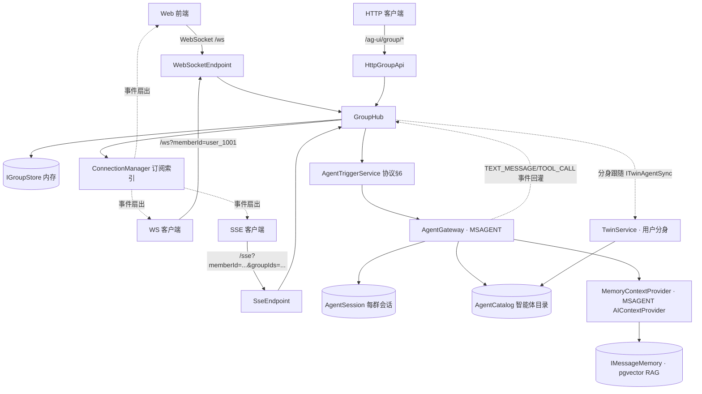

# AG-UI 群聊扩展协议 Hub（.NET 10）

基于《AG-UI 群聊扩展协议标准 v1.0》实现的群聊协议枢纽，C# / .NET 10（ASP.NET Core Minimal API）。

- ✅ 群组生命周期：创建 / 更新 / 解散（`GROUP_CREATED` / `GROUP_UPDATED` / `GROUP_DISBANDED`）
- ✅ 群成员管理：加入 / 移除 / 退群 / 角色与资料变更（`GROUP_MEMBER_*`）
- ✅ 消息扇出：用户消息以 `TEXT_MESSAGE_START/CONTENT/END` 三元组广播，支持 `all / mentioned / private` 三种可见范围
- ✅ 订阅机制：`GROUP_SUBSCRIBE` / `GROUP_UNSUBSCRIBE` / `GROUP_SUBSCRIBE_ACK` / `GROUP_STATE_SNAPSHOT`
- ✅ 双传输：WebSocket（全双工）与 SSE（单向下行），心跳保活
- ✅ 智能体触发规则（协议 §6）：提及触发 / 全量监听 / 关键词触发 / 语境触发（模型按上下文自主决定是否发言）
- ✅ **真实智能体网关**（`AguiGroupChat.Agents`）：基于 Microsoft Agent Framework（MSAGENT）实现 `IAgentGateway`，
  mock 提供方开箱即用（无密钥），亦可配置 OpenAI 兼容端点（Ollama / vLLM / Azure OpenAI）；
  触发后流式回灌 `TEXT_MESSAGE_START/CONTENT/END`，函数调用扇出 `TOOL_CALL_START`
- ✅ **人机交互（HITL，协议 4.5）**：工具可用 `ApprovalRequiredAIFunction` 标记需审批——模型调用时运行中断，
  群聊广播 `AGENT_INTERACTION_REQUEST` 交互卡片，**仅触发者可批准 / 拒绝**，决策后同一会话恢复运行
- ✅ **Web 演示前端**（`AguiGroupChat.Web`）：静态页面 + WebSocket 实时群聊，内置 @ 提及触发智能体
- ✅ **用户管理（Hub 扩展）**：注册 / 登录 / 登出 / 修改密码 / 资料维护，PBKDF2 密码哈希 + 会话令牌，WS/SSE 支持令牌鉴权（向后兼容）
- ✅ **AI 角色管理（Web 扩展）**：Web 界面可运行时新增 / 编辑 / 删除智能体（人设 / 触发规则 / 关键词 / 模型），不再局限于 appsettings 静态配置
- ✅ **持久化**：用户 / 登录会话 / 群组 / 成员 / 消息（含撤回）/ 触发规则 / 智能体定义统一快照落盘（JSON 单文件或 postgres / mysql / sqlite 三套数据库实现），重启自动恢复
- ✅ **话题（群聊扩展）**：群内独立讨论线，可切换 / 新建 / 「以此消息新建话题」/ 删除；话题级未读计数与读位点
- ✅ **链接代理**：智能体回复中的 http/https 链接由 Hub 代访后返回前端（`GET /ag-ui/proxy`）——浏览器端无法直连的内网地址 / 混合内容也可正常查看与下载（含正确文件名）
- ✅ **数据导出 / 导入**：账号（含密码哈希）+ 智能体 + 聊天记录 + 附件整体打包 zip（`GET /ag-ui/export`），导入时勾选要恢复的群并自动检查补齐账号 / 智能体（`POST /ag-ui/import/preview` / `/import`）
- ✅ **运行时模型配置与初始化**：登录后可在界面填写 DeepSeek endpoint / apiKey（留空用官方端点与环境变量，`GET/POST /ag-ui/settings/model`），重启不丢；用户菜单「数据备份」内提供「初始化（清空一切）」（`POST /ag-ui/reset`，清空数据 + 浏览器缓存）
- ✅ **桌面版多实例**：WPF / Avalonia 客户端共享同一后端进程（固定 5200），第一个实例启动 `--backend` 子进程、最后一个实例关闭才停后端；支持一次打开多个窗口
- ✅ **思考模式（AG-UI 桥接）**：外部服务的 `REASONING_MESSAGE_CONTENT` 独立通道回灌，前端渲染可折叠「思考过程」块；工具调用简洁展示（「🔧 名称 调用中…」→ 完成后收起）

## 项目结构

```
src/AguiGroupChat.Hub/           # 协议 Hub：入口与装配（Program.cs / HubApp.cs）、模型、存储、消息、传输、选项
src/AguiGroupChat.Hub/Users/     # 用户管理：AuthService（注册/登录/会话/改密）、PasswordHasher（PBKDF2）、IUserStore、UserApi
src/AguiGroupChat.Hub/Persistence/ # 持久化：PersistenceService（快照落盘/恢复）、ChangeHub、HubSnapshot DTO
src/AguiGroupChat.Agents/        # MSAGENT 智能体网关：AgentGateway（IAgentGateway 实现）、AgentCatalog、MemoryContextProvider（RAG 注入）、KnowledgeBaseCatalog（知识库：文档切片向量 + 检索）、TwinService（用户分身 + ITwinAgentSync 钩子）、IAgentDefinitionStore（私密智能体归属）、MockChatClient、技能（AgentSkillCall 智能体间调用）；embedding 抽象（IEmbeddingProvider：HTTP / LLamaSharp 本地模型）；内置工具集（Tools/：calculator / unit_converter / group_memory_search / read_attachment / web_search / read_url）
src/AguiGroupChat.Web/           # 演示 Web：组合根（Hub + Agents）+ 静态前端（index.html / app.js）+ TwinApi / AgentApi 等管理接口
src/AguiGroupChat.Desktop/       # 纯桌面版（Windows，WPF + WebView2）：SQLite + sqlite-vec 记忆、LLamaSharp 本地 embedding（捆绑 bge-m3 模型）
src/AguiGroupChat.Desktop.Core/  # 桌面共享宿主（纯托管，跨平台）：进程内 Kestrel 组装 Hub + 网关 + API + 前端
src/AguiGroupChat.Desktop.Cross/ # 跨平台桌面壳（Avalonia 12 + 官方 WebView）：Windows=WebView2 / macOS=WKWebView / Linux=WebKitGTK
tests/AguiGroupChat.Hub.Tests/   # 单元 / 集成测试（真实 Kestrel + ClientWebSocket），含 SQLite + sqlite-vec 向量记忆测试
samples/AguiGroupChat.Client/    # 示例 WS 客户端
tools/agents-starter.json        # 行业智能体包（25 个角色）：登录后在「智能体管理 → 导入 JSON」选择该文件即批量创建
tools/build-msi.ps1              # WiX v4 MSI 安装包构建（perUser 安装到 %LocalAppData%\AguiGroupChat；剔除全平台运行库，捆绑 bge-m3 模型，MSI 约 580MB）
tools/download-embedding-model.ps1 # 手动获取 embedding 模型（不捆绑模型的瘦身版可用；默认 nomic-embed-text-v1.5.Q8_0）
tools/verify-hitl.mjs            # 人机交互（审批卡片）端到端验证脚本
tools/verify-agent-import.mjs    # 智能体批量导入验证脚本
```



## 快速开始

```bash
# 方式一：Web 演示（Hub + MSAGENT 智能体网关 + 静态前端，浏览器打开 http://localhost:5200）
# 默认 Provider=deepseek，需先配置 API Key（见下文「接入 DeepSeek」）
dotnet run --project src/AguiGroupChat.Web

# 方式二：仅协议 Hub（无前端、无智能体回复）
# ⚠️ 此项目内 IAgentGateway 为占位实现（NoopAgentGateway）：智能体触发后只记日志、不产生回复。
# 要看到 AI 回复请使用方式一。
dotnet run --project src/AguiGroupChat.Hub

# 方式三：纯桌面应用（Windows）：WPF + WebView2 窗口，数据落 SQLite（sqlite-vec 语义记忆），
# embedding 用 LLamaSharp 本地模型，已捆绑 bge-m3（1024 维，models/embedding.gguf），开箱即用
# 支持多实例：多次启动共享同一后端进程（固定 5200，第一个实例自动拉起 --backend 子进程），
# 每个实例独立窗口，最后一个实例关闭才停后端（详见 src/AguiGroupChat.Desktop/README.md）
dotnet run --project src/AguiGroupChat.Desktop

# 方式四：跨平台桌面版（macOS / Linux / Windows）：Avalonia 12 + 官方 WebView 控件，
# 同一套进程内宿主（src/AguiGroupChat.Desktop.Core），体验与方式三一致
# 详见 src/AguiGroupChat.Desktop.Cross/README.md
dotnet run --project src/AguiGroupChat.Desktop.Cross
```

示例数据：群 `group_xxx`（产品需求评审群），成员 `user_1001`（张三，群主）、`user_1002`（李四）、`agent_prd`（需求助手，提及触发）、`agent_code`（代码助手，语境触发：不 @ 也能根据上下文主动发言）。

```bash
# 终端 1：示例 WS 客户端（连接 + 订阅 + 打印事件，20 秒后退出）
dotnet run --project samples/AguiGroupChat.Client -- --memberId user_1001 --groupIds group_001

# 终端 2：另一个成员加入同一群
dotnet run --project samples/AguiGroupChat.Client -- --memberId user_1002 --groupIds group_001 --send "大家好"
```

## 容器化部署（Docker）

项目提供多阶段 `Dockerfile`（Web 演示）、`Dockerfile.hub`（仅协议 Hub）与一键编排的 `docker-compose.yml`。

**默认即完整 RAG 语义记忆栈**：一条命令启动 postgres（pgvector）+ 内置 Ollama（自动拉取 embedding 模型）+ Web。

```bash
# 一键启动（postgres + 内置 ollama 语义记忆 + Web），浏览器打开 http://localhost:5200
# 首次启动内置 ollama 会自动拉取 bge-m3 模型（约 1.2GB），之后进入即时可用状态
# 若 .env 不存在，先复制：cp .env.example .env
cp .env.example .env

# 启动全部服务（依赖镜像首次拉取 + 构建较慢，耐心等待）
docker compose up -d --build

# 查看启动日志：确认出现「语义记忆已启用」且 ollama 完成模型拉取
docker compose logs -f web
docker compose exec ollama ollama list

# 如需同时启动仅协议 Hub（http://localhost:5100）
docker compose --profile hub up -d

# 停止（数据保留在命名卷，再次 up 数据完整）
docker compose down
```

配置项在 `.env` 中设置（参照 `.env.example`）：

| 变量 | 默认 | 说明 |
|---|---|---|
| `DEEPSEEK_API_KEY` | 空 | DeepSeek API Key（也支持 `OPENAI_API_KEY`） |
| `AGENTS_PROVIDER` | `deepseek` | 模型提供方：`mock` / `openai` / `deepseek` |
| `AGENTS_ENDPOINT` | 空 | OpenAI 兼容端点（如 `http://host.docker.internal:11434/v1`） |
| `AGENTS_MODEL` | `deepseek-chat` | 默认模型名 |
| `AGENTS_ENABLE_TOOLS` | `true` | 是否启用工具调用（默认开启：内置 `get_current_time` 免审批 + `publish_announcement` 需审批） |
| `AGENTS_REQUIRE_APPROVAL_TOOLS` | `publish_announcement` | 需**人机交互审批**的工具名（命中后用 `ApprovalRequiredAIFunction` 包装：模型调用时运行中断，聊天区弹出 🔐 审批卡片，仅发起请求的用户可批准 / 拒绝） |
| `STORAGE_PROVIDER` | `postgres` | 存储模式：`postgres`（默认，企业级落盘）或 `memory`（进程内 + JSON 快照） |
| `PG_DATABASE` / `PG_USER` / `PG_PASSWORD` | `agui` / `postgres` / `agui` | PostgreSQL 库名 / 用户 / 密码（`STORAGE_PROVIDER=postgres` 时生效） |
| `STORAGE_CONNECTION_STRING` | 指向内置 postgres | 自定义连接串（可指向外部 PostgreSQL 实例） |
| `MEMORY_ENABLED` | `true` | 语义记忆（RAG）开关：需 `STORAGE_PROVIDER=postgres` + pgvector 扩展（compose 已内置） |
| `MEMORY_EMBEDDING_ENDPOINT` | `http://ollama:11434/v1` | OpenAI 兼容 embedding 端点（默认指向 compose 内置 ollama；自备外部实例可改） |
| `MEMORY_EMBEDDING_MODEL` | `bge-m3:latest` | embedding 模型名（改模型时须同步改 `MEMORY_EMBEDDING_DIMENSIONS`） |
| `MEMORY_EMBEDDING_DIMENSIONS` | `1024` | 向量维度（bge-m3=1024、MiniLM=384、qwen3-embedding=2560） |
| `MEMORY_TOP_K` / `MEMORY_MIN_SCORE` | `5` / `0.25` | 每次回复注入的记忆条数 / 相似度阈值。**`group_memory_search` 工具更严格**：阈值取 max(0.40, MIN_SCORE)、最多 3 条，低相关命中物理过滤，避免记忆泛滥 |
| `MEMORY_EMBEDDING_TIMEOUT` | `60` | embedding 调用超时（秒）。CPU 环境首次加载 bge-m3 需数十秒 |
| `MEMORY_SCOPE` | `agent` | 检索范围：`agent` 该智能体所在的所有群（默认）/ `group` 仅当前群 / `all` 全部群 |
| `MEMORY_PERSONAL_TOP_K` / `MEMORY_PERSONAL_MIN_SCORE` | `3` / `0.25` | 个人记忆：回复时注入的「触发者本人历史发言」条数 / 相似度阈值。能力总开关（默认开）；实际是否注入还取决于**用户与智能体各自的开关**（默认均关） |
| `SEED_SAMPLE_DATA` | `true` | Web 演示：无历史数据时播种示例数据 |
| `SEED_SAMPLE_DATA_HUB` | `false` | 仅协议 Hub：是否播种示例数据 |
| `WEB_PORT` / `HUB_PORT` | `5200` / `5100` | 宿主机端口映射（与 `launchSettings.json` 一致） |
| `OLLAMA_PORT` | `11435` | 内置 Ollama 宿主机端口（默认避开本机 Ollama 的 11434） |
| `OLLAMA_KEEP_ALIVE` | `-1` | 模型常驻内存（-1=永驻；改 `5m` 空闲 5 分钟后卸载、释放约 1.1GB 内存） |
| `PG_PORT` | `5432` | PostgreSQL 宿主机映射端口（容器内不受影响） |

要点：

- **默认即 RAG 语义记忆**：`STORAGE_PROVIDER=postgres`（compose 内置 `pgvector/pgvector:pg16` 镜像）+ `MEMORY_ENABLED=true`（embedding 由内置 `ollama` 服务提供，启动时自动 `ollama pull bge-m3:latest`）。
  首次启动拉取模型约 1.2GB，模型与数据分别落在命名卷 `agui-ollama-data` / `agui-pg-data`，`docker compose down` 不丢数据。
- **默认即人机交互（HITL）演示**：`AGENTS_ENABLE_TOOLS=true`（compose 默认）——智能体内置工具：`get_current_time` / `calculator` / `unit_converter` / `group_memory_search` / `read_attachment` 免审批，`publish_announcement` 需审批（群聊中请智能体「发布公告」→ 🔐 审批卡片，**仅发起请求的用户**可批准 / 拒绝）；`AGENTS_REQUIRE_APPROVAL_TOOLS` 可自定义需审批的工具名，如需多个工具请在 `docker-compose.yml` 追加 `Agents__RequireApprovalToolNames__1` 等索引项；联网工具 `web_search` / `read_url` 默认关（`AGENTS_ENABLE_WEBTOOLS=true` 开启）。
- **内置 Ollama 与宿主机隔离**：web 容器内走内网 `http://ollama:11434/v1`，宿主机映射端口默认 `OLLAMA_PORT=11435`（避开本机 Ollama 的 11434）；模型拉取失败不会导致容器退出，web 侧会打印告警日志。
- **PostgreSQL 模式**：群 / 成员 / 话题 / 消息 / 用户 / 智能体触发规则与定义全部写入 PostgreSQL，重启容器数据完整保留。
  `STORAGE_PROVIDER=memory` 切换回内存 + JSON 快照模式（此时语义记忆不可用）。
- 镜像以非 root 用户（`app`）运行，内置健康检查 `GET /ag-ui/health`。
- 不使用 Compose 时可直接构建运行（此时需自备 pgvector 版 PostgreSQL 与 Ollama）：

  ```bash
  docker build -t agui-group-chat-web .
  docker run --rm -p 5200:8080 -e DEEPSEEK_API_KEY=sk-xxx -v agui-web-data:/app/data agui-group-chat-web
  ```

## 传输端点

| 端点 | 说明 |
|---|---|
| `GET /ws?memberId=user_1001` | WebSocket 全双工。握手后先收到 `GROUP_CONNECTED`（含 `connectionId`），再通过事件订阅 |
| `GET /sse?memberId=user_1001&groupIds=g1,g2` | SSE 单向下行，`data: {json}\n\n`，心跳为注释行 |
| `POST /ag-ui/group/subscribe` | SSE 动态订阅（`{"connectionId":"...","groupIds":[...]}`，connectionId 来自握手） |
| `POST /ag-ui/group/unsubscribe` | 同上，取消订阅 |

> 身份校验：携带有效会话令牌（`&token=...` 或 `Authorization: Bearer`）时，WS/SSE 一律以**令牌身份**连接（覆盖 memberId 参数，防伪造）；
> 未携带令牌时回退到按 `memberId` 查询参数信任身份（兼容旧客户端与示例），除非配置 `Auth:RequireTokenOnRealTime=true` 强制要求令牌。

WebSocket 上行事件（`type` 判别）：`GROUP_SUBSCRIBE`、`GROUP_UNSUBSCRIBE`、`GROUP_MESSAGE_SEND`、`GROUP_MESSAGE_RECALL`、`GROUP_TYPING`、`GROUP_MESSAGE_READ`。
其中 `GROUP_MESSAGE_SEND` / `GROUP_MESSAGE_RECALL` / `GROUP_TYPING` / `GROUP_MESSAGE_READ` 中的身份字段一律以连接身份覆盖（防伪造）。

## HTTP 上行 API（协议 §5）

| 接口 | 路径 | 核心参数 |
|---|---|---|
| 创建群组 | `POST /ag-ui/group/create` | groupName、ownerId、isPrivate*、memberIds、members*；**groupName 留空可先调群名自动生成** |
| 群名自动生成 | `POST /ag-ui/group/generate-name` | memberNames（已选成员昵称列表，需登录）：按成员由模型生成 6-12 字群名，mock 提供方输出确定性模板 |
| 更新群信息 | `POST /ag-ui/group/update` | groupId、updateFields、groupInfo、operatorId |
| 解散群组 | `POST /ag-ui/group/disband` | groupId、operatorId |
| 添加成员 | `POST /ag-ui/group/member/add` | groupId、memberIds、operatorId |
| 移除成员 | `POST /ag-ui/group/member/remove` | groupId、memberIds、operatorId |
| 主动退群 | `POST /ag-ui/group/member/leave` | groupId、memberId |
| 更新成员 | `POST /ag-ui/group/member/update` | groupId、memberId、updateFields、memberInfo、operatorId |
| 发送消息 | `POST /ag-ui/group/message/send` | groupId、userId、content、mentions、attachments*、replyToMessageId…（content 可空，纯附件消息） |
| 上传附件 | `POST /ag-ui/upload` | multipart 的 `file` 字段（可多个），返回附件元信息列表（需登录；**仅限白名单扩展名**，脚本类 html/js/svg 等拒绝） |
| 附件下载 | `GET /ag-ui/files/{attachmentId}/{name}` | 按附件 ID 返回文件内容（支持 Range，图片可预览；**需身份且是该附件所在群的成员**，否则 401/403；**头像附件放行**：附件是任意用户 / 智能体（含分身）头像时已登录用户可访问；响应带 nosniff 与安全响应头） |
| 撤回消息 | `POST /ag-ui/group/message/recall` | groupId、messageId、operatorId |
| 正在输入 | `POST /ag-ui/group/message/typing` | groupId、memberId、isTyping |
| 已读回执 | `POST /ag-ui/group/message/read` | groupId、memberId、readMessageId（落读位点：按成员×群×话题，供群列表 / 话题未读提示） |
| 人机交互决策 | `POST /ag-ui/group/interaction/resolve` | groupId、interruptId、approved（**仅触发者可决策**，其他成员 400） |
| 群详情快照 | `GET /ag-ui/group/{groupId}` | 返回 `GROUP_STATE_SNAPSHOT` 结构 |
| 成员列表 | `GET /ag-ui/group/{groupId}/members` | — |
| 智能体注册 | `POST /ag-ui/agent/register` | agentId、groupIds、triggerMode、keywords*、override（true=群内覆盖角色默认） |
| 智能体目录 | `GET /ag-ui/agents` | 运行时可变的全部智能体（含 appsettings 种子）；**私密智能体仅创建者可见** |
| 新增智能体 | `POST /ag-ui/agents` | nickname、instructions、triggerMode、keywords、model、isPrivate*（需登录；私密智能体记录创建者） |
| 更新智能体 | `PUT /ag-ui/agents/{agentId}` | 同上，并同步已加入群的触发规则（需登录；**仅创建者可更新**，内置智能体只读） |
| 删除智能体 | `DELETE /ag-ui/agents/{agentId}` | 移除目录 / 触发规则，并从所有群退出（需登录；**仅创建者可删除**，内置智能体只读） |
| 链接代理 | `GET /ag-ui/proxy?url=` | Hub 代访智能体回复中的 http/https 链接并返回内容（需登录）：内网地址 / 混合内容浏览器端无法直连，由服务端统一访问；HTML 响应以 CSP sandbox 沙箱化，下载带正确文件名；`LinkProxy:AllowPrivate` 默认 false（需代访内网时显式开启；关闭则走 SSRF 防护） |
| 数据导出 | `GET /ag-ui/export` | 导出账号（含密码哈希）+ 智能体 + 聊天记录 + 附件为 zip（`manifest.json` + `files/`），需登录 |
| 导入预览 | `POST /ag-ui/import/preview` | 上传 zip，返回账号 / 智能体存在性检查与群清单（multipart 的 `file` 字段） |
| 导入执行 | `POST /ag-ui/import` | 上传 zip + `selectedGroupIds`（JSON 数组），勾选群导入；账号缺失自动创建（已存在更新资料、密码保留）、智能体缺失自动创建、附件与头像文件还原 |
| 模型配置查询 | `GET /ag-ui/settings/model` | 返回当前 endpoint / 是否已配置 apiKey / provider / configured（前端据此判断是否弹出配置） |
| 模型配置保存 | `POST /ag-ui/settings/model` | `{endpoint?, apiKey?}`：endpoint 留空 → deepseek 自动官方端点 `https://api.deepseek.com`；apiKey 留空 → 环境变量（`DEEPSEEK_API_KEY` / `OPENAI_API_KEY`）；即时生效并持久化（扩展区 `modelConfig`） |
| 系统初始化 | `POST /ag-ui/reset` | 清空账号 / 智能体 / 群 / 消息 / 附件 / 记忆 / 会话 / 配置（数据库模式同步清空全部业务表）；需登录 |
| 健康检查 | `GET /ag-ui/health` | connections / groups 计数 |

`*` = Hub 扩展字段。错误响应统一为 `{"code":"GROUP_XXX","message":"..."}`，状态码映射：403 权限、404 不存在、409 群满、400 参数错误。
HTTP API 的枚举字段（`memberType`/`role` 等）已配置字符串化（`user`/`agent`、`owner`/`admin`/`normal`），与协议 §2 一致。

**写操作鉴权（与 WS / SSE 一致）**：群管理 / 消息 / 话题 / 智能体注册等全部写接口统一走身份解析——
携带 `Authorization: Bearer <token>`（或 `?token=`）时以**令牌身份为准**，覆盖请求体中的 `ownerId` / `operatorId` / `userId` / `memberId`（登录用户无法伪造他人身份，如冒充群主解散）；
`Auth:RequireTokenOnRealTime` **默认 true**：未携带有效令牌的连接（WS / SSE）与全部写请求一律 401（公网部署务必保持开启）；设为 false 仅用于旧客户端 / 演示模式回退（存在 `?memberId=` / 请求体身份冒充风险，仅限内网调试）。
**读接口鉴权（安全加固）**：群快照 / 成员列表 / 消息历史分页 / 话题列表等 GET 查询接口均要求身份并校验**调用者是该群成员**（非成员 403，群不存在 404）；`GET /ag-ui/member/{memberId}/groups` 仅本人可查（403 越权）。
智能体管理（目录 / 新增 / 编辑 / 删除）与分身、上传接口本就要求登录令牌；`/ag-ui/agents/register`（前端建群 / 加成员路径）校验调用者为群成员且智能体是该群成员，`/ag-ui/agent/register`（协议面）同样按上述规则校验。

## 用户管理（Hub 扩展）

| 接口 | 路径 | 说明 |
|---|---|---|
| 注册 | `POST /ag-ui/user/register` | `username`、`password`（≥6 位）、可选 `nickname`/`avatar`；注册即登录，返回 `userId`（user_xxx）+ `token` |
| 登录 | `POST /ag-ui/user/login` | `username` + `password` → `token`（默认有效期 7 天，滑动续期）。**安全加固**：先验密后计次（正确密码不被错误尝试锁死）、哑 PBKDF2 拉平时序（防用户名枚举）、单用户名窗口内 10 次失败限速 |
| 登出 | `POST /ag-ui/user/logout` | 吊销当前令牌 |
| 当前用户 | `GET /ag-ui/user/me` | 需令牌，返回资料 |
| 修改密码 | `POST /ag-ui/user/password` | `oldPassword` + `newPassword`；成功后吊销该用户全部旧会话（需重新登录） |
| 修改资料 | `PUT /ag-ui/user/profile` | `nickname` / `avatar` / `personalMemoryEnabled`（个人记忆开关，默认关） |
| 用户目录 | `GET /ag-ui/users` | 注册用户列表（前端建群成员选择器，公开只读） |
| 分身状态 | `GET /ag-ui/twin` | 当前用户分身状态（需登录） |
| 启用分身 | `POST /ag-ui/twin/enable` | `triggerMode`；生成人设并加入全部公开群（需登录） |
| 修改分身触发 | `POST /ag-ui/twin/trigger` | `triggerMode`；同步全部公开群注册（需登录） |
| 同步分身 | `POST /ag-ui/twin/sync` | 补齐启用后新建 / 加入的公开群（需登录） |
| 停用分身 | `POST /ag-ui/twin/disable` | 删除分身并退出全部群（需登录） |

- 除注册 / 登录 / 用户目录外，均需携带令牌：`Authorization: Bearer <token>`（或 `?token=`）。
- 密码以 **PBKDF2（SHA-256，10 万轮 + 随机盐）** 哈希存储，密码明文不落库；令牌为 32 字节随机数，存于进程内（`IUserStore`/会话均可替换为 Redis、数据库或 JWT）。
- 注册用户自动获得 `user_xxx` 身份，与群成员体系（memberId）直接复用，可被加入任意群。
- 错误码：`USER_EXISTS`(409)、`USER_BAD_CREDENTIALS`(401)、`USER_UNAUTHORIZED`(401)、`USER_PASSWORD_INVALID`(400)、`USER_NOT_FOUND`(404)。
- Web 前端启动进入登录 / 注册页，登录后右上角菜单可修改密码 / 资料 / 退出；登录页可勾选**「保持登录状态」**（除非退出登录，否则下次访问无需再次登录）；顶栏 **☀️ / 🌙** 按钮切换深色 / 浅色界面风格（选择持久化）。
- **会话跨重启保持**：登录会话（令牌哈希）随持久化扩展区 `agui_sections` 落库并在启动时恢复——桌面版每次启动/重启本地服务后、以及 Web 容器重启后，「保持登录状态」依然有效（会话原为进程内存态，重启即失效）。
- **群 / 话题记忆（本地持久化，按用户隔离）**：记住用户**最后选择的群**（再次登录自动进入）与**每个群最近使用的话题**（再次进入该群自动选中；话题被删除则回退主话题）。

Web 界面支持**创建群**与**添加成员**：群列表右上角「＋」→ 输入群名、勾选成员（含智能体）→ 创建后自动进入新群；
**不填群名也可创建**：由 AI 按所选成员自动生成 6-12 字群名（`POST /ag-ui/group/generate-name`，需登录）。
**群列表按活跃度排序**：最后发言的群排在最前（`lastMessageAt`）；**未读提示**：群列表显示该群未读合计徽标，话题栏每个话题（含主话题）显示各自未读数——
读位点按成员×群×话题落库（进入群 / 切话题 / 当前话题收到新消息时前端自动发已读回执 `POST /ag-ui/group/message/read` 清零，刷新群列表以服务端计算为准）。
成员面板右上角「＋」→ 勾选群外成员（含智能体）→ 添加后成员列表实时更新。
两种操作都会为勾选的智能体自动注册该群的触发规则（`POST /ag-ui/agents/register`，供前端使用的智能体目录为 `GET /ag-ui/agents`）。
群列表与成员列表底部均有「🔄 刷新」按钮；聊天区右上角「⚙ 群设置」可改群名 / 头像 / 私密开关并可**解散群**（仅群主）。
**话题管理**：话题栏可新建话题（支持「以此消息新建话题」引用某条发言）、切换话题（按群记住最近使用的话题）；
群主 / 管理员可在话题栏**清空某话题聊天记录**（🧹，含主话题 `main`，消息与对应语义记忆一并删除、话题保留）或**删除话题**（🗑，话题及其下记录一并删除）。
**私密群**（创建群对话框「🔒 私密群」开关）：私密群的记忆仅限本群内检索，群列表 / 聊天标题显示 🔒 标识。
**私密智能体**（智能体表单「🔒 私密智能体」开关）：仅创建者可将其拉入群（建群 / 加成员时服务端校验归属），目录对其他用户隐藏，编辑 / 删除同样仅限创建者。
个人资料（顶栏昵称 → 修改资料）支持上传头像与修改昵称、**个人记忆开关**（🧠，默认关），变更同步到各群成员资料。
**AI 分身**（修改资料 → 「AI 分身」区）：用户可自行启用分身——服务端聚合该用户在**所有公开群**的发言记录，调用模型生成人设（Instructions），
以私密智能体 `twin_{userId}`（仅创建者可管理）加入其所在全部公开群；
**触发方式可随时修改**（`POST /ag-ui/twin/trigger` 同步各公开群），「同步到公开群」可补齐启用后新建的群，停用即删除分身并退出全部群。
**分身不出现在「🤖 智能体」管理目录**（`twin_*` 前缀为系统保留：目录过滤、PUT/DELETE 拦截、创建拒绝），只经「修改资料 → AI 分身」自我管理。
**在线 / 离线互斥**：用户在线时成员列表显示本人、分身暂停；离线时成员列表以 🪞 图标显示分身（隐藏用户本人），由分身代班回复。
**在线召唤分身**：即使在线（分身常规暂停），用户只需在群内 **@ 自己**（提及自己而非分身），即可临时召唤分身立即回答——召唤按「提及」语义直接发言（不走语境决策），且仅发送者 @ 自己生效（他人 @ 不召唤；分身须为本群成员）。
私密群内容不参与人设生成，分身也不进入私密群。
聊天消息支持 **Markdown 渲染**（标题 / 加粗 / 列表 / 表格 / 代码块 / 引用 / 链接等，GFM 语法）：流式过程中以纯文本显示避免闪烁，结束渲染；
渲染前经 DOMPurify 消毒防 XSS（`<script>`、事件属性、`javascript:` 协议链接均被清除），外链自动加 `target=_blank`。前端依赖库（marked / DOMPurify）已本地化至 `wwwroot/vendor/`，无需外网。

**AI 角色管理**：顶栏「🤖 智能体」打开管理面板，登录后即可新增 / 编辑 / 删除**自己创建**的智能体（删除为行内两步确认）——
配置昵称、头像（本地图片上传）、一句话简介、人设（Instructions）、触发模式（提及 / 全量监听 / 关键词 / 语境）、关键词与模型（可选，覆盖全局默认）、
**个人记忆**（🧠，默认关）与**私密智能体**（🔒，仅创建者可拉群 / 编辑 / 删除）。
**一键生成角色设定**：在「一句话简介」输入框旁点击「✨ 生成角色设定」，调用模型根据简介自动生成**身份定位 / 职责范围 / 回复风格要求**三段设定，
填充到 Instructions（`POST /ag-ui/agents/generate-instructions`，需登录；`Provider=mock` 时输出确定性模板，无需 API Key），生成后可检查微调。
**归属校验（安全加固）**：编辑 / 删除仅限创建者（`OwnerId`）；系统内置智能体（`OwnerId` 为空）只读，前端不显示编辑 / 删除按钮，如需定制请导出后另建。
新建的智能体自动出现在建群 / 加成员的勾选目录中；删除时同步从其所在所有群移除并清理触发规则。
**导出 / 导入**：工具栏「📤 导出全部」与每行「导出」把配置导出为 JSON 文件（格式 `{version, agents:[…]}`，敏感令牌与归属不导出）；
「📥 导入」读取 JSON 逐条创建（需登录，归属当前用户；agentId 冲突自动改 ID 不覆盖）。
用户与智能体的头像均支持本地图片上传（复用 `/ag-ui/upload`），头像显示在群成员列表、聊天消息与顶栏；
头像 / 昵称变更会自动同步到其所在各群的成员资料并广播 `GROUP_MEMBER_UPDATED`。

**数据备份与初始化（用户菜单 → 数据备份）**：

- **导出全部数据**（`📦 导出全部数据`）：账号（含密码哈希 / 盐，导入后原密码可直接登录）+ 智能体定义与触发规则 + 全部群的成员 / 话题 / 消息（含撤回 / 附件 / 思考内容）+ 附件与头像文件，打包为 zip（`manifest.json` + `files/`）；AI 分身与技能目标子代理不导出
- **导入数据**（`📥 导入数据`）：上传 zip → 后端返回<b>账号 / 智能体存在性检查</b>与群清单 → 勾选要恢复的群 → 执行导入：账号按 username 检查（缺失创建并保留密码哈希；**已存在则更新资料**——昵称 / 头像 / 个人记忆开关，密码保留现有不覆盖），智能体按 agentId 检查（缺失创建，含桥接配置与触发规则），消息发送者 / 提及 / 可见列表按账号映射重写，附件与头像文件按原 `attachmentId` 还原；导入的群使用新 groupId 避免冲突，消息直接落库不触发智能体
- **初始化（清空一切）**（`🗑 初始化`，危险操作区，需输入「确认」）：删除全部数据（账号 / 智能体 / 群 / 消息 / 附件 / 语义记忆 / 会话 / 配置），所有已登录端立即失效，并<b>清空浏览器缓存</b>回到登录页；再次进入系统时自动弹出<b>模型配置</b>界面

**模型配置（用户菜单 → 模型配置）**：运行时填写 DeepSeek `Endpoint` 与 `API Key`——
endpoint 留空用官方端点 `https://api.deepseek.com`；apiKey 留空用环境变量（`DEEPSEEK_API_KEY` / `OPENAI_API_KEY`）。
保存后**即时生效**（`AgentCatalog` 缓存失效，下次触发按新配置重建客户端），经持久化扩展区 `modelConfig` 跨重启保持；
apiKey 不回显（仅提示是否已配置）。未配置过模型时，登录后自动弹出配置界面。

消息附件（Hub 扩展）：前端先 `POST /ag-ui/upload` 取得附件元信息（`attachmentId`/`name`/`contentType`/`size`/`url`/`kind`），
再随 `GROUP_MESSAGE_SEND`（WS）或 `message/send`（HTTP）以 `attachments` 数组携带；事件与快照（`TEXT_MESSAGE_START` / `GROUP_STATE_SNAPSHOT`）同样携带，历史消息可完整渲染。
智能体消费附件时：`text` 类（txt / md / json / csv 等）与 `document` 类办公文档（docx / xlsx / pptx / pdf）
由服务端提取文本注入模型上下文（Word 取正文与表格段落、Excel 按工作表输出单元格、PowerPoint 取幻灯片文本、PDF 逐页提取；单文件截断 12K 字符），
`image` / `binary` 类携带文件名 / 大小 / 下载地址供模型感知。
上传文件落盘 `data/uploads/`（与持久化快照同根，Docker 命名卷一并持久化），单文件上限 20 MB、单次最多 9 个；旧格式 `.doc` / `.xls` / `.ppt` 不在支持范围，请另存为 OOXML 或 PDF 后上传。
**安全加固**：上传仅允许白名单扩展名（图片 png/jpg/jpeg/gif/webp/bmp；文本 txt/md/json/csv/yml 等；文档 pdf/docx/xlsx/pptx；zip；**拒绝 html/js/css/svg/xml 等脚本类**）；
下载需登录且调用者须为该附件所属群的成员，响应带 `X-Content-Type-Options: nosniff`，脚本类扩展名强制 `Content-Disposition: attachment` 下载（不内联渲染）；
页面全局 CSP（`script-src 'self'` 等）+ `X-Frame-Options: DENY`。

## 链接代理（Hub 代访外部链接）

智能体回复（尤其外部 AG-UI 桥接）中的 Markdown 链接常指向与 Hub 同网络的内部服务（`127.0.0.1` / `192.168.x.x` 等），浏览器端无法直连；前端 `renderMarkdown` 会把所有 http/https 链接重写为 `GET /ag-ui/proxy?url=…`，由 Hub 服务端代访后返回内容（原链接存入 `title` 便于查看真实地址）。

- **安全收口**：登录鉴权（与附件下载一致）；仅 http/https scheme（其余 400）；单次最大 8MB（超限截断）；30s 超时；重定向最多 5 跳；不可达 502 / 超时 504
- **内网策略**：`LinkProxy:AllowPrivate` 默认 `false`（默认仅代访公网地址，走 `IsPrivateOrLoopback` SSRF 防护：拒绝环回 / 私网 / 云元数据地址）。外部 AG-UI 需代访内网服务时须显式开启 `LinkProxy:AllowPrivate=true`（此时连接级 `ConnectCallback` 对重定向逐跳仍做一致性校验）
- **HTML 沙箱化**：`text/html` 响应加 `Content-Security-Policy: sandbox; default-src 'none' …`，禁止脚本 / 表单 / 同源访问，防止代理页执行目标页面脚本；统一 `nosniff` + `Referrer-Policy: no-referrer`
- **下载文件名**：按目标响应 `Content-Disposition` → URL 路径段 → content-type 兜底扩展名的顺序推导，`filename*`（RFC 5987）支持中文名；图片 / 纯文本 / PDF 内联预览，其余强制下载

## 事件目录（协议映射）

| 事件 | 协议章节 | Hub 行为 |
|---|---|---|
| `GROUP_CREATED` / `GROUP_UPDATED` / `GROUP_DISBANDED` | 4.2 | 广播给当前已订阅连接；UPDATED 支持 `isPrivate` 等字段变更；解散时该群全部语义记忆物理删除，之后该群所有事件终止 |
| `GROUP_MEMBER_JOINED` / `LEFT` / `UPDATED` | 4.3 | 广播；LEFT 支持 `voluntary`/`kick`；被移出者先收到事件再解除订阅 |
| `TEXT_MESSAGE_START/CONTENT/END` | 4.4 | 用户消息以三元组扇出，START/END 携带群扩展字段，CONTENT 保持原生格式 |
| `GROUP_MESSAGE_RECALLED` | 4.4 | 全群广播，消息落库标记撤回 |
| `GROUP_TYPING` / `GROUP_MESSAGE_READ` | 4.4 | 广播（不含动作发起者） |
| `TOOL_CALL_START` | 4.5 | 由 AG-UI 网关经 `BroadcastAsync` 回灌扇出 |
| `AGENT_INTERACTION_REQUEST` / `AGENT_INTERACTION_RESOLVE` | 4.5 | 工具审批类人机交互：运行中断广播请求（含 `targetMemberId`），**仅触发者可经 WS 上行或 HTTP 决策**，其余成员只读 |
| `AGENT_INTERACTION_RESOLVED` | 4.5 | 触发者决策生效后全群广播，其他成员卡片同步更新为「已批准 / 已拒绝」 |
| `GROUP_SUBSCRIBE_ACK` / `GROUP_STATE_SNAPSHOT` | 4.6 / 4.7 | 订阅成功返回 ACK + 快照（群信息 / 成员 / 最近消息） |
| `RUN_ERROR` | §7 | WS/SSE 通道错误事件，携带协议错误码 |
| `GROUP_CONNECTED` | Hub 扩展 | 连接握手，SSE 场景据此动态订阅 |

## 消息扇出规则（协议 2.3 visibility）

| visibility | 接收者 |
|---|---|
| `all` | 全群成员（已订阅连接） |
| `mentioned` | `mentionAll` → 全群；否则 `mentions` 命中成员；`mentions` 为空 → 仅发送者 |
| `private` | `visibleMemberIds` 命中成员；为空 → 仅发送者 |

- 发送者恒收到自己的消息（回显）；事件只推送给**当前已订阅**该群的连接。
- 非群成员无法订阅任何群，自然收不到任何推送（协议 3.2）。
- 消息正文仅 `START` / `END` 携带 `groupId` 等扩展字段，`CONTENT` 原生格式不变（协议 4.4）。

## 智能体触发与 AG-UI 网关（协议 §6）

消息发送后，`AgentTriggerService` 按注册规则评估：

- `Mentioned`：`mentions` 包含 agentId（或 `mentionAll`）→ 触发
- `AllMessages`：全量监听，接收所有群消息
- `Keyword`：正文命中关键词（忽略大小写）→ 触发
- `Contextual`（**语境触发**）：不要求 @ 或关键词——每次消息都会进入评估，由模型结合**群最近消息上下文**自主决定是否发言；判定不发言时静默跳过（不发任何事件，返回 `AGENT_DECIDED_SILENT`）

**@ 必触发规则**：任何智能体只要被消息 `@`（`mentions` 命中）或 `@全体`（`mentionAll`）即**必定触发**，不受其注册触发模式限制；
且此时以 `Mentioned` 语义调用（跳过语境沉默决策，确保必发言）。
前端输入框输入 `@` 会弹出群成员选择浮层（↑/↓ 选择、Enter 确认，选中后以 `@昵称` 回填输入框并加入 mentions）。
命中后调用 `IAgentGateway`（`src/AguiGroupChat.Hub/Agents/IAgentGateway.cs`）：

```csharp
public interface IAgentGateway
{
    Task<AgentInvocationResult> InvokeAsync(AgentInvocationContext context, CancellationToken ct);
    Task<bool> IsAvailableAsync(string agentId, CancellationToken ct);
}
```

`src/AguiGroupChat.Agents` 提供了基于 **Microsoft Agent Framework** 的真实实现 `AgentGateway`：

1. 触发后先广播 `GROUP_TYPING`，再以群为单位维护共享 `AgentSession`（客户端历史，默认 `InMemoryChatHistoryProvider`）；
2. `ChatClientAgent` 流式运行，文本增量经 `PublishAgentMessageStartAsync` / `AppendAgentContentAsync` /
   `EndAgentMessageAsync` 落库并扇出 `TEXT_MESSAGE_START/CONTENT/END`；
3. 模型函数调用经 `BroadcastAsync` 扇出 `TOOL_CALL_START`（协议 4.5）；异常广播 `RUN_ERROR`。

**人机交互（HITL，协议 4.5）**：工具可用 `ApprovalRequiredAIFunction` 包装标记「需审批」（`Agents:RequireApprovalToolNames` 名单，默认 `publish_announcement`）——
模型调用该工具时运行**中断**（不执行工具），网关保存运行现场并广播 `AGENT_INTERACTION_REQUEST`（含 `interruptId` / `toolName` / 参数 / `targetMemberId`）。
前端在消息流渲染交互卡片：**只有触发者（targetMemberId）能看到「批准 / 拒绝」按钮**，其他群成员只读等待。
触发者决策经 WS 上行 `AGENT_INTERACTION_RESOLVE`（或 `POST /ag-ui/group/interaction/resolve`）回传，
网关校验决策者身份后把「批准 / 拒绝」作为 User 消息回灌**同一 AgentSession** 恢复运行：批准 → 执行工具并继续回复；拒绝 → 跳过工具继续。
请求 10 分钟未决策自动过期（`AGENT_AWAITING_INTERACTION` / 决策越权返回错误）。
**AG-UI 桥接角色同样支持**（见下节）：外部服务（standard+HTTP / standard+WS / hub 方言）的审批中断会回传到本 Hub 广播审批卡片，决策后按各自协议恢复。
**内置工具（`Agents:EnableTools=true`，全局挂载到所有智能体）**：

| 工具 | 说明 | 审批 |
|---|---|---|
| `get_current_time` | 返回当前服务器时间（UTC ISO 8601） | 否 |
| `calculator` | 安全数学计算（手写解析器，无 eval/反射）：`+ - * / % ^`、括号、函数（sqrt/abs/round/floor/ceil/min/max/pow/log/ln/exp/sin/cos/tan）、常量 pi/e、科学计数 | 否 |
| `unit_converter` | 单位换算：长度/质量/温度/时间/数据量/速度（含中英文单位别名，温度 C/F/K 带偏移） | 否 |
| `group_memory_search` | 语义检索该智能体的历史记忆（同 RAG 的 Scope=agent，覆盖其所在的所有群），模型可主动回忆背景 | 否 |
| `read_attachment` | 按附件 ID 读取上传文件文本（txt/md/json/csv 与 docx/xlsx/pptx/pdf） | 否 |
| `publish_announcement` | 发布群公告（演示占位；默认需审批，人机交互 HITL） | **是** |

**网络工具（`Agents:EnableWebTools=true` 追加挂载，默认关，需外网）**：

| 工具 | 说明 |
|---|---|
| `web_search` | 网页搜索（默认 DuckDuckGo Instant Answer 免费端点，`Agents:WebSearchEndpoint` 可替换） |
| `read_url` | 读取网页正文（HTML 转文本；含私网/环回地址 SSRF 防护，拒绝内网目标） |

`publish_announcement` 命中 `Agents:RequireApprovalToolNames` 名单（默认值）后用 `ApprovalRequiredAIFunction` 包装；名单可自定义。
mock 模式下对含「公告」「计算」「换算」的消息自动模拟工具调用流程。

**知识库（Knowledge Base，RAG 知识文档）**：智能体可绑定若干<b>知识库</b>（`AgentDefinition.KnowledgeBaseIds`），
知识库由用户创建并上传文档（txt/md/json/csv 与 docx/xlsx/pptx/pdf，复用附件文本提取）——文档切片（800 字符/片 + 100 重叠）
后向量化存入语义记忆向量表（GroupId 约定 `kb:{KbId}`，`sender_type='kb'`），回复前经 `MemoryContextProvider` 按绑定列表检索相关片段注入上下文，
让智能体基于用户资料作答。**文档入库为异步处理**：上传后立即显示文档记录（`status=processing`），提取文本 / 切片 / 向量化在后台执行，
前端每 2s 轮询状态——`ready`（已入库，显示切片数）或 `error`（显示失败原因）；处理中的文档可随时移除（丢弃未写入的向量），
服务重启导致处理中断的文档恢复为 `error` 需重新上传。**知识库向量不参与群记忆检索**（群记忆 RAG 与 `group_memory_search` 均排除 `sender_type='kb'`，只经绑定路径读取）。
管理 API：`POST/GET/DELETE /ag-ui/kb`、`POST/DELETE /ag-ui/kb/{kbId}/documents(/docId)`
（仅创建者可管理；系统级知识库只读）；依赖向量存储与 embedding（与语义记忆同一套：pgvector / sqlite-vec + llama / http embedding），
不可用时文档入库返回明确错误。

**技能（Skills，智能体间调用，Microsoft Agent Framework）**：每个智能体可配置 `Skills` 列表，把<b>其他已注册智能体</b>
（含 AG-UI 桥接的外部专家）挂为可调用子代理——模型需要该领域信息时自动调起子智能体（经框架 `AgentSession` 执行一次 run），
并把其答复带回当前回复。配置项：`skillId`（给模型的工具名，同智能体内唯一，**留空自动生成 `skill_<目标ID>`，
冲突追加 `_2/_3`**，也可手填但仅允许字母/数字/下划线/连字符）、`description`（何时调用说明）、
`targetAgentId`（目标智能体）。防护：目标智能体不再递归挂载自身技能（单层展开，A→B→A 不会死循环）、不能指向自己、
目标不存在或 SkillId 非法时跳过并记日志。创建 / 编辑智能体时经 `POST/PUT /ag-ui/agents` 的 `skills` 字段提交，列表回显。

**智能体自建技能（`create_skill` 工具，需审批）**：`Agents:EnableTools=true` 时内置 `create_skill` 工具——
智能体在回复中需要特定领域专长时，可请求创建技能（参数：`skillName` / `instructions` 子智能体人设 / `description` 调用说明），
**强制走人机交互审批**（仅触发者可批准，不随 `RequireApprovalToolNames` 名单调整）：批准后动态创建技能目标智能体
（`agentId = skill_<skillName>`，标记 `IsSkillTarget`：不出现在智能体目录、不可被拉群、拒绝 HTTP 编辑/删除）并挂载到当前智能体，
快照持久化重启不丢，**下一条消息起生效**。同名技能复用并覆盖人设；每智能体最多自建 10 个；技能名须符合
`^[a-zA-Z0-9_-]{1,40}$`。mock 模式对含「创建技能 xxx」的消息自动模拟该流程。

**触发方式支持群内覆盖角色默认设定**：每个群内的智能体成员可单独指定触发方式（提及 / 全量监听 / 关键词 / 语境），
也可选「跟随角色默认」。群内设定（`POST /ag-ui/agents/register` 携带 `override=true`）会持久化保存，
之后编辑角色（`PUT /ag-ui/agents/{agentId}`）时**只同步未覆盖的群**，已覆盖的群保持群内设定不变；
群快照（`GROUP_STATE_SNAPSHOT`）的智能体成员带 `triggerMode` / `keywords` / `isTriggerOverridden` 字段，
Web 界面的群成员列表可直接改并保存。语境触发的发言决策同样按群内生效的触发模式判断。

**上下文滑动窗口**：为避免群聊记录无限增长拖慢模型生成，每次触发重建会话，上下文由网关从群存储注入最近 12 条消息
（单条截断 500 字符、过滤撤回、**仅注入全群可见消息**——定向可见性 private/mentioned 消息不进上下文），附件文本另行注入（单文件 12K 字符）。

**可见性隔离（安全加固）**：非全群可见的消息（`Visibility=private/mentioned`）不写入语义记忆、不进智能体上下文窗口；
智能体回复**继承触发消息的可见性**（定向触发的回复只推送给定向成员，不再默认全群广播）。

**回复不回显 @**：智能体回复消息不携带触发消息的 `mentions` / `mentionAll`（提及仅用于触发）。

**分身在线暂停**：`twin_{userId}` 分身仅在归属用户**离线**时响应（`GroupHub.TriggerAgents` 按连接数判断）；
用户上线后分身自动暂停、成员列表改为显示用户本人（前端互斥显示）。
**@ 自己召唤分身**：用户在线时若在消息中 **@ 自己**，`TriggerAgents` 会绕过暂停判定强制加入分身，并以 `Mentioned` 触发模式直接调用（显式召唤语义，覆盖群内触发设定）。

### AG-UI 桥接角色（不经本地大模型，对接外部 AG-UI 服务）

某个智能体角色可以**不调用本地大模型**，而是作为桥接：把群聊触发消息以 AG-UI 协议转发给外部 AG-UI 服务，
外部服务的流式回复再回灌群聊。在 `appsettings.json` 中给角色配置 `bridgeEndpoint` 即可：

```jsonc
{
  "Agents": {
    "AguiBridge": {
      "Mode": "standard",            // standard（标准 AG-UI 事件）/ hub（本项目群聊扩展协议）
      "Token": ""                    // 认证令牌（Authorization: Bearer）
    },
    "Agents": [
      {
        "AgentId": "agent_ext",
        "Nickname": "外部专家",
        "Instructions": "",
        "TriggerMode": "mentioned",
        "BridgeEndpoint": "ws://agui-external:8080/ws",  // 非空 → 该角色走桥接，不走本地大模型
        "BridgeMode": "standard",    // 可选，覆盖全局 Mode
        "BridgeToken": ""            // 可选，覆盖全局 Token
      }
    ]
  }
}
```

桥接链路（`AgentGateway` 按端点 scheme 与方言自动选择传输）：

- **传输方式**：`ws://` / `wss://` → WebSocket；`http://` / `https://` → HTTP(S)：
  - **standard + HTTP(S)**：使用本项目自建的 **`AguiBridgeHttpStandardClient`**（结构兼容官方 `Microsoft.Agents.AI.AGUI` 的 `AGUIChatClient` / `AGUI.AspNetCore` 服务端）——
    POST `{endpoint}/` 上行 `RunAgentInput`（`threadId` / `runId` / `messages`，`context` 为空数组），
    响应按 `text/event-stream` 消费 AG-UI 事件流（`RUN_STARTED` → `TEXT_MESSAGE_*` → `RUN_FINISHED` / `RUN_ERROR`）；
  - **standard + WebSocket**：内置 `AguiBridgeClient` 上行 `RunAgentInput` 结构，
    下行兼容 AGUI.Abstractions 的 `TEXT_MESSAGE_START/CONTENT/END`、`RUN_FINISHED`、`RUN_ERROR`，
    以及原生 AG-UI 的 `ASSISTANT_MESSAGE` / `RUN_UPDATED` / `RUN_COMPLETED`；
- **hub 方言**：WebSocket 连接外部 Hub 的 `/ws?memberId=...`；HTTP 则 `POST /ag-ui/group/message/send` 发送 +
    `GET /sse` 订阅回复——先订阅群再上行 `GROUP_MESSAGE_SEND`，下行 `TEXT_MESSAGE_*` **仅接受 `replyToMessageId` 指向本桥接发送消息的回复**
    （从自身回显捕获消息 id；其他成员的发言 / 无关消息一律忽略，镜像部署亦正确区分）——可用于 Hub 级联；
- 注意：本项目自建客户端要求目标服务端按 AG-UI 协议返回 SSE 事件流（必须包含 `RUN_STARTED` 且与 `RUN_FINISHED` 的
  `threadId` / `runId` 一致），非 SSE 的 `application/json` 一次性回复不适用于 standard + HTTP(S)；
- 连接失败 / 运行异常 / **流中途断开**（收到回复前连接终止）广播 `RUN_ERROR`（`AGENT_BRIDGE_ERROR` / `AGENT_BRIDGE_DISCONNECTED`）并回灌群聊，管理界面中桥接角色显示 🔗 标识；
- 全局配置回退：智能体未单独配置 `bridgeEndpoint` 时回退到 `Agents:AguiBridge:Endpoint`（全局默认端点）。

**会话与上下文（按话题隔离 + 增量）**：外部 AG-UI 会话以**话题**为单位——main 话题沿用群级 threadId，非 main 话题追加话题后缀，
外部服务为每个话题维护独立会话；会话历史注入**只含本话题消息**（记忆体 RAG 检索才是全量/跨话题的）。
增量传输：会话首次建立（无游标）发送**话题全部历史**；会话建立后只发送**上次节点之后**的本话题新消息（避免每次全量重发）；
增量游标经扩展区 `bridgeCursors` 持久化（`agui_sections` 表 / JSON 快照），网关重启后游标不丢。

**外部事件覆盖（standard 方言）**：文本增量（`TEXT_MESSAGE_CONTENT` / `ASSISTANT_MESSAGE` / `RUN_UPDATED`）→ `TEXT_MESSAGE_CONTENT` 流式回灌；
思考过程（`REASONING_MESSAGE_CONTENT`）→ `TEXT_MESSAGE_REASONING` 独立思考通道（前端渲染折叠的「思考过程」块，与正文分离）；工具调用（`TOOL_CALL_START`，参数 `TOOL_CALL_ARGS` 累积回填）→ `TOOL_CALL_START` 群事件；
工具结束（`TOOL_CALL_END` + 分帧累积）与结果（`TOOL_CALL_RESULT`）→ 前端把工具行收敛为简洁展示（「🔧 名称 调用中…」→ 完成后整行收起，不展示参数 / 结果细节）；
动作开始（`ACTION_STARTED`）→ 同一过程行；**附件（`ATTACHMENT_STARTED` 的 source.url 型、`TEXT_MESSAGE_START.attachments` 数组）→ 消息结束时经
`TEXT_MESSAGE_ATTACHMENTS` 回灌**（前端渲染附件卡片 / 图片，按 URL 去重落库）；
审批中断（`RUN_FINISHED` outcome.interrupts **或独立 `INTERRUPT_STARTED`**）→ `AGENT_INTERACTION_REQUEST` 审批卡片；
运行结束（`RUN_COMPLETED` / `TURN_COMPLETED` / 非中断 `RUN_FINISHED`）→ `TEXT_MESSAGE_END`；错误（`RUN_ERROR` / `TURN_ERROR`）→ `RUN_ERROR`。
**附件两种形态均支持**：url 直链型（`source.url`）直接回灌；**base64 内容流型**（`ATTACHMENT_STARTED` 无 url + `ATTACHMENT_CONTENT` 分帧 + `ATTACHMENT_FINISHED`）
由客户端跨事件累积并转为 data URL 附件回灌（单附件上限 20MB base64，超限丢弃；前端 `safeUrl` / `authedAssetUrl` 已放行 data URL）。

**外部事件覆盖（hub 方言）**：外部回复的 `TEXT_MESSAGE_START/CONTENT/END`、`TOOL_CALL_START`（匹配自己回复的消息）、
回复 START 携带的附件、`AGENT_INTERACTION_REQUEST`（级联审批）、`RUN_ERROR`。

**桥接角色同样支持人机交互（HITL，协议 4.5）**：外部服务在运行中请求审批时（工具需批准），三种桥接形态都会中断并广播
`AGENT_INTERACTION_REQUEST` 审批卡片（**仅触发者可决策**），决策后自动恢复：

- **standard + HTTP(S)**：自建 SSE 客户端解析外部服务的标准 AG-UI 事件流，识别 `RUN_FINISHED` 审批中断
  （`TEXT_MESSAGE_END` 非终止事件，工具参数从 `TOOL_CALL_ARGS` 增量累积回填），恢复时上行 `RunAgentInput` + `resume` 数组
  （`AGUIToolApprovalResumePayload`：`{approved, toolCall:{callId, name, arguments}}`）——与本地大模型 HITL 同机制；
- **standard + WebSocket**：解析外部服务 `RUN_FINISHED` + `outcome: {type:"interrupt", interrupts:[…]}`（AG-UI 协议），
  恢复时上行 `RunAgentInput` + `resume` 数组（`{interruptId, status:"resolved", payload:{approved, toolCall}}`）；
- **hub 方言**：识别外部 Hub 的 `AGENT_INTERACTION_REQUEST` 事件，恢复时发送 `AGENT_INTERACTION_RESOLVE`
  （WS 上行或 HTTP `POST /ag-ui/group/interaction/resolve`）——支持 **Hub 级联审批**（外部 Hub 的智能体请求审批，回传到本 Hub 的触发者）。

**两类交互中断**（按外部服务的 `responseSchema` 自动区分，前端渲染对应控件）：

- **工具审批（approval）**：`responseSchema` 仅含 `approved(boolean)`（或缺失）→ 渲染「批准 / 拒绝」按钮，
  恢复 payload 为 `{approved, toolCall}`；
- **请求用户输入（input）**：`responseSchema.type=string` 或 properties 含非布尔字段（如 `answer`）→ 渲染**输入框 + 提交**，
  恢复 payload 以该字段名为键回传用户文本（`{answer: "…"}`）；触发者提交后卡片隐藏，外部服务继续运行并回灌最终结果。

除 `appsettings.json` 静态配置外，**管理界面**（🤖 智能体 → 新增/编辑）的表单同样提供「AG-UI 桥接（可选，外部专家）」区块：
填写桥接端点（`ws://…`）即切换为外部专家；可设协议方言（standard / hub）与认证令牌。
令牌不随列表回显（公开只读目录），编辑时留空表示沿用原值；创建 / 编辑后的桥接角色同样经持久化快照保存，重启不丢失。

**HITL 健壮性**：待决策的交互由 60 秒定时器定期清理（10 分钟未决策自动结束挂起的消息，防止泄漏与悬挂）；
恢复过程失败时广播 `AGENT_RESUME_ERROR` 并结束消息（不会出现「卡片已消费但消息永久悬挂」）；
同一消息最多 5 轮审批（防外部服务异常导致死循环），超限强制终止。

**语境触发（`Contextual`）的发言决策**：`AgentGateway` 把群最近 `Agents:ContextMaxMessages`（默认 10）条消息连同
智能体人设拼成决策提示词，调用模型输出 YES/NO；YES 才进入上面的流式回复流程，NO 保持沉默。
**决策 run 使用裸客户端**（不挂工具 / 记忆检索 / 审批绑定），避免每条消息双重模型调用与双重 embedding 检索。
`MockChatClient`（`Provider = mock`）按简单规则模拟决策：消息含 `?/？/帮我/建议` 或 `@昵称` → YES，否则 NO，便于本地演示与测试。

模型提供方由 `appsettings.json` 的 `Agents` 节点配置：

| `Provider` | 说明 |
|---|---|
| `mock`（默认） | 内置 `MockChatClient`，无需 API 密钥即可演示流式群聊 |
| `deepseek` | DeepSeek 官方 API：自动使用 `https://api.deepseek.com` 与默认模型 `deepseek-chat` |
| `openai` | OpenAI 官方 / 任何 OpenAI 兼容端点（Ollama、vLLM、Azure OpenAI…），配 `Endpoint`、`Model` |

### 接入 DeepSeek（Web 演示默认已配置 `Provider = deepseek`）

只需配置 API Key，三种方式任选（优先级从高到低）：

```bash
# 方式一：user-secrets（推荐开发环境，密钥不入库）
dotnet user-secrets set "Agents:ApiKey" "sk-xxxx" --project src/AguiGroupChat.Web

# 方式二：环境变量（推荐部署环境）
# Windows PowerShell:
$env:DEEPSEEK_API_KEY = "sk-xxxx"
# Linux / macOS / Git Bash:
export DEEPSEEK_API_KEY="sk-xxxx"
# （或标准映射 AGENTS__APIKEY=sk-xxxx，与 Agents:ApiKey 等价）

# 方式三：直接写入 src/AguiGroupChat.Web/appsettings.json 的 Agents:ApiKey（注意不要提交到仓库）
```

Key 解析优先级：`Agents:ApiKey`（appsettings / user-secrets / `AGENTS__APIKEY` 环境变量）→ `DEEPSEEK_API_KEY` → `OPENAI_API_KEY`。

模型可在 `Agents:Model` 全局设置（如 `deepseek-reasoner`），或按智能体在 `Agents:Agents[i].Model` 单独覆盖。
本地无密钥联调时把 `Agents:Provider` 改回 `mock` 即可。

自定义网关时，在 `Program.cs` / `HubApp.ConfigureServices` 中替换 DI 注册：
`builder.Services.AddSingleton<IAgentGateway, YourGateway>();`

## 配置（appsettings.json → `GroupChat` 节点）

| 键 | 默认 | 说明 |
|---|---|---|
| `MessageHistoryLimit` | 1000 | 每群消息历史上限（程序性默认 1000；随附两套 appsettings 均显式设为 200。内存 / JSON 快照模式超限静默裁剪最旧，数据库模式不受此限） |
| `SnapshotMessageCount` | 50 | 快照携带最近消息数 |
| `MaxGroupMembers` | 500 | 群人数上限（`GROUP_FULL`） |
| `HeartbeatIntervalSeconds` | 15 | WS ping / SSE 心跳间隔 |
| `MessageWriteDebounceMs` | 1000 | 智能体流式内容的数据库写入防抖间隔（毫秒）；0 = 每次增量立即写 |
| `SeedSampleData` | false | 启动写入示例群组（程序性默认 false；Web 演示的基础 appsettings 即置 true，Hub 端为 false） |
| `MaxMessageChars` | 50000 | 单条消息内容最大字符数（超出返回 `BAD_REQUEST`） |
| `MaxConcurrentAgentInvocations` | 8 | 智能体触发调用的最大并发数（超出排队等待） |
| `MessageRetentionDays` | 0 | 消息保留天数（0 = 不清理；>0 时每天清理超期历史消息，群 / 成员 / 话题结构保留） |

用户认证配置（`appsettings.json` → `Auth` 节点）：

| 键 | 默认 | 说明 |
|---|---|---|
| `SessionTtlHours` | 168 | 登录会话有效期（小时），滑动续期 |
| `RequireTokenOnRealTime` | true | 实时通道（WS/SSE）与 HTTP 群管理写接口是否强制要求有效 token（true 时未携带 / 无效一律 401；false 为旧客户端 / 演示回退） |
| `AbsoluteSessionTtlDays` | 30 | 会话绝对过期天数：滑动续期之上的硬上限（被盗令牌即使持续续期也会过期） |
| `AdminUserIds` | 空 | 系统管理员名单（逗号分隔 userId 或 username，与账号 `IsAdmin` 标记叠加）；导出 / 导入 / 重置 / 模型配置等管理操作仅管理员可执行 |
| `FirstUserIsAdmin` | true | 首个注册账号自动成为管理员（单机 / 桌面部署的首个用户即管理员） |
| `AllowedOrigins` | 空 | WS/SSE 跨站来源白名单（逗号分隔完整 Origin）；空 = 仅允许同源（防 CSWSH） |

## 持久化

存储提供器由 `appsettings.json` → `Storage` 节点（或环境变量 `Storage__Provider`）切换，两种模式：

### 模式一：memory（默认，JSON 快照）

所有运行态统一快照写入单个 JSON 文件（默认 `data/agui-state.json`，相对内容根目录），变更后由后台定时器合并落盘（默认 5 秒），关闭时强制冲刷；写入采用临时文件 + **原子替换**（`File.Replace`，失败回退覆盖移动），脏位双检避免落盘期间的新变更丢失，文件损坏时自动降级为空状态启动并告警。

**持久化的内容**：用户账号、登录会话（重启后保持登录态，**令牌落盘前哈希化**——快照文件内不存明文令牌）、群组 / 成员 / 话题 / 消息（含撤回标记）、智能体触发规则、智能体定义（appsettings 种子 + Web 界面创建的）。
启动时若快照存在则以快照为准（跳过示例数据播种）；首次运行无快照时才播种示例数据。

| 键 | 默认 | 说明 |
|---|---|---|
| `Enabled` | true | 是否启用持久化（false = 纯内存模式） |
| `FilePath` | data/agui-state.json | 快照文件路径（相对内容根或绝对路径；留空禁用） |
| `FlushIntervalSeconds` | 5 | 变更后的落盘间隔 |

### 模式二：数据库落盘（postgres / mysql / sqlite）

```json
"Storage": {
  "Provider": "postgres",
  "ConnectionString": "Host=localhost;Port=5432;Database=agui;Username=postgres;Password=***"
}
```

启动时自动建表（幂等 `CREATE TABLE IF NOT EXISTS`，共 10 张：`agui_groups`、`agui_group_members`、`agui_topics`、`agui_messages`、`agui_users`、`agui_agent_registrations`、`agui_group_reads`（已读位点）、`agui_sections`（扩展区）、`agui_usage`（用量统计）、`agui_tasks`（文档入库等异步任务），及大小写不敏感用户名唯一索引；另建 pgvector 向量表 `agui_message_memory`）。群 / 成员 / 话题 / 消息 / 用户 / 智能体触发规则与智能体定义全部即时写库（智能体定义按 5 秒合并写入），重启后完整恢复；JSON 快照在此模式下自动禁用。

智能体流式回复的文本写入带防抖（`GroupChat.MessageWriteDebounceMs`，默认 1000ms）：窗口内增量只在内存合并，到达窗口边界或消息结束时才落库，避免逐 token 写库的写放大；内存累计内容始终以最新为准。成员在线状态为连接态，重启后一律重置为离线。

**支持三种数据库**（MySQL / SQLite 与 PostgreSQL 共用同一套存储实现，仅 UPSERT 方言不同）：

| 提供器 | 连接串示例 | 备注 |
|---|---|---|
| `postgres` | `Host=localhost;Port=5432;Database=agui;Username=postgres;Password=***` | Npgsql；云 RDS / Aurora / CockroachDB 等 PG 兼容服务零改动 |
| `mysql` | `Server=localhost;Port=3306;Database=agui;User ID=root;Password=***` | MySqlConnector；兼容 TiDB / OceanBase / PolarDB for MySQL；需 MySQL 8.0.13+（用户名大小写不敏感唯一索引依赖函数索引） |
| `sqlite` | `Data Source=data/agui.sqlite` | Microsoft.Data.Sqlite，单文件零部署；相对路径基于内容根解析；自动启用 WAL + busy timeout（高并发写不报锁） |

本地 Docker 快速起库：

```bash
# PostgreSQL（用 pgvector 镜像，语义记忆 RAG 依赖 vector 扩展）
docker run -d --name agui-pg -e POSTGRES_PASSWORD=agui -e POSTGRES_DB=agui -p 5432:5432 -v pgdata:/var/lib/postgresql/data pgvector/pgvector:pg16

# MySQL（测试库，集成测试用 AGUI_MYSQL_TEST_CONN 覆盖连接串）
docker run -d --name agui-mysql-test -e MYSQL_ROOT_PASSWORD=root -e MYSQL_DATABASE=agui_test -p 3306:3306 mysql:8
```

| 键 | 默认 | 说明 |
|---|---|---|
| `Provider` | `memory` | `memory`（JSON 快照）/ `postgres` / `mysql` / `sqlite` |
| `ConnectionString` | 空 | 数据库连接串（Provider 非 memory 时必填） |
| `AutoCreateSchema` | true | 启动时自动建表 |

已知限制（各模式一致）：智能体会话记忆（MSAGENT AgentSession）为运行时对象，重启后重建——群消息历史本身已持久化，语境决策读取的即是持久化消息；登录会话为进程内对象，数据库模式重启后需重新登录（memory 模式经快照保留登录态）。

## 语义记忆（RAG，PostgreSQL + pgvector）

把聊天记录向量化存入 PostgreSQL（pgvector），智能体回复前按**语义相似度**检索相关历史并注入上下文——长期记忆，与「最近 N 条」滑动窗口互补。

```jsonc
"Agents": {
  "Memory": {
    "Enabled": true,                                     // 需 Storage:Provider=postgres 且 PG 装有 pgvector 扩展
    "EmbeddingEndpoint": "http://localhost:11434/v1",    // OpenAI 兼容 /v1/embeddings（Ollama 默认）
    "EmbeddingModel": "bge-m3:latest",              // 维度需与 EmbeddingDimensions 一致（bge-m3=1024、MiniLM=384、qwen3-embedding=2560）
    "EmbeddingDimensions": 1024,
    "TopK": 5,                                           // 每次回复注入的记忆条数
    "MinScore": 0.25,                                    // 相似度阈值
    "Scope": "agent",                                    // 检索范围：agent 该智能体所在的所有群（默认）/ group 仅当前群 / all 全部群
    "PersonalTopK": 3,                                    // 个人记忆条数（0=关闭能力；实际注入还取决于用户与智能体各自开关）
    "PersonalMinScore": 0.25,                             // 个人记忆相似度阈值
    "MaxCharsPerMemory": 600,
    "RetentionDays": 0                       // 自动遗忘：记忆默认保留天数（0=永不过期；>0 时普通记忆写入即带过期时间，后台每小时物理清理）
  }
}
```

> ⚠️ **以下为该示例与 Docker 编排的部署值**：`EmbeddingModel=bge-m3:latest`（1024 维）、`Enabled=true`、`EmbeddingDimensions=1024`、`PersonalTopK=3` 均由 `docker-compose.yml` / `.env` 显式覆盖（也是 Desktop版捆绑 bge-m3 时的取值）。**`Options` 程序性默认**是不同的：`Enabled=false`、`EmbeddingModel="nomic-embed-text"`、`EmbeddingDimensions=768`、`PersonalTopK=0`（关闭）——不带 compose / 未显式配置时按后者生效。

**记忆治理（分群分级 / 自动遗忘 / 可视化）**：

- **分群分级**：记忆按群隔离（私密群仅限本群检索）已有；新增 `importance` 级别（0 普通 / 1 重要 / 2 关键）——检索时同相似度下<b>高级别优先</b>；可在「记忆管理」中调整单条级别
- **自动遗忘**：`Memory:RetentionDays>0` 时普通记忆写入即带过期时间戳（重要记忆不受影响），检索自动过滤过期条目，后台 `MemoryMaintenanceService`（每小时）物理清理；也可在「记忆管理」中<b>手动遗忘</b>（按群保留最近 7/30/90 天或立即遗忘）
- **记忆可视化**：用户菜单 →「记忆管理」——各群记忆统计（条数 / 最近时间 / 已过期数）、按群 / 关键词浏览条目（时间 / 发送者 / 级别 / 内容）、单条<b>分级 / 删除</b>、按群<b>遗忘</b>；权限校验：仅可查看 / 治理自己所在群的记忆（非成员 403）
- 管理 API：`GET /ag-ui/memory/groups`、`GET /ag-ui/memory`、`POST /ag-ui/memory/{messageId}/importance`、`DELETE /ag-ui/memory/{messageId}`、`POST /ag-ui/memory/forget`

工作机制：

- **写入**：群消息落库后异步向量化写入 `agui_message_memory` 表（HNSW 索引，fire-and-forget，失败不影响群聊）；智能体流式消息在 END（内容完整）后写入；撤回消息同步清除记忆；**解散群时该群全部记忆物理删除**
- **个人记忆**：每条发言按发言者（用户或智能体）留存个人记忆——智能体回复时除群记忆外，还按语义检索**触发者本人**的历史发言（跨群、遵守私密群隔离）作为「个人记忆」段落注入，帮助智能体了解触发者的偏好与立场。**默认不注入**：需智能体与触发者用户**各自开启**「个人记忆」（智能体表单 / 个人资料均有开关，默认关），同时全局能力 `Memory:PersonalTopK>0`（**程序性默认 0 = 关闭**；Docker 编排默认注入 3 条——`MEMORY_PERSONAL_TOP_K:-3`）。智能体自己的发言同样保存为个人记忆
- **检索注入（MSAGENT 标准）**：智能体触发时把触发消息向量化，按余弦距离检索 top-k（默认范围 = **该智能体所在的所有群**，可配 group 仅当前群 / all 全部群），低于 `MinScore` 丢弃。记忆经 **`MemoryContextProvider`（`Microsoft.Agents.AI.AIContextProvider`）** 在每次 agent run 前（`ProvideAIContextAsync`）作为 Instructions 注入 prompt（位于「最近对话」之前），与 MSAGENT 官方「内存与持久性」的 ContextProvider 抽象对齐；当前 run 的群 / 触发者上下文经 `AgentGateway.AmbientContext`（AsyncLocal）传递
- **私密群隔离**：群可设置 `isPrivate`（创建时 `isPrivate=true`，或 `POST /ag-ui/group/update` 的 updateFields 含 `isPrivate`）。私密群的记忆**只允许在群内被检索到**——智能体在**其他群**触发（scope=agent/all）时一律排除私密群内容；在**私密群本群**内触发不受影响。前端创建群对话框提供「🔒 私密群」开关，群列表 / 聊天标题显示 🔒 标识
- **降级**：pgvector 扩展不可用 / embedding 端点不可达时自动静默失效，不影响任何既有功能；MySQL / SQLite 提供器下该配置不生效
- **部署**：Docker 编排的 postgres 服务已换为 pgvector 镜像（`pgvector/pgvector:pg16`，与 postgres 16 同内核）；本地起库：`docker run -d --name agui-pg -e POSTGRES_PASSWORD=agui -e POSTGRES_DB=agui -p 5432:5432 pgvector/pgvector:pg16`；embedding 用 Ollama：`ollama pull bge-m3:latest && ollama serve`

## 测试

```bash
dotnet test AguiGroupChat.slnx
```

559 个用例覆盖：群生命周期、权限控制、订阅与快照、可见性扇出（all/mentioned/private）、撤回、踢出/退群、在线状态联动、智能体触发规则（含语境触发与**群内触发方式覆盖角色默认**、**分身在线暂停**）、MSAGENT 网关流式回灌（mock + 增量/累计文本兼容 + 语境发言决策 + 群内触发模式生效）、**人机交互（审批中断产出 ToolApprovalRequestContent、仅触发者可决策、批准后恢复同一会话执行工具并回灌、`approveAll` 一次性批准）**、DeepSeek/API Key 配置解析、**用户管理（注册/登录/改密/资料/头像同步/个人记忆开关/令牌/WS·SSE 鉴权/多设备会话 / TOTP 二次验证）**、**智能体运行时管理（动态目录增删改 + 头像 + 私密智能体权限 + 智能体级差异化审批 + 角色交接 relay + 市场导入 + HTTP 管理 API）**、**AI 分身（启用/停用/触发方式修改/公开群跟随/同步）**、**语义记忆（pgvector 写入/检索/私密群隔离/解散删记忆/个人记忆/时间线回放/混合 BM25 重排/沉淀知识库）**、**话题（新建/删除/按消息新建/清空话题记录/跨话题主题关联）**、**审批与治理（细粒度 RBAC、操作审计日志、TOTP）**、**编排与定时（多步工作流 pipeline、重复性定时任务）**、**富媒体附件（图片多选 / 语音 audio 类别 / 画布标注，音频不注入文本上下文）**、**持久化（JSON 快照 round-trip + 全应用重启恢复）**、**PostgreSQL 存储**（群/成员/话题/消息分页/撤回/原地修改/用户/触发规则/扩展区 round-trip + 全应用 PG 重启恢复，需本地 PG 测试库，`AGUI_PG_TEST_CONN` 覆盖连接串）、**MySQL 存储**（同上 11 例，需本地 MySQL 8.0.13+，`AGUI_MYSQL_TEST_CONN` 覆盖连接串）、**SQLite 存储**（同上 11 例，单文件零部署本机即跑），未配置数据库时对应用例自动跳过；以及真实 Kestrel 上的 HTTP + WebSocket 全流程集成测试。

**智能体工具 / 技能 / 知识库专项**（用例随版本持续增长，以 `dotnet test` 实测为准）：计算器（表达式求值 + 注入/除零/超长拒绝 + 幂与一元负号优先级）、单位换算（6 类单位 + 温度偏移 + 类别不一致拒绝）、工具注册（EnableTools/EnableWebTools 开关组合）、附件读取与群记忆检索工具（含 AmbientContext 注入）、网络工具 SSRF 防护（私网/环回/云元数据地址拒绝）、端到端工具调用链路（mock 模型调 calculator → 真实执行 → 回灌）、技能（Skills）智能体间调用（API 往返、空 SkillId 自动生成与冲突去重、非法 SkillId 400 / 挂载跳过、循环引用防护、端到端子代理调用）、**知识库（RAG 知识文档：切片、文档向量化入库、检索命中、删除级联、可见性、无向量存储时的明确降级错误、MemoryContextProvider 注入绑定知识库）**。

## 设计决策

- 事件 JSON：camelCase、枚举字符串化（`user`/`agent`、`owner`/`admin`/`normal`…）、null 字段省略，与协议示例逐字段对齐。
- 线程模型：`GroupHub` 无锁事件扇出（`ConcurrentDictionary` + 每个连接一个 Channel 发送队列），WS 单写者循环发送。
- 前端渲染性能：消息流式增量、结束 / 撤回 / 工具调用均**局部更新单条消息 DOM**（不整表重渲染）；
  折叠按钮的溢出判定只计算一次并缓存（避免 layout thrash）；消息区仅渲染最近 300 条 DOM（窗口外只保留状态数据），
  上滑回看历史时不强制滚动到底部——大群历史多时仍保持流畅。
- 存储：`IGroupStore` 抽象 + 内存实现；多实例 / 持久化可替换为 Redis / 数据库，`GroupHub` 无需改动。
- 私密与归属：私密群（记忆仅限群内检索）、私密智能体（仅创建者可拉群 / 编辑 / 删除）、AI 分身（`twin_{userId}`，归属用户、在线暂停离线代班）均为服务端强校验（403 / 401）+ 前端互斥显示。
- 扩展点：`GROUP_CONNECTED` 握手事件与 `GROUP_MESSAGE_SEND` / `GROUP_MESSAGE_RECALL` WS 上行为 Hub 扩展，旧客户端可忽略（协议 §8 兼容原则）。
