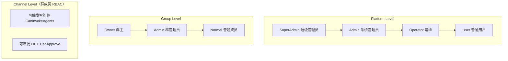

# RBAC 权限分层运维文档（User Permissions & Role-Based Access Control）

本文档描述 AG-UI Multi-Party 的权限模型与运维配置。覆盖**平台级 / 群级 / 频道级**三层，以及对应的配置项、接口与安全建议。

> 版本：随 1.0.103 及之后版本提供。既有部署可原位升级，无需数据迁移。

---

## 1. 三层权限总览



### 1.1 平台级角色（`PlatformRole`）

| 角色 | 说明 | 可访问的管理能力 |
|---|---|---|
| `User` | 普通用户 | 群聊、个人资料、个人记忆、公共数字员工/技能/知识库 |
| `Operator`（运维） | 只读运维 | `GET /ag-ui/admin/status`、`/usage`、`/audit`、`/bridge-health`、`/bridge-capabilities`、`/metrics`；**不包含**数据导出、模型配置、品牌、治理、用户管理 |
| `Admin`（系统管理员） | 既有 `IsAdmin` 语义的完整管理 | Operator 全部 + 用户列表/禁用/重置密码、数据导入导出、模型配置、品牌白标、配置治理、系统初始化（`/reset`） |
| `SuperAdmin`（超级管理员） | 最高角色 | Admin 全部 + **管理平台角色**（`GET|POST /ag-ui/admin/roles`：查看角色矩阵、授予/回收 user/operator/admin/superadmin） |

**生效角色推导**：账号有一个「显式」`PlatformRole` 字段，同时受既有 `IsAdmin` 标记与 `Auth:AdminUserIds` / `Auth:SuperAdminUserIds` 配置影响。`AuthService.ResolveRole` 取三者较高者——
- 显式 `PlatformRole` 未设置（旧部署/旧快照）时，按 `IsAdmin=true` 或命中 `AdminUserIds` 推导为 **至少 `Admin`**；
- `SuperAdmin` 不能仅靠 `IsAdmin` 获得，但可经两种途径取得：**显式 `PlatformRole=superadmin`**，或**命中 `Auth:SuperAdminUserIds` 配置名单**（用于既有部署 / bootstrap，不写账号显式角色）。

**自举**：首个注册账号默认同时成为 `Admin` 与 `SuperAdmin`（避免新部署无人能管理平台角色）。后续账号默认 `User`。

### 1.2 配置项

| 配置 | 说明 |
|---|---|
| `Auth:AdminUserIds` | 逗号分隔的 userId/username 名单；命中者**生效角色至少为 Admin**（即使显式角色为 User）。不授予 SuperAdmin。 |
| `Auth:SuperAdminUserIds` | 逗号分隔的 userId/username 名单（**生效角色至少为 SuperAdmin**，平台最高角色）；用于既有部署 / bootstrap——无需先用现职超级管理员即可把某账号顶为最高角色。不作为账号显式角色存储。 |
| `Auth:FirstUserIsAdmin` | 默认 `true`：首个注册账号自动成为管理员与超级管理员。 |
| `PlatformRole`（账号字段） | 显式平台角色。经**超级管理员**用 `POST /ag-ui/admin/roles/{userId}` 设置；持久化随账号/快照保存。 |

### 1.3 平台角色管理接口（仅超级管理员）

- `GET /ag-ui/admin/roles` —— 返回全体账号的角色矩阵（`explicitRole` 显式角色、`effectiveRole` 生效角色、`isAdmin`、`isDisabled`）。
- `POST /ag-ui/admin/roles/{userId}`，body `{ "role": "user|operator|admin|superadmin" }` —— 授予/回收平台角色。
  - 防呆：不能修改**自己**的角色（防止误伤最后一任管理员）；**不能降级最后一名超级管理员**；把角色设为 `admin`/`superadmin` 会同步 `IsAdmin` 标记。

---

## 2. 群级权限（GroupRole）

| 群内角色 | 权限 |
|---|---|
| `Owner`（群主） | 群最高权限：解散、**群主转让**、移除/升级管理员、全体管理 |
| `Admin`（群管理员） | `CanManage`：加/移成员、改成员昵称/头像、**频道级 RBAC 设置**、管理话题/消息、`CanInvokeAgents`/审批相关 |
| `Normal`（普通成员） | 发言、@数字员工触发、个人话题管理 |

**RBAC 收敛（1.0.103 起）**：
- 不允许通过成员更新把普通成员标为 `Owner`（`Owner` 仅能经**群主转让**获得）。
- **授予/撤销群管理员**仅群主可操作（群管理员不能把他人或自己设/撤为管理员，防自治提权）。
- 新增 **`POST /ag-ui/group/transfer-owner`** 群主转让：body `{ groupId, newOwnerId }`。仅当前群主可调用；目标须为群内**用户**成员（不能转让给智能体、不能转让给自己）；转让后新群主为 `Owner`、原群主降为 `Admin`（保留群管理权）。

---

## 3. 频道级权限（群成员 RBAC，Channel Level）

每个群成员的 `Extra["rbac"]` 可覆盖「是否可触发数字员工」「是否可批准人机交互」。仅**群主 / 群管理员**可设置他人该细粒度权限；未设置时默认全部允许（跟随角色默认）。

```jsonc
// GroupMemberPermissions
{ "canInvokeAgents": true, "canApprove": false }
```

- `canInvokeAgents`：是否允许该成员触发 / @ 数字员工（提及 / 全量监听 / 关键词 / 语境触发）。
- `canApprove`：是否允许该成员批准/拒绝人机交互（HITL）。

设置接口：`POST /ag-ui/group/member/update`，`updateFields` 含 `"permissions"`，`memberInfo.permissions` 传上述 JSON。

---

## 4. 安全加固配套（同一发布）

随 RBAC 一并提供的加固，建议共享多用户部署开启：

1. **HTTP API 移除 `?memberId=` 身份回退**：附件/记忆/定时任务/链接代理/客户端技能桥/市场/模型配置读取等端点只接受有效 token/API 密钥，不再信任 `?memberId=`（WS/SSE 演示与外部智能体桥不受影响）。
2. **客户端技能桥部署开关** `ClientTool:RequireAdmin`：默认 `false`（单机桌面「本机执行」）。**共享多用户 Web 部署请置 `true`**，本端点仅系统管理员可执行，封堵宿主机任意 shell 的 RCE 面；已加 `kind=shell` 白名单与命令长度上限。
3. **静态敏感数据加密**：模型 API Key 与 TOTP 密钥落盘前经 `Secrets:DataProtectionKey`（或自动生成的 `data/secret-vault.key`）AES-256-GCM 加密。
4. **快照签名与防损**：可选 `Persistence:SnapshotSigningKey` 对快照加 HMAC 签名、载入校验；载入损坏时自动备份 `xxx.bad-<ts>`，防止以空态覆盖仅存数据。

---

## 5. 部署与升级建议

- **新部署**：首账号自动成为 SuperAdmin，直接可在「管理员控制台 → 用户管理」为他人分配角色（前端下拉，仅超级管理员可见）。
- **既有部署升级**：无需迁移。老快照/数据库无 `PlatformRole` 字段时自动按 `IsAdmin`/`AdminUserIds` 推导为至少 Admin；如需 SuperAdmin，用任意现有 Admin 先登录后在 `/admin/roles` 提升（或首次注册的新账号自举）。
- **共享多用户部署**：务必设置 `ClientTool:RequireAdmin=true`；按最小权限原则只给 Operator/只读账号，Admin/SuperAdmin 数量最小化；`Auth:RequireTokenOnRealTime` 保持 `true`。
- **前端**：管理员控制台门户按生效角色显示——User 无管理菜单；Operator 显示只读运维菜单；Admin/SuperAdmin 显示完整管理菜单；角色下拉仅 SuperAdmin 可见。
