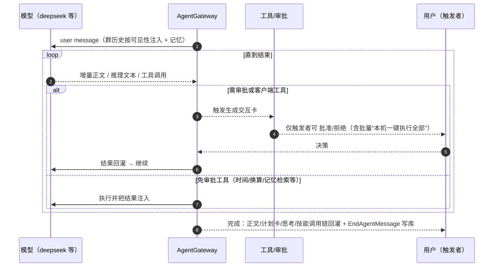
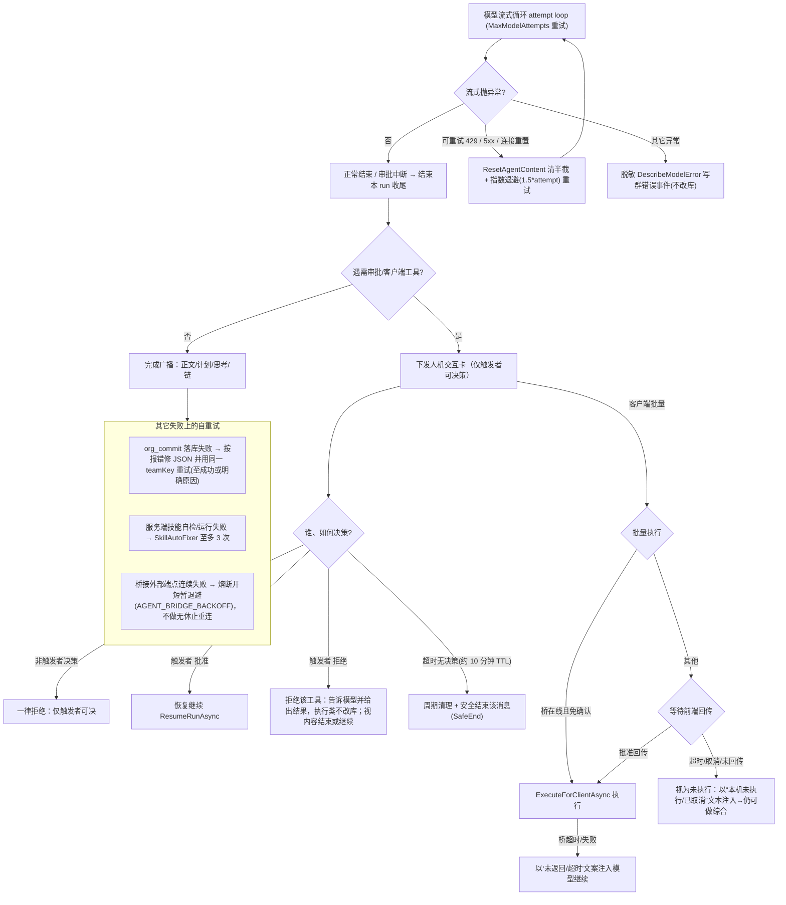

# 智能体（数字员工）执行算法
# How a digital employee runs: execution algorithm

> 依据当前代码（`.NET 10`）。总入口：群消息触发 `GroupHub`/`AgentTriggerService` 判定 → `AgentGateway.InvokeAsync` → `InvokeCoreAsync`；分派到若干执行路径后，结果以群内流式事件回灌。
> Back code anchors: `src/AguiGroupChat.Agents/AgentGateway.cs`, `src/AguiGroupChat.Agents/AgentCatalog.cs`, `src/AguiGroupChat.Hub/Messaging/GroupHub.cs`, `src/AguiGroupChat.Hub/Agents/AgentTriggerService.cs`.

---

## 1) 主流程图（Overall flowchart）

```mermaid
flowchart TD
    msg["群内一条消息 / @ 某数字员工"] --> eval{"AgentTriggerService 判定触发方式"}

    eval -- "提及 / 召唤 / 关键词 / 全量 / 语境 OK" --> hub["GroupHub 触发\n(查该角色定义与"谁是触发者)"] --> g[AgentGateway.InvokeAsync]
    eval -- "语境且判定应沉默" --> silent["AGENT_DECIDED_SILENT·静默跳过"]

    g --> core[InvokeCoreAsync: 读角色定义]
    core --> b{配桥接?}
    b -- 是 --> bridge[InvokeBridgeAsync：经 AG-UI 转发外部专家，流式回灌, 外部审批]
    b -- 否 --> p{配编排流水线 Pipeline?}
    p -- 是 --> pipe[InvokePipelineAsync：按步骤依次调子数字员工聚合答复] --> emit(结束·EndAgentMessage)
    p -- 否 --> r{配置角色交接 RelayToAgentId?}
    r -- 是 --> relay[InvokeRelayAsync：整轮转交, 由对方以别名代答]
    r -- 否 --> m{触发语义=提及?}
    m -- 提及 & (有下级指派/提升目标 或 策划可用) --> route[InvokeAssignmentEscalationAsync：组织化路由]
    m -- 其他 --> run[普通带工具流式 run] 

    route --> p1{"先试确定性编排计划\nCoordinatorPlanning && !挂 org_deploy"}
    p1 -- 有计划 --> plan[ExecuteCoordinatedPlanAsync]
    p1 -- 无计划 --> rec[递归指派/提升路由, 深度/环路防护]
    rec -- 全链路无解 --> refuse["(该问题我不在可解决范围) 并保留原始@宿主语义"] --> emit
    rec -- 有解人员→由对方代答自答 --> emit

    plan --> ex{逐项激活 dispatch / server技能 / 客户端技能}
    ex -- dispatch | 服务端技能 --> actSeq[依次执行、结果级联]
    ex -- 客户端技能集中 --> card["合并成「本机一键执行全部」/ 审批卡，本机或经桥执行并回传"]
    plan --> synth["最终一步递归综合(ExecuteRecursiveAnswerAsync)"]

    run --> stream[RunStreamingAsync 流式输出+推理+工具]
    stream --> tool?{模型请求工具?}
    tool? -- 免审批工具 --> fn[执行并注入结果 → 继续流]
    tool? -- 需审批/客户端工具 --> hitl[人机交互卡, 仅触发者可批准/拒绝 → 结果回灌 → 继续或结束]
    tool? -- 无需工具 --> ok["完成流 → 写库/广播(正文+计划卡+思考+调用链)"]
    synth --> emit
    ok --> emit
```

---

## 2) 关键路径说明（Method branch map)

- 桥接（`def.BridgeEndpoint` 或全局 `AguiBridge.Endpoint`）先于一切：本角色不再调本地大模型，`InvokeBridgeAsync` 经 AG-UI（standard/hub 方言）建立外部会话，外部流式回复逐段回灌；外部也带人机交互。
- 编排流水线 `def.Pipeline`：本角色**不自己跑模型**，而是按 `Pipeline` 步骤依次调一个子数字员工一次性 run，把各步结果聚合成本角色对群的回复。
- 角色交接 `def.RelayToAgentId`：整轮委托给被交接方（以本角色昵称/别名代它回复），并阻止 A→B→A 环回。
- 语境触发：`AgentTriggerMode.Contextual` 且 `ShouldSpeak` 判沉默 → 不发任何事件（`AGENT_DECIDED_SILENT`）。
- 组织化路由：当触发为“提及”且（角色配了 `AssignmentIds`/`EscalationAgentId` 或启用了策划）时进入 `InvokeAssignmentEscalationAsync`：
  1. `CoordinatorPlanning` 且非组织-落库部署员（未挂 `org_deploy`）→ 先试 `BuildCoordinatedPlanAsync` 拿到结构化计划；
  2. 有计划 → `ExecuteCoordinatedPlanAsync` 逐项激活并把计划卡点亮；
  3. 无计划 → 回退递归路由（多候选指派/提升，深度上限 `MaxRouteDepth`、环路去重）；全部无解 → 明确复用“无法解决”引导；有解 → 由下游数字员工自答/代答，回复以原 @ 宿主身份发出。
- 递归综合 `ExecuteRecursiveAnswerAsync`：在计划收集结果后让模型综合，若信息不够就继续补调技能/下属（“体检式”一问到底），直到 `needsMore=false` 给最终答复；该处以 JSON 容错避免 `{needsMore,…}` 泄漏。
- 普通流式 run：无上述分支时，直接由模型带工具做一轮流式（`Run/rerun Stream`）、支持工具调用、审批中断与恢复。
- 组织角色（挂 `org_design`/`org_deploy`，如 org_architect）不属于策划批量路径，走“普通带工具 run”，让 `org_plan_draft`/`org_commit` 是真可被模型 function-call 的工具。

---

## 3) 普通带工具 run 的内部循环（Local streaming + HITL）



---

## 4) 组织化路由 → 计划 → 递归综合（分层细图 / Org routing → plan → recursive synthesize）

```mermaid
flowchart TD
    cell["触发语义=提及 且 (有 AssignmentIds / EscalationAgentId 或策划可用)"]
    cell --> cap{CoordinatorPlanning && 非组织落库员(未挂 org_deploy)?}
    cap -- 否 --> fallback["回退：递归指派 / 提升 (ResolveRoute)"]
    cap -- 是 --> build["BuildCoordinatedPlanAsync：列可达下属 + 可调技能 → 路由模型产出结构化 steps (最多 N 步)"]
    build --> hasPlan{拿到计划?}
    hasPlan -- 空/失败 --> fallback
    hasPlan -- 有计划 --> startStream["广播计划卡(点亮待执行)"]

    startStream --> step1{逐条 step.Action}
    step1 -- dispatch --> subRun["子数字员工一次性 run，结果级联 return(不递归下钻，防无限深)"]
    step1 -- 服务端技能 --> skRun["SkillRunner 执行(server 沙箱)；含 SkillAutoFixer 自修（至多 3 次）"]
    step1 -- 客户端技能 --> batch["合并成「本机一键执行全部 / 浏览器或桥」→ 回传结果逐个点亮"]
    subRun --> cascade(级联为下一 step 输入 working)
    skRun --> cascade
    batch --> cascade
    cascade --> more{还有 step?}
    more -- 是 --> step1
    more -- 否 --> rs["最终·递归综合 ExecuteRecursiveAnswerAsync"]

    rs --> enough{信息足够 needsMore=false?}
    enough -- 否 --> pick{还需补查 skill / dispatch?}
    pick -- 有 --> runMore["已执行集合去重 → 补查一轮"]
    enough -- 是 --> done["给最终答复（正文 + 计划卡 + 思考 + 技能链 → EndAgentMessage）"]
    fallback -- 解答/代答/无解:见回退提示 --> done
```

> 说明：递归补查有轮次上限（`MaxRecursiveRounds`）；“已执行技能/已带回结果的下属”会去重，避免同一技能被重复调用两次。客户端技能在本机执行也必须走批准/桥，服务端绝不当 bash 误跑此类 PowerShell 技能。

---

## 5) 驳回 / 超时 / 失败重试 分支（Reject · timeouts · retry branches）



> 关键常量/语义：模型流式 `StreamTimeoutMinutes=5` 挂起保护；人机交互 `InteractionTtlMs≈10 分钟`，超时由周期定时器清理；模型流可重试错误按 `MaxModelAttempts` 次指数退避；桥接失败走熔断退避；单次消息审批轮数有上限防死循环。驳回/超时都不会静默改库：执行类技能一律“已获批准才执行”，拒绝即不执行。

---

## 一句话理解

群消息被判定触达某数字员工 → 按“桥接 > 流水线 > 交接 > 语境沉默 > 组织化路由(计划→逐项→递归综合) > 普通流式(带工具+人机审批)”的顺序择一路径，最终把该角色的一次答复（正文 + 计划卡 + 思考 + 技能链）定向/全群地回灌本群。

In one sentence: once a message touches a digital employee, the runtime picks a single pipeline in priority order — bridge > pipeline > relay > contextual silence > org routing (plan → execute → recursive synthesize) > plain streaming (tools + human-in-the-loop) — and delivers that role’s reply (body, plan card, thinking, skill chain) back into the group.

---

## 附：代码锚点

- 触发判定：`AgentTriggerService`（提及/关键词/全量/语境）。
- 总入口与 ambient/桥退避：`AgentGateway.InvokeAsync`。
- 分派(s开关)：`InvokeCoreAsync`（桥 `InvokeBridgeAsync` / 流水线 `InvokePipelineAsync` / 交接 `InvokeRelayAsync` / 语言沉默 / 策划指派 `InvokeAssignmentEscalationAsync` / 普通流式）。
- 组织化路由/计划/递归综合/计划卡广播：`BuildCoordinatedPlanAsync` / `ExecuteCoordinatedPlanAsync` / `ExecuteRecursiveAnswerAsync` / `RecordStandinChain`。
- 普通 run：`agent.RunStreamingAsync`、审批 (`HITL`) 恢复 `ResumeRunAsync`、暂停清理 `ResolveInteractionAsync`、批量客户端 `AwaitBatchClientExecAsync`。
