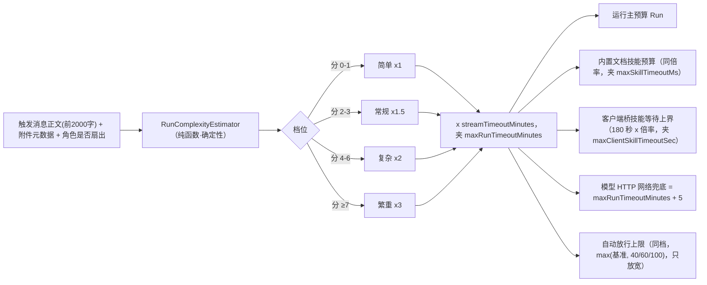
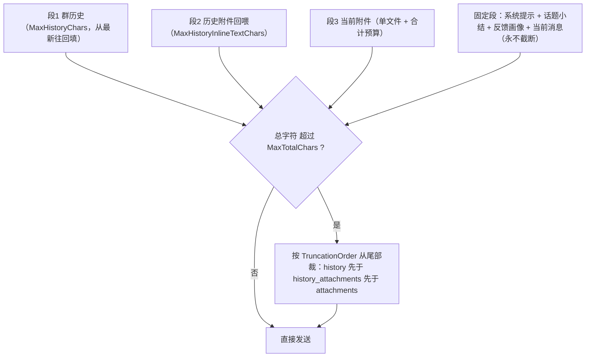
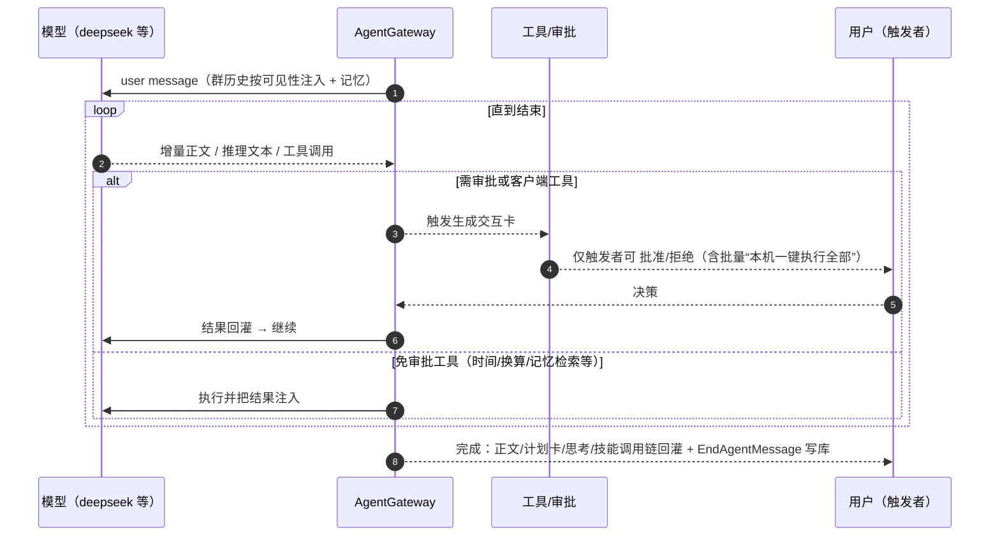
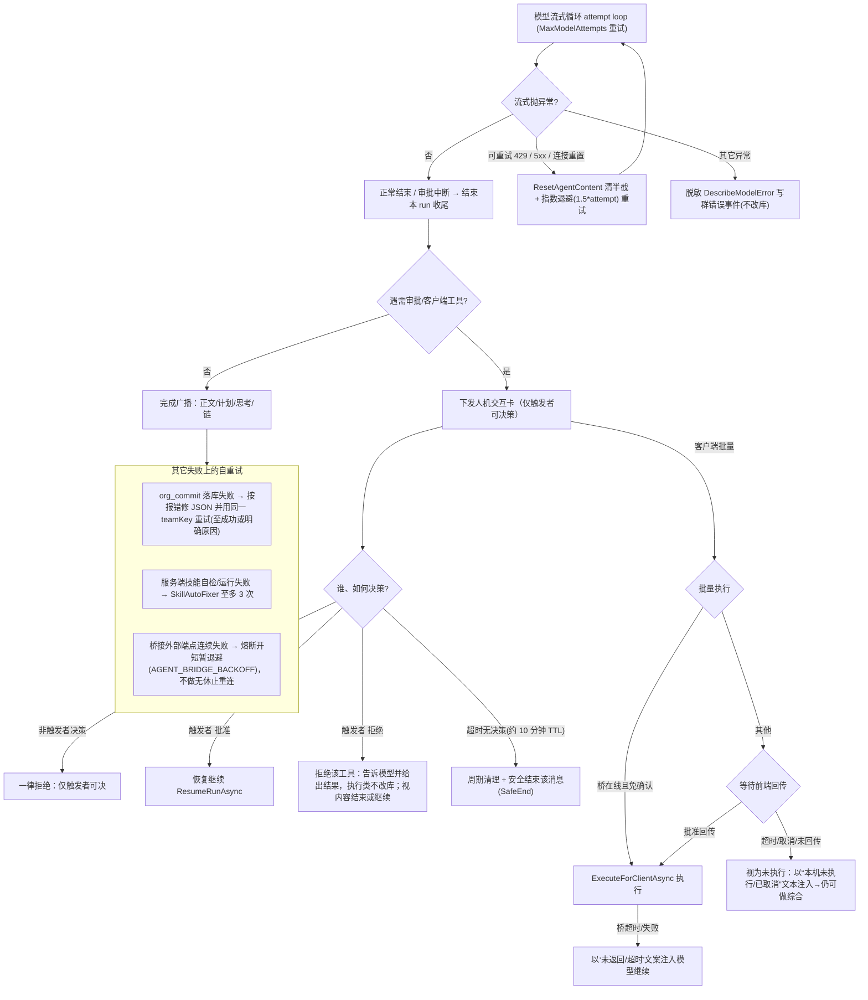

# 智能体（数字员工）执行算法
# How a digital employee runs: execution algorithm

> 依据当前代码（`.NET 10`）。总入口：群消息触发 `GroupHub`/`AgentTriggerService` 判定 → `AgentGateway.InvokeAsync` → `InvokeCoreAsync`；分派到若干执行路径后，结果以群内流式事件回灌。
> Back code anchors: `src/AguiGroupChat.Agents/AgentGateway.cs`, `src/AguiGroupChat.Agents/AgentCatalog.cs`, `src/AguiGroupChat.Hub/Messaging/GroupHub.cs`, `src/AguiGroupChat.Hub/Agents/AgentTriggerService.cs`.
> 想“改执行行为而不改代码”的旋钮清单与哪些仍码内固定见姊妹篇：[执行配置：可热改项 / 有效范围 / 能力矩阵](execution-configuration.md)。

---

## 1) 主流程图（Overall flowchart）

```mermaid
flowchart TD
    msg["群内一条消息 / @ 某数字员工"] --> eval{"AgentTriggerService 判定触发方式"}

    eval -- "提及 / 召唤 / 关键词 / 全量 / 语境 OK" --> hub["GroupHub 触发\n(查该角色定义与"谁是触发者)"] --> g[AgentGateway.InvokeAsync]
    eval -- "语境且判定应沉默" --> silent["AGENT_DECIDED_SILENT·静默跳过"]

    g --> core[InvokeCoreAsync: 读角色定义]
    core --> b{配桥接?}
    b -- 是 --> bridge[InvokeBridgeAsync：经 AG-UI 转发外部专家，流式回灌, 外部审批]
    b -- 否 --> p{配编排流水线 Pipeline?}
    p -- 是 --> pipe[InvokePipelineAsync：按步骤依次调子数字员工聚合答复] --> emit(结束·EndAgentMessage)
    p -- 否 --> r{配置角色交接 RelayToAgentId?}
    r -- 是 --> relay[InvokeRelayAsync：整轮转交, 由对方以别名代答]
    r -- 否 --> m{触发语义=提及?}
    m -- 提及 & (有下级指派/提升目标 或 策划可用) --> route[InvokeAssignmentEscalationAsync：组织化路由]
    m -- 其他 --> run[普通带工具流式 run] 

    route --> p1{"先试确定性编排计划\nCoordinatorPlanning && !挂 org_deploy"}
    p1 -- 有计划 --> plan[ExecuteCoordinatedPlanAsync]
    p1 -- 无计划 --> rec[递归指派/提升路由, 深度/环路防护]
    rec -- 全链路无解 --> refuse["(该问题我不在可解决范围) 并保留原始@宿主语义"] --> emit
    rec -- 有解人员→由对方代答自答 --> emit

    plan --> ex{逐项激活 dispatch / server技能 / 客户端技能}
    ex -- dispatch | 服务端技能 --> actSeq[依次执行、结果级联]
    ex -- 客户端技能集中 --> card["合并成「本机一键执行全部」/ 审批卡，本机或经桥执行并回传"]
    plan --> synth["最终一步递归综合(ExecuteRecursiveAnswerAsync)"]

    run --> stream[RunStreamingAsync 流式输出+推理+工具]
    stream --> tool?{模型请求工具?}
    tool? -- 免审批工具 --> fn[执行并注入结果 → 继续流]
    tool? -- 需审批/客户端工具 --> hitl[人机交互卡, 仅触发者可批准/拒绝 → 结果回灌 → 继续或结束]
    tool? -- 无需工具 --> ok["完成流 → 写库/广播(正文+计划卡+思考+调用链)"]
    synth --> emit
    ok --> emit
```

---

## 2) 关键路径说明（Method branch map)

- 桥接（`def.BridgeEndpoint` 或全局 `AguiBridge.Endpoint`）先于一切：本角色不再调本地大模型，`InvokeBridgeAsync` 经 AG-UI（standard/hub 方言）建立外部会话，外部流式回复逐段回灌；外部也带人机交互。
- 编排流水线 `def.Pipeline`：本角色**不自己跑模型**，而是按 `Pipeline` 步骤依次调一个子数字员工一次性 run，把各步结果聚合成本角色对群的回复。
- 角色交接 `def.RelayToAgentId`：整轮委托给被交接方（以本角色昵称/别名代它回复），并阻止 A→B→A 环回。
- 语境触发：`AgentTriggerMode.Contextual` 且 `ShouldSpeak` 判沉默 → 不发任何事件（`AGENT_DECIDED_SILENT`）。
- **带图轮次只换模型、不换能力**：消息（或本话题最近窗口）含图且启用了视觉时，`BuildVisionUserMessageAsync` 把图片像素一并组装成多模态消息，并把 agent 换成**视觉模型**的同一岗位（`AgentCatalog.GetOrCreateVision`）——工具 / 记忆注入 / 技能链 / 审批包装全部保留。
  反例（已修）：曾经换成“裸视觉体”（`Tools = null`），于是请求里根本没有 tools；DeepSeek 这类模型不会报错，而是**把工具调用当正文写出来**（DSML 标记），结果技能从未执行、也拿不到文件。
- 组织化路由：当触发为“提及”且（角色配了 `AssignmentIds`/`EscalationAgentId` 或启用了策划）时进入 `InvokeAssignmentEscalationAsync`：
  1. `CoordinatorPlanning` 且非组织-落库部署员（未挂 `org_deploy`）→ 先试 `BuildCoordinatedPlanAsync` 拿到结构化计划；
  2. 有计划 → `ExecuteCoordinatedPlanAsync` 逐项激活并把计划卡点亮；
  3. 无计划 → 回退递归路由（多候选指派/提升，深度上限 `MaxRouteDepth`、环路去重）；全部无解 → 明确复用“无法解决”引导；有解 → 由下游数字员工自答/代答，回复以原 @ 宿主身份发出。
- 递归综合 `ExecuteRecursiveAnswerAsync`：在计划收集结果后让模型综合，若信息不够就继续补调技能/下属（“体检式”一问到底），直到 `needsMore=false` 给最终答复；该处以 JSON 容错避免 `{needsMore,…}` 泄漏。
- 普通流式 run：无上述分支时，直接由模型带工具做一轮流式（`Run/rerun Stream`）、支持工具调用、审批中断与恢复。
- 组织角色（挂 `org_design`/`org_deploy`，如 org_architect）不属于策划批量路径，走“普通带工具 run”，让 `org_plan_draft`/`org_commit` 是真可被模型 function-call 的工具。

---

## 2.1) 小决策（该不该发言 / 派给谁）：模型与阈值

数字员工的模型调用分两类，**必须分开看待**：

| 类别 | 调用点 | 输出预算 | 走哪个模型 |
|---|---|---|---|
| 正式回复 | 普通流式 / 桥接 / 计划各步 / 递归综合 | 大（受 `StreamTimeoutMinutes` 等约束） | 受思考模式影响（思考开则走推理模型） |
| **小决策** | `ShouldSpeakAsync`（语境触发）、`RankAssignTargetsAsync`（指派路由） | **只有几个 token**（判定 8 / 路由 64） | **故意无视思考模式**，固定非推理模型 |

为什么必须解耦（实测教训）：推理模型会把这点预算**全花在思维链上，正文为空**——而这类失败**没有任何异常、没有错误日志**：

- 发言判定旧实现用 `StartsWith("YES")` 看正文 → 空正文恒为假 → **语境触发的数字员工永远不发言**；
- 指派路由旧实现把空输出当“模型回 NONE” → 解析出 0 个下游 → 退化成“只有问题提升、没有任务指派”。

实测（同一判定提示，生产实际使用的模型）：`deepseek-flash` 预算 8 → 正文空；预算 64 → 正文空（推理恰好吃满 64 被截断，这就是“有时空有时不空”的间歇性来源）；换 `deepseek-chat` 后预算 8 → 正文 `YES`，只花 1 个 token。

因此小决策现在：

1. **模型解析与思考模式解耦**（`AgentOptions.DecisionModel` → 智能体 `Model` → 全局 `Model`）；
2. **用概率而非文本前缀**：直调 OpenAI 兼容端点拿 `logprobs`，归一化成 P(是)，再与 `Agents:DecisionMinProbability`（默认 0.3）比；拿不到概率才退回文本（只认第一个词，认不出就**不猜**，返回 null 而不是默默当“否”）；
3. **空输出 ≠ NONE**：指派路由对空正文重试一次（更大预算）并记 `warn`，而不是静默当成“没人合适”；
4. 判定调用固定 `temperature=0`（判定不该采样），用量按同一口径记入库（判定提示很长，不记会低估配额消耗）。

**配置取值口径：留空/空白 = “未设置”。** 配置绑定会把**空字符串照绑**（Docker 里 `Agents__DecisionModel: ${AGENTS_DECISION_MODEL:-}` 在用户没配时就是空串），因此模型名解析一律按“空白即未设置”处理（`AgentCatalog.FirstNonBlank`），不能直接用 `??`。否则空串会被当成已设置的模型名一路传下去，`ChatClient` 构造直接抛 `ArgumentException: Value cannot be an empty string. (Parameter 'model')` —— 实测就是 1.0.154 上线后每次语境判定都失败（日志只有一句“语境判定调用失败”）。

---

## 2.2) 运行超时预算：按任务复杂度自适应（Complexity-adaptive run budget）

原先所有运行共用一条固定预算（`streamTimeoutMinutes`，默认 5 分钟）——固定值对“寒暄”过宽、对“41 页带插图的 PPT”过窄（实测撞到过「一次提交 41 页 + 长备注，服务端处理超限」）。现在改为**先估任务量级、再按倍率放宽**：



- **信号口径**：交付物格式词（docx/pptx/pdf/word/报告/方案…）+2；页数 / 字数 / 条目数按量级 +1~+3；多步措辞（先…再…最后 / 逐条 / 每页…）每处 +1（上限 3）；穷尽性措辞（完整/详细/全面）+1；文档类附件每个 +1（上限 3）、附件 ≥2MB +1、图片 ≥5 张 +1；该角色会向下指派或有编排流水线 +1。
- **分配与传播**：`RunTimeoutPolicy.Install` 在**每个运行入口**各设一次（首轮 / 流水线 / 交接 / 指派链 / 桥接 / 审批恢复），同时写入 `RunTimeoutPolicy.Ambient`（`AsyncLocal`，与仓库既有的 `SkillChainBuilder.Ambient` 同一套路数），让拿不到触发上下文的**技能宿主**按同一倍率放宽单技能预算。
- **指派链 x3**：计划 → 逐步执行 → 递归补查 → 交付兑底 是一条多阶段链，在自适应预算之上再乘 3（同样夹上界），交付兑底内部再开一份自己的预算。
- **自动放行上限同档定档**：同一份档位也决定“自动放行（已同意技能 / 批量批准）的工具调用上限”——`maxAutoApprovedRounds`（默认 30）退化为简单档基准值 / 关闭自适应时的兜底，实际上限 = `max(基准值, 40/60/100)`，**只放宽不收紧**。理由是“时间够了、轮数却先到”同样会被误杀：一次合法的大活本就调用几十次技能（40 页 PPT：出正文 → 逐页配图 → 校验 → 追加）。它与超时同源同档，不再是一组孤立的魔数。
- **两条不变量**（测试钉住）：①**只放宽、不收紧**——任何档位 / 夹紧都不低于你原本配的 `streamTimeoutMinutes`、技能预算与 `maxAutoApprovedRounds`；②**确定性**——恢复路径用 `PendingInteraction` 里保留的同一份触发上下文重算，必得同一预算。
- 开关与字段见 `docs/execution-configuration.md` §A.1；预算被真正放宽时日志会打一行 `运行超时预算按任务复杂度放宽：agent=… Heavy（分 8，x3，5→15 分钟，自动放行≤100，依据：交付物格式、41 页…）`，可直接回答“这次为什么跑这么久 / 为什么允许这么多轮”。

---

## 2.3) 提示词装配预算：分段 + 总闸门（PromptBudget）

模型看到的“上下文”由若干段拼成。此前它们的上限散在两处（`AttachmentStore` 的常量 + 网关里的一批 `const`）、
**各自独立且截断完全静默**——用户看到文字被截断，却查不出是哪一层截的。现在收拢为一份可配预算（appsettings 顶层 `PromptBudget` 节点）：

| 段 | 字段 | 默认 |
|---|---|---|
| 群历史（滑动窗口） | `HistoryWindowMessages` / `MaxCharsPerHistoryMessage` / `MaxHistoryChars` | 12 条 / 4000 字符 / 48000 字符 |
| 历史附件回喂 | `MaxHistoryInlineTextChars` | 96000 字符 |
| 当前附件 | `AttachmentMaxTextCharsPerFile` / `AttachmentMaxTextCharsTotal` | 40000 / 200000 字符 |
| 附图 | `MaxContextImages` / `MaxHistoryImages` | 4 / 4 张 |
| **总闸门** | `MaxTotalChars` | 200000 字符 |
| 降级顺序 | `TruncationOrder` | `history,history_attachments,attachments` |



- **为何不按窗口定预算**：模型（DeepSeek-V4.1-Flash）官方推荐 `context_window = 1M tokens`，而本平台实测单次 prompt 仅 3.5K~17.5K tokens（窗口的 0.35%~1.75%）。真正的约束是成本与延迟（每轮重建上下文 → 每次调用都重付 prefill），所以设计成“单项宽松 + 总闸门兜底”，而不是贴着窗口设。
- **分层降级**：超预算时按 `TruncationOrder` 从**尾部**裁（历史尾部 = 更早的消息）；**当前消息与系统提示永不截断**。
- **可观测**：只要有截断就记一条 WARN，写明“用了多少 / 上限多少 / 历史丢弃最早几条 / 哪一段被总闸门裁了多少”，把“猜”变成“查”；接近闸门（>50%）也留一条 Information 便于观察趋势。
- **记忆 / 知识库注入不在闸门内**：那部分由 `Agents:Memory` 的 `TopK` × `MaxCharsPerMemory` 各自兜住（默认 6 × 1500）。真实总规模以模型返回的 prompt tokens 为准（超 `WarnPromptTokens` 打 WARN）。

### 输出侧：输出预算与推理力度

实测 completion 中 **reasoning 占 57%~79%**，而应用此前**不给** `MaxOutputTokens`，等于把输出长度交给提供方默认值。
现在正式回复路径显式给出预算：

| 字段 | 默认 | 说明 |
|---|---|---|
| `Agents:MaxOutputTokens` | 16000 | `<=0` = 不设（交给提供方）。模型方推荐 `max_tokens ≥ 256K`，因此默认值很保守，可放心上调 |
| `Agents:ReasoningEffort` | null（不设） | `none` / `low` / `medium` / `high`（另接受 `extrahigh`）。**默认不启用**：DeepSeek 自家是连续 1~100 口径，而 OpenAI 兼容面上是字符串枚举，取值需实测后再固定 |

两者都只作用于**正式回复**路径（`AgentCatalog.Create`）；小决策 / 路由走 `CreateBare` 并自带极小预算（发言判定 8 / 指派路由 64 tokens），不受影响。

---

## 2.4) 记忆向量化的输入预算（Memory embedding input budget）

**现象**：日志出现 `语义记忆检索失败：HttpClient.Timeout of 60 seconds elapsing`——看着像“embedding 服务挂了”，实际是**排队超时**。

**根因（实测，4 核 CPU + bge-m3）**：embedding 耗时由**输入长度**主导，约 **8.5 ms/字符**：

| 输入 | 单条耗时 |
|---|---|
| 6 字 | 0.3 s |
| 1500 字 | **12.7 s** |
| 1500 字 × 4 条（批量 1 请求） | 49.6 s |

而此前：**写入侧把整条消息原文不限长送进 embedding**（一条 5000 字回复 ≈ 40 s+）；检索侧 query 上限 2000 字（≈17 s/条），一轮提问约 4 条检索（群记忆 / 个人记忆 / 知识库 / 知识库图谱）→ 合计 60 s+，正好撞上传入方 60 秒超时。

**改法**（都是“缩短要算的东西”，不是“提高并发”）：

| 字段 | 默认 | 说明 |
|---|---|---|
| `Agents:Memory:MaxQueryChars` | **500**（旧 2000） | 检索 query 截断。语义检索只需“主题含义”，500 字足够，且提高信噪比 |
| `Agents:Memory:MaxWriteChars` | **800**（新增） | 写入侧 embedding 输入上限。**同时作用于入库文本与向量**，两者必须一致，否则“检索命中却内容对不上” |
| `Agents:Memory:EmbeddingConnectTimeoutSeconds` | **5**（新增） | 把「连不上」与「排队中」分开：建连超时只管连接，总预算（`EmbeddingTimeoutSeconds`）只管排队 + 推理——服务不可用时秒级判死，不再白等满 60 秒 |
| `Agents:Memory:SlowEmbeddingWarnSeconds` | **10**（新增） | 单次 embedding 超过该秒数记 WARN（带输入字符数）。阈值取 10 而非更小：写入侧 800 字本身约 6.8 秒属正常，只有明显越过（输入未截断 / 服务在排队）才告警 |

**为什么不靠并发 / 并行**（实测对照，8 条同样文本）：

| 模式 | 耗时 |
|---|---|
| 串行 8 请求 | 4.59 s |
| 并发 8 请求（服务端并行槽=1，当前配置） | 2.77 s |
| 并发 8 请求（并行槽=4） | 2.52 s（**仅比槽=1 快 9%**） |
| 批量（1 请求 8 输入） | 1.26 s |

- 并行槽 1→4 只快 ~9%，因为瓶颈是“4 个核在算”；代价是每槽一份 KV cache（内存翻倍）。
- 批量化只对短文本有用（3.6×）；**长文本完全无效**（1500 字 × 4：批量 49.6 s vs 串行 48.7 s）。
- 所以这是“算术量”问题，不是“并发度”问题：**降低每次要算的字符数**才是杠杆。

> 仍未处理：知识库切片（`Memory:KnowledgeChunkSize=4096`，≈35 s/片）属于后台导入 / 周期沉淀。总量不变，已用 **两池隔离**（见下）避免它把交互检索挤到超时。

### 交互 / 后台两池隔离（EmbeddingGates）

embedding 服务（本地 bge-m3）在 CPU 上只有一条推理通道，**客户端并发度基本等于排队长度**；知识库单片 4096 字 ≈ 35 秒，多个后台任务并发入库就会把交互检索排到超时。因此把向量化并发拆成两个互不抢占的池子：

| 池 | 用在哪 | 并发 | 等不到时的行为 |
|---|---|---|---|
| **交互** | 回复前的记忆检索 / 知识库检索 / 图谱检索 | `InteractiveEmbeddingConcurrency`（3） | **降级**：本次不注入这段上下文（可选上下文，不让用户干等） |
| **后台** | 记忆写入、记忆导入、知识库切片与图谱入库 | `BackgroundEmbeddingConcurrency`（1） | 等待上限 `BackgroundEmbeddingWaitSeconds`（60）后**跳过本条**，由下次任务补上 |

两池容量之和 = 旧版总并发（默认 4），**不增加**对 embedding 服务的压力，只是重新分配优先权。实现：`EmbeddingGates`（`src/AguiGroupChat.Agents/EmbeddingGates.cs`），被 `AgentMessageMemory` 与 `KnowledgeBaseCatalog` 共用。

---

## 3) 普通带工具 run 的内部循环（Local streaming + HITL）



---

## 4) 组织化路由 → 计划 → 递归综合（分层细图 / Org routing → plan → recursive synthesize）

```mermaid
flowchart TD
    cell["触发语义=提及 且 (有 AssignmentIds / EscalationAgentId 或策划可用)"]
    cell --> cap{CoordinatorPlanning && 非组织落库员(未挂 org_deploy)?}
    cap -- 否 --> fallback["回退：递归指派 / 提升 (ResolveRoute)"]
    cap -- 是 --> build["BuildCoordinatedPlanAsync：列可达下属 + 可调技能 → 路由模型产出结构化 steps (最多 N 步)"]
    build --> hasPlan{拿到计划?}
    hasPlan -- 空/失败 --> fallback
    hasPlan -- 有计划 --> startStream["广播计划卡(点亮待执行)"]

    startStream --> step1{逐条 step.Action}
    step1 -- dispatch --> subRun["子数字员工一次性 run，结果级联 return(不递归下钻，防无限深)"]
    step1 -- 服务端技能 --> skRun["SkillRunner 执行(server 沙箱)；含 SkillAutoFixer 自修（至多 3 次）"]
    step1 -- 客户端技能 --> batch["合并成「本机一键执行全部 / 浏览器或桥」→ 回传结果逐个点亮"]
    subRun --> cascade(级联为下一 step 输入 working)
    skRun --> cascade
    batch --> cascade
    cascade --> more{还有 step?}
    more -- 是 --> step1
    more -- 否 --> nd{计划里跳过了文档生成类技能?<br/>needsDelivery}
    nd -- 否 --> rs["最终·递归综合 ExecuteRecursiveAnswerAsync"]
    nd -- 是 --> deliver["交付兑底 TrySatisfyDeliveryAsync：找挂了匹配文件技能的同事，完整流式让它自己调技能并回档产物"]
    deliver --> dhandled{交付接手了吗?}
    dhandled -- 已出文件 / 已挂审批卡 --> done
    dhandled -- 静默放弃 --> planNote["补发计划说明（如实告知跳过了哪些步及原因）"]
    planNote --> done

    rs --> enough{信息足够 needsMore=false?}
    enough -- 否 --> pick{还需补查 skill / dispatch?}
    pick -- 有 --> runMore["已执行集合去重 → 补查一轮"]
    enough -- 是 --> done["给最终答复（正文 + 计划卡 + 思考 + 技能链 → EndAgentMessage）"]
    fallback -- 解答/代答/无解:见回退提示 --> done
```

> 说明：递归补查有轮次上限（`MaxRecursiveRounds`）；“已执行技能/已带回结果的下属”会去重，避免同一技能被重复调用两次。客户端技能在本机执行也必须走批准/桥，服务端绝不当 bash 误跑此类 PowerShell 技能。
>
> 交付分支（1.0.137 修正）：文档生成技能的入参是结构化 JSON，必须由模型当工具调用构造，计划路径按纯文本直接调它只会塑出空壳文档，因此计划里跳过它并标记 `needsDelivery`，改由交付兑底完整流式产出。交付物类型优先取用户那句里的格式词，用户没提格式词时回退用**计划点名的文件技能**（否则“希望有一些插图”这类迭代请求会因判不出交付物而直接放弃）；计划内各步产出会作为正文素材（`upstreamDraft`）一并交给交付岗。计划侧那段“说明”在交付收尾时暂不发，只有交付**静默放弃**（没认出交付物 / 找不到能做的岗位）时才补发，避免空消息，也避免两条自相矛盾的说明叠在同一条消息里。

---

## 5) 驳回 / 超时 / 失败重试 分支（Reject · timeouts · retry branches）



> 关键常量/语义：模型流式挂起保护 = **复杂度自适应预算**（基准 `StreamTimeoutMinutes=5` × 档位倍率，上界 `MaxRunTimeoutMinutes=30`；详见 §2.2）；人机交互 `InteractionTtlMs≈10 分钟`，超时由周期定时器清理；模型流可重试错误按 `MaxModelAttempts` 次指数退避；桥接失败走熔断退避。驳回/超时都不会静默改库：执行类技能一律“已获批准才执行”，拒绝即不执行。
>
> **审批轮数分两道线（1.0.162 修正）**：`MaxInteractionRounds`（默认 15）只数“**真的打断了用户**”的那一轮；已同意技能 / 批量批准这类**自动放行**不计入，而是走 `MaxAutoApprovedRounds`——**该值自 1.0.163 起按任务复杂度定档**（简单档 = 基准值 30，常规 40 / 复杂 60 / 繁重 100，且**只放宽不收紧**；详见 §2.2）。旧实现把两者混在一个计数器里，于是一次正常的长生成（文档技能天然要被反复调用：出正文 → 逐页配图 → 改）会在第 5 次调用就被判超限杀掉——实测踩到 40 页 PPT 已生成到磁盘却因“交互恢复超过最大轮数（5）”终止。**且终止前会先把已产出的产物挂到消息上**，不再出现“出稿了却拿不到”。
>
> **一轮可能有多条审批请求**：模型一次轮次里提多个需审批的工具调用时，网关把它们<b>全部收下、全部回应</b>（一张卡、一个决定作用于全组），不会只回第一条 —— 漏回会产生“无人回应的审批请求”，导致恢复请求被框架或模型拒（实测三次 `HTTP 400 The reasoning_content in the thinking mode must be passed back` 全部紧跟在“一轮两条审批”之后，而单审批恢复从未失败）。
>
> **恢复崩溃也先保产物**：恢复路径抛异常时，先把本轮已经产出的文件回挂到消息再收尾 —— 实测浅色版 PPT 已落盘、却因恢复请求 400 而终止，用户只看到“回复说已出稿”却拿不到文件。与其它收尾路径同一原则：先保证用户能拿到东西。
>
> 孤儿流兑底：一条流式消息**创建超过 10 分钟且最近 60s 无活跃**时被强制收尾（防状态泄漏）。因此审批卡放太久（>10 分钟）再点批准，恢复会报“消息不存在或未开启流式灌入”（该次回复拿不到了）；及时点按不受影响。

---

## 一句话理解

群消息被判定触达某数字员工 → 按“桥接 > 流水线 > 交接 > 语境沉默 > 组织化路由(计划→逐项→递归综合) > 普通流式(带工具+人机审批)”的顺序择一路径，最终把该角色的一次答复（正文 + 计划卡 + 思考 + 技能链）定向/全群地回灌本群。

In one sentence: once a message touches a digital employee, the runtime picks a single pipeline in priority order — bridge > pipeline > relay > contextual silence > org routing (plan → execute → recursive synthesize) > plain streaming (tools + human-in-the-loop) — and delivers that role’s reply (body, plan card, thinking, skill chain) back into the group.

---

## 附：代码锚点

- 触发判定：`AgentTriggerService`（提及/关键词/全量/语境）。
- 总入口与 ambient/桥退避：`AgentGateway.InvokeAsync`。
- 分派(s开关)：`InvokeCoreAsync`（桥 `InvokeBridgeAsync` / 流水线 `InvokePipelineAsync` / 交接 `InvokeRelayAsync` / 语言沉默 / 策划指派 `InvokeAssignmentEscalationAsync` / 普通流式）。
- 组织化路由/计划/递归综合/计划卡广播：`BuildCoordinatedPlanAsync` / `ExecuteCoordinatedPlanAsync` / `ExecuteRecursiveAnswerAsync` / `RecordStandinChain`。
- 交付兑底与交付物类型判定：`TrySatisfyDeliveryAsync` / `RunDeliveryStreamAsync` / `WantedDeliverable` / `DeliverableFromSkillId` / `BuildDeliveryPrompt` / `BuildNoOutputFallback`。
- 普通 run：`agent.RunStreamingAsync`、审批 (`HITL`) 恢复 `ResumeRunAsync`、暂停清理 `ResolveInteractionAsync`、批量客户端 `AwaitBatchClientExecAsync`。
- 小决策（§2.1）：`AgentCatalog.ResolveDecisionModelName` / `DecideYesNoAsync` / `ParseYesNo` / `ParseAssignTargets`、`AgentGateway.ShouldSpeakAsync` / `RankAssignTargetsAsync`。
- 复杂度自适应超时（§2.2）：`RunComplexityEstimator` / `RunTimeoutPolicy` / `RunTimeoutBudget`（`src/AguiGroupChat.Agents/RunTimeoutPolicy.cs`）、`AgentGateway.InstallRunBudget` / `ClientSkillTimeout`、`SkillRunner.RunDotnetSkill`、`AgentCatalog.BuildOpenAIChatClient`（网络兜底）。
- 提示词装配预算（§2.3）：`PromptBudgetOptions`（`src/AguiGroupChat.Hub/Options/PromptBudgetOptions.cs`）、`AgentGateway.BuildUserMessageAsync` / `BuildHistorySection` / `BuildHistoryAttachmentsSectionAsync` / `BuildAttachmentsSectionAsync` / `TrimSectionsToBudget` / `ReportPromptAssembly`、`AttachmentStore.TextCharsPerFile/Total`、`AgentCatalog.BuildReasoningOptions`。
- 记忆向量化输入预算（§2.4）：`MemoryOptions.MaxQueryChars/MaxWriteChars/SlowEmbeddingWarnSeconds/EmbeddingConnectTimeoutSeconds`、`AgentMessageMemory.ProcessWriteQueueAsync` / `ImportMemoriesAsync`、`HttpEmbeddingProvider`。
