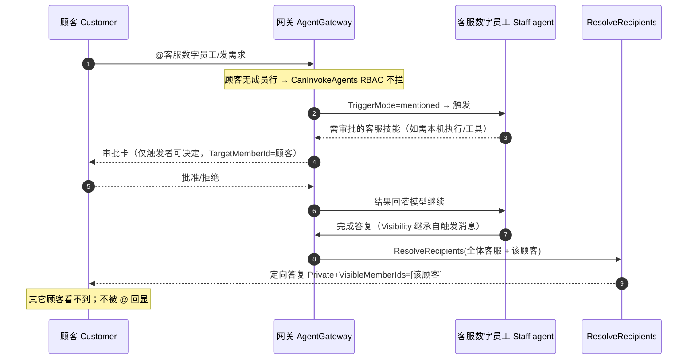
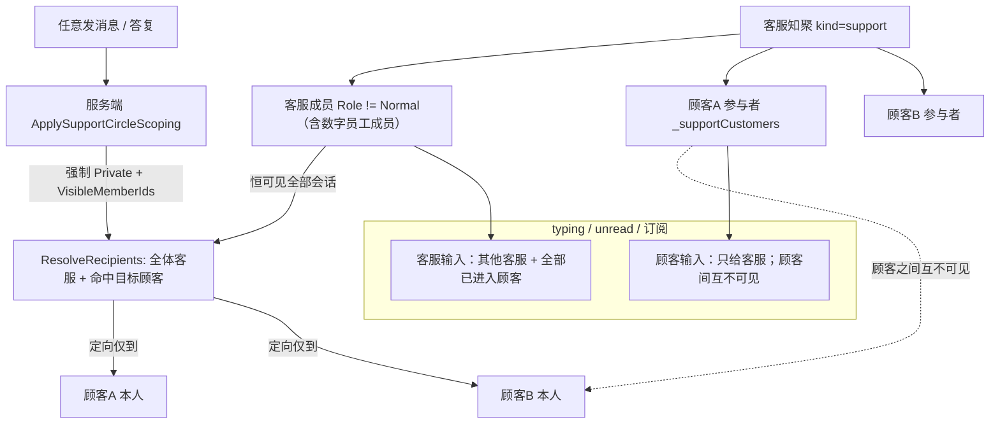
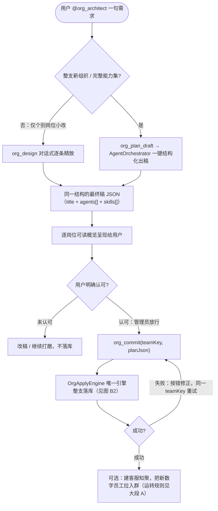

# 客服知聚聊天规则 & 组织架构构建师的组织打造算法
# Support-Circle Chat Rules & How the Org Architect Builds an Organization

> 本文把两块本平台的专题整理在**同一页的“大段 A / 大段 B”**里：A＝客服知聚（Support Circle）的聊天规则；B＝“组织架构构建师（org_architect）”的组织打造算法。二者同属“面向组织/客服的一键式构建与运转”：B 负责把组织建/覆盖到库，A 负责建好的“客服知聚”落地后如何与人&数字员工聊天、隔离、触发与审批。
> 代码缩写：`GroupHub`=`src/AguiGroupChat.Hub/Messaging/GroupHub.cs`、`AgentGateway`=`src/AguiGroupChat.Agents/AgentGateway.cs`、`OrgApplyEngine`=`src/AguiGroupChat.Agents/OrgApplyEngine.cs`、`AgentOrchestrator`=`src/AguiGroupChat.Agents/AgentOrchestrator.cs`、`Group`=`src/AguiGroupChat.Hub/Models/Group.cs`。

This page merges our two platform topics into one document in two big parts: **Part A — Support-Circle chat rules**, and **Part B — how the “Org Architect”（org_architect）builds an organization**. Part B is about how a team gets built/overwritten into the store; Part A is about how a built “support circle” then chats, isolates, triggers and approves with people and agents.

---

<div id="partA-header"></div>

# 大段 A · 客服知聚聊天规则 Support-Circle Chat Rules

### 图 A1 · 顾客触发 → 审批 → 客服定向答复（时序） / A1 · Customer -> approve -> directed reply



## 摘要一页看（Summary）

| 维度 | 规则 |
|---|---|
| 身份 | 客服 = 群成员且 `Role != Normal`（创建即被置为 Admin/客服）；顾客 = 非成员“参与者” |
| 客服看到 | 群内全部会话（staff sees all） |
| 顾客看到 | 仅自己与客服团队的会话；顾客之间互不可见 |
| 会话隔离机制 | 每条消息强制 `Private` + `VisibleMemberIds` 定向，不再分独立 topic |
| 顾客可否触发 | 可；因无成员行，主群组 RBAC `CanInvokeAgents` 不拦截顾客 |
| 审批 | 顾客触发客服技能需**顾客本人**确认；服务端仅放行触发者 |
| 客服回复 | 继承触发消息的可见性，定向写回该顾客，不再带 @ 回显 |
| 顾客生命周期 | 非持久成员；进入登记到 `_supportCustomers`，30 分钟无活动由 TTL 回收 |
| 解散 | 仅群主能解散 |

| Aspect | Rule |
|---|---|
| Roles | Staff = group member with `Role != Normal` (made Admin/customer-service at creation); Customer = non-member “participant” |
| What staff see | every conversation in the circle (staff sees all) |
| What a customer sees | only his/her own conversation with the team; customers never see each other |
| Isolation mechanism | every message forced `Private` + `VisibleMemberIds`; no per-customer subtopic |
| Can a customer trigger? | Yes — no member row → `CanInvokeAgents` RBAC does not block customers |
| Approvals | the triggerer decides; a customer can approve his/her own triggered skills |
| Agent replies | inherit the triggering message’s visibility; only that customer; no `@` echo |
| Customer lifecycle | non-persistent; registered in `_supportCustomers`; reclaimed after 30 min idle |
| Disband | owner only |

---

### 图 A2 · 可见性 / 扇出边界（flow）- A2 · Visibility / fan-out boundary



### A.0 底层：kind / IsSupportCircle

- 组类型经 `Extra["kind"] := "support"/"normal"` 存，`Kind = support ? GroupKind.Support : GroupKind.Normal`（`Group.cs`）；`IsSupportCircle => Kind == GroupKind.Support`。
- 以上规则**仅对客服知聚成立**；普通群全员对等（`Role` 全 `Normal`）。

### A.0 Backing `kind`/`IsSupportCircle`

The type is stored as `Extra["kind"]`; `Kind`/`IsSupportCircle` come from it. The rules below apply **only to support circles**; ordinary groups are fully symmetric members.

---

### A.1 创建与成员（Creation & membership)

- 客服知聚由 `OwnerId` 创建（角色 `Owner`）；创建时拉入的团队（真人+数字员工）**被服务端覆盖成 `Role=Admin`**：`if (req.Kind == GroupKind.Support && id != req.OwnerId) role = Admin;`（`GroupHub`）。
- 客服知聚**强制非私密**：`IsPrivate = isSupport ? false : req.IsPrivate`。
- 普通用户不写进成员表，以“顾客参与者”进（见 A.2/A.6）。
- 运行时后加入者仍 `Role=Normal`，不被视作客服（Admin 化仅在创建首批）。

#### A.1 notes

The circle is created by `OwnerId`; at creation, pulled team (humans + agents) are forced to `Role=Admin`. It can’t be private. Ordinary users enter as customer participants. Later-added members stay `Role=Normal` (not staff).

---

### A.2 客服 vs 顾客 —— 两种身份（Two identities）

- **客服（staff）**＝ 该组成员列表里 `Role != Normal`（`SupportStaffIds`＝`ListMembers.Where(Role!=Normal)`）；含数字员工成员；恒见全部。
- **顾客（customer/参与者）**＝ 非成员、登记于 `GroupHub._supportCustomers`(groupId→顾客集合)。不出现在成员清单、不占名额、不持久。
- 顾客无成员行 → 成员 RBAC（`CanInvokeAgents` / `CanApproveInteractions`）不拦顾客。

#### A.2 notes

Staff = members with `Role != Normal`; customers = non-member participants tracked in `_supportCustomers`, isolated from one another.

---

### A.3 可见性与范围（Visibility & scoping）

- **写端**（`ApplySupportCircleScoping`）：客服→顾客回复= `Private`+`[该顾客]`；客服↔客服= `Private`+`[全体客服]`；客服无目标通知= `Private`+`[全体客服]`；顾客消息= `Private`+`[发送者]`。
- **读端**：历史/快照/分页/搜索都过 `CanSeeMessageAware`（staff 恒 `true`）；普通群走全等可见。
- **扇出**：`ResolveRecipients`＝全体客服＋命中会话顾客，绝不广播给无关顾客。
- **网关上下文**按 customer 隔离（见 A.4/A.7）。

#### A.3 notes

Server enforces scope on write and read: staff→customer replies are directed to that customer, etc.; staff always sees everything; customers only see their own thread.

---

### A.4 触发与 @ 提及（Agent triggering)

- 客服知聚不设全局“谁能触发”拦：`AgentTriggerService` 按提及/keyword/全员/语境判定。
- 发送者为**成员**才有 `CanInvokeAgents` RBAC；**顾客没有成员行 → 不受限 → 可 @ 触发组内数字员工**。
- 显式提及/召唤→`mentioned`；具名触发走 `InvokeAgentFor`。
- > 更高层“谁能落库”等（如组织落库需管理员）属上层 org 角色/工具闸，非本条。

#### A.4 notes

Team gateway has no extra global gate; only members face `CanInvokeAgents`; customers (no member row) can @-trigger the circle’s agents.

---

### A.5 数字员工（客服）如何定向答复顾客（Directed agent replies)

- 构建 `AgentInvocationContext` 继承触发消息的 `Visibility`+`VisibleMemberIds`（`GroupHub.InvokeAgentFor`）。
- 各派生 `PublishAgentMessageStart*` 都带 `Visibility=context.Visibility; VisibleMemberIds=context.VisibleMemberIds ?? []`，Hub 用 `ResolveRecipients` 只对那批订阅者建流；`Append/End/Reset/Attach` 只写向流的收件集合 → 客服答复定向给触发它的那位顾客。
- 回复正文不再回显 @。

#### A.5 notes

Agent replies inherit the trigger’s visibility and are streamed only to that customer’s recipients; the `@` is not echoed.

---

### A.6 审批 / 人机交互（Approvals)

- 顾客触发技能 => 仅需**触发者**批准。
- 双层收口：Hub 放行顾客参与者作为决策者（真实成员另需 RBAC `CanApproveInteractions`）；网关按 `pending.TargetMemberId==决策者` 强校验，非触发者一律拒绝（批量 client 技能看 `batch.TargetMemberId`）。

#### A.6 notes

Only the triggerer may approve. The Hub admits a customer as a decision-maker; the gateway rejects anyone whose id != the target triggerer.

---

### A.7 客服看全部 vs 顾客只看自己（Read/unread/typing/subscribe)

- 历史"原样"存，可见性在**消费端**过滤（`CanSeeMessageAware(m,viewerId)`）。
- 顾客非成员：不在“我的群”/成员 unread。
- typing：客服=广播其他客服＋已进入顾客；顾客=只给其他(成员)客服（顾客之间不可见）。
- 订阅：`CanParticipate` 放行顾客；顾客只拿自己会话快照。

#### A.7 notes

History is filtered per viewer. Customers aren’t members so they don’t appear in “my groups”/member unread; typing and subscriptions are scoped accordingly.

---

### A.8 顾客生命周期 / 解散（Customer lifecycle & disband)

- 进入写 `_supportCustomers`；超过 **30 分钟**无活动由 `PurgeExpiredSupportCustomers` 回收（`SupportCustomerTtlMs=30*60*1000`，非持久、无成员行）。
- 顾客不占槽位；"每顾客会话"隔离靠消息 `Private`+定向，不建独立 topic。
- 解散仅群主；顾客表主要靠 TTL 收。

#### A.8 notes

Customers are reclaimed after 30 min idle via TTL; sessions are isolated by message visibility (not subtopics); disband is owner-only.

---

### A.9 与普通群速查（Support vs ordinary)

| 点 | 普通知聚 | 客服知聚 |
|---|---|---|
| 成员角色 | 全员 `Normal` | Owner + 首批团队 = Admin；后续加入仍 Normal |
| 私密 | 可私密 | 强制 `IsPrivate=false` |
| 进入者 | 须成员 | 成员 + 顾客参与者（非成员） |
| 消息可见 | `All` | 每条强制 `Private`+`VisibleMemberIds`；客服全可见 |
| 触发 | 成员（RBAC） | 客服成员 + 顾客（顾客无成员行不受 RBAC） |
| 审批 | 成员批 | 触发者本人 |
| typing | 全体可见 | 客服↔客服、客服↔其顾客；顾客间不可见 |
| 成员列表 | 全部成员 | 只客服；顾客不在清单 |

#### A.9 notes

Ordinary groups: everyone equal. Support circle: a staff/admin cluster sees all; non-member customers each get a private 1-to-1 thread, isolated from each other.

---

### A.10 权威实现锚点(Part A)

- `GroupHub.cs`：建群 Admin 化/私密、客户登记/TTL、scoping、可见性、`ResolveRecipients`、typing、审批、PublishAgentMessageStart、解散。
- `AgentGateway.cs`：触发回复可见性继承/只向定向流；`IsVisibleForAgentContext` + support 历史注入。
- `Group.cs`(kind/IsSupportCircle)、`HttpGroupApi.cs`(discover/members/history/search)、`Web/AttachmentApi.cs`(客服/顾客下载)。测试：`SupportCircleTests.cs`、`HitlGatewayTests.cs`。

---

<div id="partB-header"></div>

# 大段 B · 组织架构构建师的组织打造算法 Org-Architect Build Algorithm

### 图 B1 · 组织 - 架构构建：整体算法（flow）- B1 · org-architect build flow



## B.0 角色是谁、挂了什么（Who is it / what it carries)

`org_architect`（组织架构构建师）是一位"组织角色/部署员"。库里挂 `skillDefIds=["org_design","org_deploy"]`；代码层（`AgentCatalog.Create`）给"挂 org_design 的组织角色"自动多挂两个原生工具：
1. `org_commit`：把最终组织稿整支落库/按 teamKey 覆盖；仅平台管理员能真写。
2. `org_plan_draft`：一键式/结构化整支初稿（复用 `AgentOrchestrator`），只生成不落库。
`org_design` 描述会注入「当前平台可用运行能力概览」（server/client、kind 选择、需管理员建/放行），避免一律 pure prompt。

### B.0 notes

An org role mounted on `org_design` auto-gains native tools `org_commit` (admin-gated commit/overwrite) and `org_plan_draft` (one-shot structured draft via `AgentOrchestrator`); `org_design`’s description carries a runtime “available run capabilities” note so kinds are real, not pure prompt.

---

## B.1 总体算法（自上而下)

```
用户@org_architect 一句需求 / “就按这版落库”
 →(1)路由：整支新的/完整能力集 → org_plan_draft；个别岗位小改 → org_design逐条
 →(2)出稿：plan_draft=AgentOrchestrator.GenerateAsync(一句)→{title, agents[…], skills[…]};
         design=靠注入的“运行能力”对话式攒同一结构最终稿 JSON
 →(3)呈现＋确认：逐岗位可读概览给用户；未获明确认可绝不落库
 →(4)管理员放行 → org_commit(teamKey, planJson)
 →(5)OrgApplyEngine 整支落库(见B.3)；成功可选建“客服知聚”（见大段 A）
     失败→按报错修正、同一 teamKey 重试（覆盖 keep-latest）
```

### B.1 Overall flow

Route（whole build→plan_draft; small tweak→design) → draft (one-shot structured JSON or conversation) → present & confirm (never commit before explicit OK) → admin authorizes `org_commit(teamKey, planJson)` → `OrgApplyEngine` writes the whole team; on failure fix and retry under same `teamKey`.

---

## B.2 为何这样路由 / 权限（Routing & privilege)

- 挂 `org_deploy`/`org_design` 的组织角色不进协调计划/批量（`HasMountedOrgDeploy` 关掉 `isSkillPlanner` → 走“普通带工具流式 run”），于是 `org_commit`/`org_plan_draft` 是模型可真调用的函数。
- 出稿工具只读（任何用户可触发产稿）；`org_commit` 按生效平台角色≥Admin 才写，普通用户只拿“需管理员放行”预览。

### B.2 notes

Org roles aren’t treated as plan/batch executors; drafts are read-only for anyone, `org_commit` writes only when effective role ≥ Admin.

---

## B.3 OrgApplyEngine 落库算法（唯一引擎）

### 图 B2 · OrgApplyEngine 落库流水线（flow）- B2 · write pipeline

```mermaid
flowchart LR
    in["skills[] + agents[] + createSupportCircle?"] --> s1["技能归一：ASCII id 去重/自动后缀，记原→新映射"]
    s1 --> s2["校验 name/desc/body；shell/http/dotnet 需管理员"]
    s2 --> s3["executionLocation 规约 + 审批（client/shell 强制）"]
    s3 --> s4["服务端技能冒烟 + SkillAutoFixer 自修复（至多3次）"]
    s4 --> a1["数字员工 id 归一（去重/改名、twin_ 前缀保护）"]
    a1 --> a2["校验 skillIds 引用与本批一致"]
    a2 --> a3["校验连接目标指向本批员工"]
    a3 --> w1["先 skillCatalog.Upsert 技能"]
    w1 --> w2["再按映射 Upsert 数字员工（skillDefIds/连接重映射）"]
    w2 --> opt{createSupportCircle?}
    opt -- "是" --> group["CreateGroupAsync(GroupKind.Support)：建客服群+注册触发"]
    opt -- "否" --> ret["返回 created agents/skills + smoke[]"]
    group --> ret
```



1. 技能归一：合法 ASCII id、与库冲突自动追加后缀；记 `原→新` 映射供引用重映射；name/desc/body 非空；`shell/http/dotnet` 需 admin。
2. executionLocation 规约 + 审批：`client`→Client 强制批准、`shell` 需批准；缺 clientRunner 自动生成。
3. 服务端技能冒烟自检+自动修复（`SkillAutoFixer`，≤3）：先验后写，避免部分写入。
4. 数字员工归一：重名自动改名、`twin_` 前缀保护；nickname 非空；引用 skills 须在本批存在。
5. 连接目标校验：`assignmentIds/escalationAgentId/relayToAgentId` 必须指向本批员工。
6. 先 `skillCatalog.Upsert` 技能、再按映射写数字员工（skillDefIds/连接都重映射）。
7. 可选建客服知聚：`CreateGroupAsync(GroupKind.Support)` 把新员工整批建客服群并在组内注册触发规则。
8. 返回 `created agents/skills`、（可选）客服群 id、每技能 `smoke[]`。

> 覆盖 keep-latest：`org_commit` 在 `OrgTeamStore` 按 `teamKey` 查到上一版 → `Retire` 清上一批相关对象 → 同 key 重建；写同一 key = 覆盖，只留最新版。（网页"一键编排 apply"共用同引擎。）

### B.3 Engine algorithm

Normalize skills (dedupe/auto-suffix, require admin for shell/http/dotnet); normalize executionLocation + approvals; smoke-test & auto-repair server skills ≤3 before persist; normalize agent ids; validate skill references and connection targets within the batch; upsert skills then agents; optionally create a `kind=support` circle; return ids + `smoke[]`. Overwriting the same `teamKey` retires the previous batch first — keep-latest.

---

## B.4 kind / executionLocation 原则

- `prompt` 最稳妥，但别把什么都写成它。
- `http` 服务端执行（内网受 SSRF 开关约束）。
- `shell` server/client（client=本机需批准；Windows 用 PowerShell；系统会拒绝"把 client/PS 技能当服务端 bash 跑"并给‘在本机经 NativeBridge/PowerShell 执行’引导）。
- `dotnet` server 沙箱 / client 桌面桥本机编译。
- 2~6 名员工成"主管→执行岗"层次；执行岗 `assignmentIds` 空、`escalationAgentId` 指主管；每岗 1~6 技能贴合职责。

### B.4 kind/location principle

`prompt`(no exec, but not sole), `http`(server), `shell`(server or client w/ approval; PowerShell on Windows; never mis-run as server bash), `dotnet`(server Roslyn / local bridge). Prefer a manager→exec hierarchy, real skills per role.

---

## B.5 一句话 + 实现锚点（TL;DR & anchors)

组织架构构建师 = 路由 →（一键式/逐条）出稿 → 呈现等确认 → 管理员放行 → **唯一引擎整支落库/覆盖** →（可选建客服知聚，其运转规则见大段 A）。写库唯一、去重/引用/连接/自测都收敛在 `OrgApplyEngine`。

Anchors：`AgentCatalog.Create`（挂 org_commit/org_plan_draft、注运行能力）；`AgentOrchestrator.cs`（一键初稿生成引擎）；`Tools/OrgOneShotDraftTool.cs`（org_plan_draft）；`Tools/OrgCommitTool.cs`（org_commit）；`OrgTeamManager.cs`(OrgTeamCommitter/OrgTeamStore)；`OrgApplyEngine.cs`（§B.3）；`AgentGateway`/`HasMountedOrgDeploy`。

Org-Architect = route → draft (structured/conversation) → confirm → admin’s `org_commit` → single `OrgApplyEngine` overwrite-write → (optional) support circle (rules: Part A). Anchors mirror code above.

---

## 附：本文定位 / 本文与历史专题的关系

- 本文把两块内容合并为单一权威页：**大段 A＝客服聊天规则**、**大段 B＝组织架构算法**，中文为主、对应处以英文简述。
- 参考单独文档时以本页为准；历史分别介绍的独立小文已并入本页，避免双份歧义。
