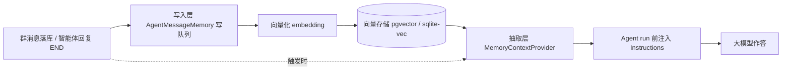

# 数字员工记忆：系统机制与「记忆拟人类型」特性说明

> 适用版本：1.0.121+（已随 1.0.121 Windows 桌面安装包发布）
> 关联代码：`src/AguiGroupChat.Agents/`（AgentOptions / AgentMessageMemory / MemoryContextProvider /
> MemoryProfileTuning / MemoryProfileWritePolicy）、`src/AguiGroupChat.Hub/Agents/`（IMessageMemory /
> MemoryRetrievalTuning）、`src/AguiGroupChat.Web/AgentApi.cs`、`wwwroot`（编辑表单「记忆类型」）。

本文是**记忆特性专项说明书**：先讲清平台「知聚共享记忆」的整体机制（写入 / 存储 / 抽取三层），
再详细展开 1.0.121 新增的**记忆拟人类型**（五档拟人预设 + 可选微调）——它决定每个数字员工
「调取记忆时如何回忆」，并给出配置入口、数据模型、运行效果、观测手段与设计红线。

---

## 目录

1. [记忆总体机制（三层）](#1-记忆总体机制三层)
2. [记忆拟人类型是什么](#2-记忆拟人类型是什么)
3. [五档拟人类型详解](#3-五档拟人类型详解)
4. [数据模型与配置入口](#4-数据模型与配置入口)
5. [读取侧：按类型执行抽取](#5-读取侧按类型执行抽取)
6. [写入侧：按类型调整落库](#6-写入侧按类型调整落库)
7. [运行效果与调试观测](#7-运行效果与调试观测)
8. [设计红线、边界与后续](#8-设计红线边界与后续)

---

## 1. 记忆总体机制（三层）

知聚（群）里的消息会形成**平台级共享的语义记忆**（RAG），数字员工回复前按语义相似度检索并注入
上下文。整个机制分三层，理解这三层是理解「记忆拟人类型」的前提：



| 层 | 承担者 | 说明 |
|---|---|---|
| **写入层** | `GroupHub.RememberMessage` → `AgentMessageMemory`（有界队列，fire-and-forget） | 全群可见消息（`Visibility=All`）落库后异步向量化写入；智能体消息在 END（内容完整）后才写；撤回同步清除；解散群 / 清话题物理删除 |
| **存储层** | `IMessageMemoryStore`（PostgreSQL+pgvector / SQLite+sqlite-vec，BLOB+内存余弦降级） | 每条记忆含 `importance`（0 普通 / 1 重要 / 2 关键）与 `expiresAt`（自动遗忘）；同相似度下高级别优先；已过期记忆不参与检索并由后台清理 |
| **抽取层** | `MemoryContextProvider`（MSAGENT `AIContextProvider`） | 每次 agent run 前按触发消息语义检索**群记忆**与**个人记忆**（可再叠加知识库 / 图谱 RAG），排版为 Instructions 注入 |

记忆内容来自历史消息 / 用户发言，视为**不可信输入**：所有注入段落都包 `UntrustedBoundary`
（prompt 注入边界），数字员工只能“参考”，不得改写记忆本身。

几个关键“度”都收口在全局 `Agents:Memory`（`MemoryOptions`）：

- `TopK=5`、`MinScore=0.25`：每次回复注入的历史记忆条数与相似度下限；
- `Scope=agent`：检索该智能体所在的所有群（可配 `group` / `all`）；
- `PersonalTopK=0`：个人记忆**程序性默认关闭**（Docker 编排默认注入 3 条）；个人记忆还需
  「触发者用户开启」+「数字员工开启个人记忆」三重条件；
- `RetentionDays=0`：自动遗忘默认关闭；开启后普通记忆带过期时间，重要（importance≥1）记忆不过期；
- `HybridSearch=true`：稠密命中集合内做 BM25 二次精排（不改召回集合）。

> 知识库（RAG 文档）与图谱记忆（Graph RAG）走**同一抽取注入点**（`ProvideAIContextAsync`），
> 但各有独立的存储与检索参数（`KnowledgeBaseIds`、`GraphEnabled` 等）。**记忆拟人类型不作用于
> 知识库 / 图谱段**——它只描述数字员工对“知聚里聊过的事”的记忆方式。

---

## 2. 记忆拟人类型是什么

不同的人有不同“记性”，平台允许**为每个数字员工单独配置记忆特征**：不只是一种人设标签，
而是真正改变**调取记忆时抽取参数**（条数、相似度阈值、回忆提示分支、近期窗口）以及**本人发言的落库方式**。

设计原则：

1. **只影响“怎么回忆”，不影响“记忆本体”**。知聚记忆仍是所有成员 / 数字员工共享的一份，
   五档类型决定某位数字员工从这份共享历史里“想起什么、想起多少、敢不敢确定”。
2. **向后兼容**。数字员工不配置（`MemoryProfile = null`）时行为与旧版本完全一致。
3. **不伪造记忆**。广记型“记混”用**置信度降级语气**呈现（“我记得好像是…”），而不是改写内容；
   存得住想不起型靠**提示词分支**放宽检索，而不是凭空补全。
4. **不越权删除数据**。快速遗忘型“忘得快”在读取侧体现为**近期窗口**（默认只看最近 21 天），
   写入侧仅缩短**本人普通发言**的保留期（且仅在平台已开启自动遗忘时），落库数据始终可控、可治理。

---

## 3. 五档拟人类型详解

| key | 中文 | 拟人画像 | 读取侧（抽取）特征 | 写入侧（本人发言落库） |
|---|---|---|---|---|
| `broad` | **广记型** | 编码能力强、记得多，但存储一般，细节容易混杂、张冠李戴。记得多，但不一定准 | 多取：检索 TopK 放大约 1.8 倍（上限 24），相似度阈值放低约 0.12（下限 0.15）；注入时附“用『我记得好像是…』留有余地、不凭空补全”的口吻说明 | 无差别 |
| `deep` | **深记型** | 记得少而久，一旦记住保存很久、很难忘；宁缺毋滥 | 克制：TopK 减半（≥1），阈值抬高 0.12（≤0.85）；只引用最有把握的少数条目，注入时附“宁可少说也不要讲错” | **自动刻为「重要」级记忆**（importance=1：不过期、同相似度检索优先） |
| `slowToLearn` | **难录入型** | 新信息很难刻进去，需反复多次才记住；一旦存住反而不容易忘 | 只想起“反复确认过”的事：TopK 约 0.75 倍，阈值略高 0.06；注入时把它当作相对可靠的既有结论 | 无差别（写入需“重复确认”需跨会话落库上下文，属后续项，见 §8） |
| `cueDependent` | **存得住想不起型** | 信息其实存着，但提取通道弱；当时学懂、事后卡壳，见提示恍然大悟 | **双态**：平时 TopK 约 0.55 倍、阈值高 0.08（弱提取）；用户消息含「记得吗 / 上次 / 之前」等**回忆提示**时临时放宽（TopK 约 1.6 倍且至少多 2 条，阈值放低 0.12），尽力帮对方回忆；想不起明说、不编造 | 无差别 |
| `fastForgetting` | **快速遗忘型** | 痕迹衰减快，不管好坏时间一长自动淡化；需要复盘 | 只对最近清晰：检索默认只保留**最近 21 天**（读取侧窗口，不删数据），TopK 约 0.7 倍、阈值高 0.06；注入时标注较早的信息并请对方确认 | 平台开启自动遗忘时，本人**普通发言**保留期缩短为全局的约 40%（≥2 天） |

> **举例**（全局 `TopK=5`、`MinScore=0.25`、`PersonalTopK=4`）：
> 同一条群历史，广记型会尝试取 9 条、阈值 0.15；深记型只取 3 条、阈值 0.37；
> 存得住想不起型平时取 3 条、阈值 0.33，但用户说“你还记得上次的方案吗”时放宽到 8 条、阈值 0.18。

数字员工默认不配置 = **跟随平台默认**，也就是 `MemoryOptions` 的全局参数（读取无窗口、
写入无区别），与未引入本特性前逐字节一致。

---

## 4. 数据模型与配置入口

### 4.1 字段（`AgentDefinition.MemoryProfile`，可空）

| 字段 | 类型 | 说明 |
|---|---|---|
| `memoryType` | string | **必填**（配置时）：`broad` / `deep` / `slowToLearn` / `cueDependent` / `fastForgetting`；未知或缺失 = 不配置 |
| `styleMode` | string? | 口吻模式：`recall`（平实引述，默认）/ `digest`（先把相关记忆概括成要点再回答）。叙事重写（`narrate`）不做，防幻觉 |
| `personaCard` | string? | 人设口吻一句话（≤120 字），注入为软性说明，非硬约束 |
| `topK` | int? | 微调：群记忆检索条数（1~24，越界后端收敛） |
| `personalTopK` | int? | 微调：个人记忆检索条数（1~16） |
| `minScore` | double? | 微调：群记忆相似度下限（0.05~0.92） |
| `personalMinScore` | double? | 微调：个人记忆相似度下限（0.05~0.92） |

规则：**手动填写的高级微调优先于该类型的推算值**；留空 = 按该类型在此平台全局参数下推算。
记忆类型本身不需要数据库迁移（`AgentDefinition` 以 JSON 持久化，天然随定义存储）。

### 4.2 配置入口（界面）

「AI 角色管理 → 编辑数字员工 → **记忆与权限 → 🧠 记忆类型（拟人召回）**」：

1. **记忆类型预设**下拉：跟随平台默认 / 五档；选中后下方实时显示该类型的一句话说明
   （i18n：`agent.form.memoryType.desc.<type>`）。
2. **口吻模式**：平实引述 / 先概括要点再回应。
3. **人设口吻**（可选）：一句话。
4. **高级微调**（可折叠）：群 / 个人记忆 TopK 与相似度阈值四个数值框，留空 = 按预设。

保存体：

```jsonc
// 不配置：
"memoryProfile": null

// 深记型 + digest + 人设 + 微调群记忆阈值示例：
"memoryProfile": {
  "memoryType": "deep",
  "styleMode": "digest",
  "personaCard": "话不多，回忆时喜欢先给结论",
  "topK": null,
  "personalTopK": null,
  "minScore": 0.5,
  "personalMinScore": null
}
```

### 4.3 API 与往返

- `POST /ag-ui/agents`、`PUT /ag-ui/agents/{agentId}`：`AgentUpsertHttpRequest.MemoryProfile`；
  列表接口 `GET /ag-ui/agents` 经 `ToDtos` 原样回显 `memoryProfile`（前端编辑回显用）。
- 后端 `BuildMemoryProfile`：未知 `memoryType` → 按“不配置”处理；TopK / 阈值越界自动收敛到
  1~24 / 1~16 / 0.05~0.92；非 `digest` 的 `styleMode` 归一为默认。
- **导出 / 导入数字员工 JSON**（`serializeAgent` / `importAgentsFromFile`）带 `memoryProfile` 往返。
- 系统内置数字员工（无 ownerId）只读，不在此开放配置。

### 4.4 组织构建自动配型（一键编排 / org_architect）

「一键组织编排」与内置「组织架构构建师」(`org_plan_draft`) 共用同一生成引擎 `AgentOrchestrator`：
产稿时让模型**按每个岗位的实际职责挑选一个记忆拟人 preset**（`memoryProfile` 写为 key 字符串），
随方案 JSON 一起预览；用户确认落库（apply / `org_commit`）后，新创建的数字员工<b>自带匹配其岗位的
记忆类型</b>——例如统筹主管常为 `deep`、高频客服/一线为 `broad`、需回想客户过往的顾问/售后为
`cueDependent`、值班/速查岗为 `fastForgetting`、重复套路岗为 `slowToLearn`。

- 五档选择口径见 `AgentOrchestrator.BuildPrompt`；示例 JSON 结构含 `"memoryProfile":"deep"`。
- **宽容解析**：模型可写 preset 字符串或 `{"memoryType":…}` 对象；未知 / 残缺 / 缺失都不报错——
  缺失时按岗位称呼/职责关键词**启发式兜底**，仍无把握则保持 `null`（沿用全局，绝不因该字段中断整支落库）。
- **预览可见**：编排预览逐岗位回显「记忆: 🧠深记型…」；apply 原样回传（web 路径经 `OrchestratedAgentHttp.MemoryProfile`，
  内置角色路径经 `OrgTeamCommitter` 解析最终稿 JSON 的 `memoryProfile`），统一在 `OrgApplyEngine` 落库。
- **向后兼容**：历史方案 / 手写最终稿 JSON 没有该字段 → 解析为 `null`，与旧行为完全一致。
- **连接自动成对**：一键编排 / `org_architect` 建出的组织还会**自动成对连接**（与记忆拟人 preset 相互独立）——只填向上提升（`escalationAgentId`）时，解析与落库两处会把直接下级并入主管 `assignmentIds`，使团队「指派 + 提升」双向健全（详见 `docs/customer-service-and-org-builder.md` §B.1），因此配型总是落在结构完整的团队上。

---

## 5. 读取侧：按类型执行抽取

抽取发生在 `MemoryContextProvider.ProvideAIContextAsync`（每次 agent run 前），流程：

1. 取当前 run 的数字员工定义 `AgentDefinition def`（`run.AgentId`）。
2. 若 `def.MemoryProfile` 存在，调用 `MemoryProfileTuning.Resolve(def.MemoryProfile, MemoryOptions, query)`
   算出本次的**单次检索覆盖** `MemoryRetrievalTuning`：群记忆 `TopK / MinScore`、个人记忆
   `PersonalTopK / PersonalMinScore`、是否命中回忆提示 `CueDetected`、近期窗口 `RecencyWindowDays`
   （快速遗忘型 = 21 天）、以及一句**召回口吻说明** `RecallNote`。
3. 群记忆检索时把覆盖传给检索实现：

   ```csharp
   memories = await _memory.SearchAsync(groupId, agentId, query, ct, profileTuning.Tuning);
   ```

   `AgentMessageMemory.SearchAsync / SearchPersonAsync` 收到覆盖后，把 topK / minScore 直接传给
   store（`Search` / `SearchPerson`）——**不是在返回后再截断**，而是 store 层真正按类型取数
   （广记型能取回比全局 TopK 更多的候选、放低阈值）。
4. Provider 再做三重收口（对任意实现一致）：
   - `FilterByType`：快速遗忘型的**近期窗口**过滤 + 按类型阈值再滤一遍；
   - `Dedupe(...)`：排除触发消息自身、按内容去重、按**类型 TopK** 截断；
   - 确有群 / 个人记忆注入时，把 `RecallNote` 作为**软性说明**置于记忆段落之前
     （只有知识库 / 图谱注入时不加，避免误导）。
5. 检索 query 统一按 `MaxQueryChars` 截断再向量化（与写入端一致）。

关键点：

- **个人记忆守卫不变**：个人记忆仍需 `MemoryOptions.PersonalTopK > 0` + 数字员工开启个人记忆 +
  触发者用户开启个人记忆三重条件；类型只负责在检索时覆盖 `PersonalTopK / PersonalMinScore`。
- **知识库 / 图谱段不受类型影响**：检索仍用全局 `TopK / MinScore / Graph*`。
- **回忆提示检测**（存得住想不起型专用）：对触发消息匹配
  `记得|还记得|上次|之前|以前|回想|想起来|remind|remember|last time|previously|earlier`
  （大小写不敏感）。命中即“提示分支”临时放宽；未命中即默认弱提取。
- **注入可信边界**：`RecallNote` 是系统提示文本（可信），记忆段落本身仍在
  `UntrustedBoundary.Wrap` 内（不可信）——二者不混淆。

---

## 6. 写入侧：按类型调整落库

写入发生在 `AgentMessageMemory` 的写队列（作者是数字员工且配置了 `MemoryProfile` 时生效；
**用户消息与未配置的数字员工完全不变**）。策略在 `MemoryProfileWritePolicy`：

| 类型 | 写队列行为 |
|---|---|
| `deep` | 本人发言自动 `importance = Important(1)`：不随自动遗忘过期、同相似度检索优先（“说出口即烙印”） |
| `fastForgetting` | 平台 `RetentionDays > 0` 时，本人**普通**发言的 `expiresAt = 写入时刻 + max(2, ⌈RetentionDays×0.4⌉)` 天；平台未开自动遗忘时不主动引入过期（尊重运维选择，淡忘由读取侧 21 天窗口呈现） |
| 其余 / 未配置 | 与全局逻辑一致 |

装配要点：`AgentHosting.AddMessageMemory` 注入“作者 agentId → MemoryProfile”的**惰性解析器**
——不在记忆服务构造期解析 `AgentCatalog`（避免集成宿主装配期死锁），而是在写队列第一条
“数字员工本人发言”要落库时才取一次目录并缓存（写队列单消费者，缓存安全）。

---

## 7. 运行效果与调试观测

### 7.1 你会在回复里看到什么

- 数字员工配置记忆类型且确实注入了群 / 个人记忆时，注入段落前多一句与类型相符的软性说明
  （如深记型：“你是『深记型』记忆：记得少而牢……宁可少说也不要讲错。”）。它**不改变记忆事实**，
  只约束“如何引用”。
- 广记型在引用细节时会使用「我记得好像是…」这类留有余地的说法（由模型执行软性指示）。
- 存得住想不起型面对「上次说的那个方案」这类追问会明显“想得更努力”；若真没有吻合记忆，会明说想不起来。

### 7.2 日志与排查

- `AgentMessageMemory.SearchAsync / SearchPersonAsync` 的 Debug 日志带 `topK / minScore`
  （命中时），可确认类型覆盖是否真传到 store 层。
- `MemoryContextProvider` 注入日志带 `记忆类型={MemoryType}`（未配置为“默认”）与条数。
- 写入日志（`AgentMessageMemory` 写队列）带 `importance / expiresAt`，可核对深记型“重要”、
  快速遗忘型“短过期”是否生效。
- 「用户菜单 → 记忆管理」可视化与该特性正交：分级 / 遗忘 / 浏览仍然是全局治理工具，
  类型配置不产生新的记忆条目，也不改既有治理语义。

---

## 8. 设计红线、边界与后续

**红线**

- 绝不伪造记忆：任何类型都不允许系统改写历史内容本身；“记混 / 想不起 / 忘得快”都通过
  抽取参数、窗口与措辞层面的拟人来呈现。
- 不可信边界不破：记忆 / 知识片段永远在 `UntrustedBoundary` 内，类型口吻说明永远在其外。
- 兼容旧数据：`MemoryProfile=null`（旧定义 / 种子数据）行为逐字节同旧版；无 schema 迁移。

**当前边界（有意为之）**

- 记忆仍是知聚共享一份；类型只作用于“该员工怎么回忆”与“该员工本人发言的落库微调”，
  不产生每员工独立记忆副本。
- 写入侧只有 `deep`（刻深）与 `fastForgetting`（短保留）有差异；`slowToLearn`
  “需重复几次才落库”需要“谁在写、跨会话重复计数”的落库上下文（涉及存储层扩展），
  列入后续；`broad` / `cueDependent` 的差异集中在读取侧。
- 类型不作用于知识库文档 / 图谱记忆的检索。
- 个人记忆为“触发者”维度，与数字员工自己的“回忆习惯”是两个正交开关。

**可能的后续方向**（如需排期）：每员工“可见性”记忆副本 / 写入侧重复编码门（难录入型真正需要
重复才落库）、类型相关的跨话题“复盘小结”、按记忆类型的检索结果置信度标注展示、数字员工列表
的记忆类型徽标等——实现前回到代码核对，本文以当前代码为准。
